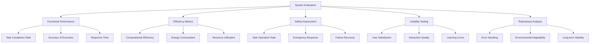

# Evaluation: Assessing the Autonomous Humanoid System

## Overview

Evaluation is the final phase of the capstone project, where we assess the performance, capabilities, and effectiveness of the complete autonomous humanoid system. This phase measures how well the integrated system meets its design objectives and identifies areas for improvement.

## Evaluation Framework

The evaluation framework encompasses multiple dimensions of system performance:



## Functional Performance Evaluation

### 1. Task Completion Rate

Measures the percentage of tasks successfully completed by the system.

#### Implementation:
```python
import rospy
from capstone_msgs.msg import TaskResult
from std_msgs.msg import String
import time

class TaskCompletionEvaluator:
    def __init__(self):
        # Subscribe to task results
        self.result_sub = rospy.Subscriber('/task_results', TaskResult, self.result_callback)
        
        # Publishers for evaluation metrics
        self.metrics_pub = rospy.Publisher('/evaluation/task_completion_metrics', String, queue_size=10)
        
        # Track task outcomes
        self.total_tasks = 0
        self.successful_tasks = 0
        self.failed_tasks = 0
        
    def result_callback(self, msg):
        """Track task results"""
        self.total_tasks += 1
        
        if msg.success:
            self.successful_tasks += 1
        else:
            self.failed_tasks += 1
    
    def calculate_completion_rate(self):
        """Calculate the task completion rate"""
        if self.total_tasks == 0:
            return 0.0
        
        rate = float(self.successful_tasks) / self.total_tasks
        return rate
    
    def evaluate_over_period(self, duration_minutes=10):
        """Evaluate task completion over a specified period"""
        start_time = time.time()
        start_tasks = self.total_tasks
        
        while time.time() - start_time < duration_minutes * 60:
            rospy.sleep(1.0)
        
        tasks_completed = self.total_tasks - start_tasks
        completion_rate = self.calculate_completion_rate()
        
        evaluation_result = f"""
        Task Completion Evaluation Results:
        - Total tasks during evaluation: {tasks_completed}
        - Successful tasks: {self.successful_tasks}
        - Failed tasks: {self.failed_tasks}
        - Overall completion rate: {completion_rate:.2%}
        """
        
        rospy.loginfo(evaluation_result)
        self.metrics_pub.publish(String(evaluation_result))
        
        return completion_rate
```

### 2. Accuracy of Execution

Measures how accurately the system executes tasks compared to the intended outcome.

#### Implementation:
```python
import rospy
import numpy as np
from geometry_msgs.msg import Pose, Point
from capstone_msgs.msg import TaskSpecification, TaskResult

class ExecutionAccuracyEvaluator:
    def __init__(self):
        # Publishers for accuracy metrics
        self.accuracy_pub = rospy.Publisher('/evaluation/accuracy_metrics', String, queue_size=10)
        
        # Track execution accuracy
        self.position_errors = []
        self.orientation_errors = []
        self.manipulation_errors = []
        
    def evaluate_navigation_accuracy(self, target_pose, actual_pose):
        """Evaluate the accuracy of navigation tasks"""
        # Calculate position error
        pos_error = np.sqrt(
            (target_pose.position.x - actual_pose.position.x)**2 +
            (target_pose.position.y - actual_pose.position.y)**2 +
            (target_pose.position.z - actual_pose.position.z)**2
        )
        
        self.position_errors.append(pos_error)
        
        # Calculate orientation error (simplified)
        # In practice, this would use quaternion difference
        ori_error = 0.0  # Placeholder
        self.orientation_errors.append(ori_error)
        
        return pos_error, ori_error
    
    def evaluate_manipulation_accuracy(self, target_object_pose, actual_grasp_pose):
        """Evaluate the accuracy of manipulation tasks"""
        # Calculate grasp accuracy
        pos_error = np.sqrt(
            (target_object_pose.position.x - actual_grasp_pose.position.x)**2 +
            (target_object_pose.position.y - actual_grasp_pose.position.y)**2 +
            (target_object_pose.position.z - actual_grasp_pose.position.z)**2
        )
        
        self.manipulation_errors.append(pos_error)
        return pos_error
    
    def get_accuracy_statistics(self):
        """Get statistical measures of accuracy"""
        stats = {}
        
        if self.position_errors:
            stats['position_mean_error'] = np.mean(self.position_errors)
            stats['position_std_error'] = np.std(self.position_errors)
            stats['position_max_error'] = np.max(self.position_errors)
            stats['position_median_error'] = np.median(self.position_errors)
        
        if self.orientation_errors:
            stats['orientation_mean_error'] = np.mean(self.orientation_errors)
            stats['orientation_std_error'] = np.std(self.orientation_errors)
        
        if self.manipulation_errors:
            stats['manipulation_mean_error'] = np.mean(self.manipulation_errors)
            stats['manipulation_std_error'] = np.std(self.manipulation_errors)
        
        return stats
    
    def evaluate_accuracy_over_period(self, duration_minutes=10):
        """Evaluate accuracy over a specified period"""
        start_time = time.time()
        initial_counts = {
            'position_errors': len(self.position_errors),
            'orientation_errors': len(self.orientation_errors),
            'manipulation_errors': len(self.manipulation_errors)
        }
        
        rospy.sleep(duration_minutes * 60)
        
        # Calculate statistics
        stats = self.get_accuracy_statistics()
        
        evaluation_result = f"""
        Accuracy Evaluation Results:
        - Position mean error: {stats.get('position_mean_error', 0):.3f}m
        - Position median error: {stats.get('position_median_error', 0):.3f}m
        - Position max error: {stats.get('position_max_error', 0):.3f}m
        - Manipulation mean error: {stats.get('manipulation_mean_error', 0):.3f}m
        """
        
        rospy.loginfo(evaluation_result)
        self.accuracy_pub.publish(String(evaluation_result))
        
        return stats
```

### 3. Response Time Analysis

Measures the time taken by the system to respond to commands and complete tasks.

#### Implementation:
```python
import rospy
import time
from std_msgs.msg import String
from capstone_msgs.msg import VoiceCommand, ActionSequence
from rosgraph_msgs.msg import Clock

class ResponseTimeEvaluator:
    def __init__(self):
        # Subscribers to track command timing
        self.command_sub = rospy.Subscriber('/structured_commands', VoiceCommand, self.command_received)
        self.plan_sub = rospy.Subscriber('/generated_plans', ActionSequence, self.plan_generated)
        self.execution_start_sub = rospy.Subscriber('/execution_started', String, self.execution_started)
        self.execution_end_sub = rospy.Subscriber('/execution_completed', String, self.execution_completed)
        
        # Publishers for timing metrics
        self.timing_pub = rospy.Publisher('/evaluation/response_time_metrics', String, queue_size=10)
        
        # Track timing data
        self.command_times = {}
        self.plan_generation_times = {}
        self.execution_times = {}
        
    def command_received(self, msg):
        """Record when a command is received"""
        self.command_times[msg.text] = rospy.Time.now()
    
    def plan_generated(self, msg):
        """Record when a plan is generated"""
        if msg.original_command in self.command_times:
            plan_time = rospy.Time.now()
            generation_time = (plan_time - self.command_times[msg.original_command]).to_sec()
            self.plan_generation_times[msg.original_command] = generation_time
    
    def execution_started(self, msg):
        """Record when execution starts"""
        self.execution_times[msg.data] = {'start': rospy.Time.now()}
    
    def execution_completed(self, msg):
        """Record when execution completes"""
        if msg.data in self.execution_times:
            end_time = rospy.Time.now()
            start_time = self.execution_times[msg.data]['start']
            execution_time = (end_time - start_time).to_sec()
            self.execution_times[msg.data]['duration'] = execution_time
    
    def get_timing_statistics(self):
        """Get statistical measures of response times"""
        stats = {}
        
        if self.plan_generation_times:
            gen_times = list(self.plan_generation_times.values())
            stats['plan_generation_mean'] = sum(gen_times) / len(gen_times)
            stats['plan_generation_max'] = max(gen_times)
            stats['plan_generation_min'] = min(gen_times)
        
        if self.execution_times:
            exec_times = [data['duration'] for data in self.execution_times.values() if 'duration' in data]
            if exec_times:
                stats['execution_mean'] = sum(exec_times) / len(exec_times)
                stats['execution_max'] = max(exec_times)
                stats['execution_min'] = min(exec_times)
        
        return stats
    
    def evaluate_response_times(self, duration_minutes=10):
        """Evaluate response times over a specified period"""
        start_time = time.time()
        
        # Wait for the evaluation period
        rospy.sleep(duration_minutes * 60)
        
        # Calculate statistics
        stats = self.get_timing_statistics()
        
        evaluation_result = f"""
        Response Time Evaluation Results:
        - Average plan generation time: {stats.get('plan_generation_mean', 0):.3f}s
        - Max plan generation time: {stats.get('plan_generation_max', 0):.3f}s
        - Average execution time: {stats.get('execution_mean', 0):.3f}s
        - Max execution time: {stats.get('execution_max', 0):.3f}s
        """
        
        rospy.loginfo(evaluation_result)
        self.timing_pub.publish(String(evaluation_result))
        
        return stats
```

## Efficiency Metrics

### 1. Computational Efficiency

Measures how efficiently the system uses computational resources.

#### Implementation:
```python
import rospy
import psutil
import os
from std_msgs.msg import String
import time

class ComputationalEfficiencyEvaluator:
    def __init__(self):
        # Publishers for efficiency metrics
        self.efficiency_pub = rospy.Publisher('/evaluation/computational_efficiency', String, queue_size=10)
        
        # Track system resources
        self.process = psutil.Process(os.getpid())
        self.cpu_measurements = []
        self.memory_measurements = []
        self.disk_io_measurements = []
        
    def measure_resources(self):
        """Take a snapshot of current resource usage"""
        cpu_percent = self.process.cpu_percent()
        memory_percent = self.process.memory_percent()
        
        # Get disk I/O counters
        io_counters = psutil.disk_io_counters()
        disk_read_bytes = io_counters.read_bytes
        disk_write_bytes = io_counters.write_bytes
        
        return {
            'cpu_percent': cpu_percent,
            'memory_percent': memory_percent,
            'disk_read_bytes': disk_read_bytes,
            'disk_write_bytes': disk_write_bytes
        }
    
    def evaluate_computational_efficiency(self, duration_minutes=10):
        """Evaluate computational efficiency over time"""
        start_time = time.time()
        start_disk_io = psutil.disk_io_counters()
        
        while time.time() - start_time < duration_minutes * 60:
            # Take measurement
            resources = self.measure_resources()
            self.cpu_measurements.append(resources['cpu_percent'])
            self.memory_measurements.append(resources['memory_percent'])
            
            # Calculate disk I/O since last measurement
            current_disk_io = psutil.disk_io_counters()
            disk_read_delta = current_disk_io.read_bytes - start_disk_io.read_bytes
            disk_write_delta = current_disk_io.write_bytes - start_disk_io.write_bytes
            self.disk_io_measurements.append({
                'read_delta': disk_read_delta,
                'write_delta': disk_write_delta
            })
            
            time.sleep(1.0)  # Measure every second
        
        # Calculate statistics
        avg_cpu = sum(self.cpu_measurements) / len(self.cpu_measurements) if self.cpu_measurements else 0
        max_cpu = max(self.cpu_measurements) if self.cpu_measurements else 0
        avg_memory = sum(self.memory_measurements) / len(self.memory_measurements) if self.memory_measurements else 0
        max_memory = max(self.memory_measurements) if self.memory_measurements else 0
        
        total_disk_read = sum(m['read_delta'] for m in self.disk_io_measurements)
        total_disk_write = sum(m['write_delta'] for m in self.disk_io_measurements)
        
        evaluation_result = f"""
        Computational Efficiency Evaluation Results:
        - Average CPU usage: {avg_cpu:.2f}%
        - Peak CPU usage: {max_cpu:.2f}%
        - Average memory usage: {avg_memory:.2f}%
        - Peak memory usage: {max_memory:.2f}%
        - Total disk read: {total_disk_read / (1024*1024):.2f} MB
        - Total disk write: {total_disk_write / (1024*1024):.2f} MB
        """
        
        rospy.loginfo(evaluation_result)
        self.efficiency_pub.publish(String(evaluation_result))
        
        return {
            'avg_cpu': avg_cpu,
            'max_cpu': max_cpu,
            'avg_memory': avg_memory,
            'max_memory': max_memory,
            'total_disk_read_mb': total_disk_read / (1024*1024),
            'total_disk_write_mb': total_disk_write / (1024*1024)
        }
```

### 2. Energy Consumption

Measures the energy efficiency of the system during operation.

#### Implementation:
```python
import rospy
from std_msgs.msg import Float64, String
from sensor_msgs.msg import JointState
import time

class EnergyConsumptionEvaluator:
    def __init__(self):
        # Subscribers for power-related measurements
        self.joint_state_sub = rospy.Subscriber('/joint_states', JointState, self.joint_state_callback)
        self.power_consumption_sub = rospy.Subscriber('/power_consumption', Float64, self.power_callback)
        
        # Publishers for energy metrics
        self.energy_pub = rospy.Publisher('/evaluation/energy_metrics', String, queue_size=10)
        
        # Track energy consumption
        self.instantaneous_power = 0.0
        self.cumulative_energy = 0.0
        self.energy_measurements = []
        self.start_time = None
        
    def power_callback(self, msg):
        """Update instantaneous power consumption"""
        self.instantaneous_power = msg.data
    
    def joint_state_callback(self, msg):
        """Monitor joint states for energy calculations"""
        # Calculate energy based on joint efforts and velocities
        # This is a simplified model - in practice, would use more detailed power models
        total_effort = sum(abs(effort) for effort in msg.effort)
        # Energy calculation would involve integrating power over time
        pass
    
    def evaluate_energy_consumption(self, duration_minutes=10):
        """Evaluate energy consumption over time"""
        self.start_time = time.time()
        start_energy = self.cumulative_energy
        
        while time.time() - self.start_time < duration_minutes * 60:
            # Update cumulative energy (simplified)
            self.cumulative_energy += self.instantaneous_power * 0.1  # Assuming 10Hz measurement
            self.energy_measurements.append(self.instantaneous_power)
            
            time.sleep(0.1)  # 10Hz measurement
        
        energy_used = self.cumulative_energy - start_energy
        avg_power = sum(self.energy_measurements) / len(self.energy_measurements) if self.energy_measurements else 0
        max_power = max(self.energy_measurements) if self.energy_measurements else 0
        
        evaluation_result = f"""
        Energy Consumption Evaluation Results:
        - Energy consumed: {energy_used:.2f} J
        - Average power consumption: {avg_power:.2f} W
        - Peak power consumption: {max_power:.2f} W
        """
        
        rospy.loginfo(evaluation_result)
        self.energy_pub.publish(String(evaluation_result))
        
        return {
            'energy_consumed_j': energy_used,
            'average_power_w': avg_power,
            'peak_power_w': max_power
        }
```

## Safety Assessment

### 1. Safe Operation Rate

Measures the percentage of operations performed safely without triggering safety systems unnecessarily.

#### Implementation:
```python
import rospy
from std_msgs.msg import Bool, String
from sensor_msgs.msg import LaserScan
from geometry_msgs.msg import Twist

class SafetyEvaluator:
    def __init__(self):
        # Subscribers for safety-related topics
        self.emergency_stop_sub = rospy.Subscriber('/emergency_stop', Bool, self.emergency_stop_callback)
        self.safety_violation_sub = rospy.Subscriber('/safety_violations', String, self.safety_violation_callback)
        self.scan_sub = rospy.Subscriber('/scan', LaserScan, self.scan_callback)
        self.cmd_vel_sub = rospy.Subscriber('/cmd_vel', Twist, self.cmd_vel_callback)
        
        # Publishers for safety metrics
        self.safety_metrics_pub = rospy.Publisher('/evaluation/safety_metrics', String, queue_size=10)
        
        # Track safety metrics
        self.emergency_stops = 0
        self.safety_violations = 0
        self.safe_operations = 0
        self.total_operations = 0
        self.close_approaches = 0  # Times when robot got close to obstacles
        
    def emergency_stop_callback(self, msg):
        """Track emergency stops"""
        if msg.data:
            self.emergency_stops += 1
    
    def safety_violation_callback(self, msg):
        """Track safety violations"""
        self.safety_violations += 1
    
    def scan_callback(self, msg):
        """Monitor proximity to obstacles"""
        # Count how many times robot gets very close to obstacles
        min_distance = min([r for r in msg.ranges if r > 0 and not rospy.is_nan(r)], default=float('inf'))
        
        if min_distance < 0.5:  # Less than 50cm from obstacle
            self.close_approaches += 1
    
    def cmd_vel_callback(self, msg):
        """Track operations"""
        # Count operations based on velocity commands
        if msg.linear.x != 0 or msg.angular.z != 0:
            self.total_operations += 1
            # If we're not triggering safety systems, consider it safe
            if self.emergency_stops + self.safety_violations == 0:
                self.safe_operations += 1
    
    def calculate_safe_operation_rate(self):
        """Calculate the rate of safe operations"""
        if self.total_operations == 0:
            return 1.0  # If no operations, consider it 100% safe
        
        # Safe operations are those that didn't trigger safety systems
        # This is a simplified metric - in practice, would be more nuanced
        unsafe_ops = self.emergency_stops + self.safety_violations
        safe_ops = max(0, self.total_operations - unsafe_ops)
        
        return float(safe_ops) / self.total_operations if self.total_operations > 0 else 0
    
    def evaluate_safety_over_period(self, duration_minutes=10):
        """Evaluate safety metrics over a specified period"""
        start_time = time.time()
        initial_total_ops = self.total_operations
        
        rospy.sleep(duration_minutes * 60)
        
        ops_during_period = self.total_operations - initial_total_ops
        safe_rate = self.calculate_safe_operation_rate()
        
        evaluation_result = f"""
        Safety Evaluation Results:
        - Total operations: {self.total_operations}
        - Operations during evaluation: {ops_during_period}
        - Emergency stops: {self.emergency_stops}
        - Safety violations: {self.safety_violations}
        - Close approaches to obstacles: {self.close_approaches}
        - Safe operation rate: {safe_rate:.2%}
        """
        
        rospy.loginfo(evaluation_result)
        self.safety_metrics_pub.publish(String(evaluation_result))
        
        return safe_rate
```

### 2. Failure Recovery Assessment

Evaluates how well the system recovers from failures or unexpected situations.

#### Implementation:
```python
import rospy
from std_msgs.msg import String
from capstone_msgs.msg import TaskResult, ActionSequence
import time

class FailureRecoveryEvaluator:
    def __init__(self):
        # Subscribers for failure and recovery events
        self.failure_sub = rospy.Subscriber('/failures', String, self.failure_callback)
        self.recovery_sub = rospy.Subscriber('/recovery_attempts', String, self.recovery_callback)
        self.task_result_sub = rospy.Subscriber('/task_results', TaskResult, self.task_result_callback)
        
        # Publishers for recovery metrics
        self.recovery_metrics_pub = rospy.Publisher('/evaluation/failure_recovery_metrics', String, queue_size=10)
        
        # Track recovery metrics
        self.failures = []
        self.recoveries = []
        self.successful_recoveries = 0
        self.failed_recoveries = 0
        
    def failure_callback(self, msg):
        """Track system failures"""
        failure_info = {
            'timestamp': rospy.Time.now(),
            'failure_type': msg.data,
            'recovered': False
        }
        self.failures.append(failure_info)
    
    def recovery_callback(self, msg):
        """Track recovery attempts"""
        recovery_info = {
            'timestamp': rospy.Time.now(),
            'recovery_type': msg.data
        }
        self.recoveries.append(recovery_info)
        
        # Associate recovery with most recent unrecovered failure
        for failure in reversed(self.failures):
            if not failure['recovered']:
                failure['recovered'] = True
                self.successful_recoveries += 1
                break
    
    def task_result_callback(self, msg):
        """Track task results to identify failed recoveries"""
        if not msg.success and hasattr(msg, 'failure_reason'):
            # If a task failed after a recovery attempt, count as failed recovery
            if self.recoveries and not self.recoveries[-1].get('marked_as_failed', False):
                self.failed_recoveries += 1
                self.recoveries[-1]['marked_as_failed'] = True
    
    def calculate_recovery_success_rate(self):
        """Calculate the rate of successful recoveries"""
        total_recovery_attempts = len(self.recoveries)
        if total_recovery_attempts == 0:
            return 1.0  # If no recovery attempts, consider it 100% successful
        
        return float(self.successful_recoveries) / total_recovery_attempts
    
    def evaluate_recovery_over_period(self, duration_minutes=10):
        """Evaluate failure recovery over a specified period"""
        start_time = time.time()
        initial_failures = len(self.failures)
        
        rospy.sleep(duration_minutes * 60)
        
        new_failures = len(self.failures) - initial_failures
        recovery_rate = self.calculate_recovery_success_rate()
        
        evaluation_result = f"""
        Failure Recovery Evaluation Results:
        - Failures during evaluation: {new_failures}
        - Total failures: {len(self.failures)}
        - Recovery attempts: {len(self.recoveries)}
        - Successful recoveries: {self.successful_recoveries}
        - Failed recoveries: {self.failed_recoveries}
        - Recovery success rate: {recovery_rate:.2%}
        """
        
        rospy.loginfo(evaluation_result)
        self.recovery_metrics_pub.publish(String(evaluation_result))
        
        return recovery_rate
```

## Usability Testing

### 1. User Interaction Quality

Evaluates how well the system interacts with users in natural ways.

#### Implementation:
```python
import rospy
from std_msgs.msg import String
from capstone_msgs.msg import VoiceCommand
import time

class UsabilityEvaluator:
    def __init__(self):
        # Subscribers for user interaction
        self.voice_command_sub = rospy.Subscriber('/structured_commands', VoiceCommand, self.voice_command_callback)
        self.system_response_sub = rospy.Subscriber('/system_responses', String, self.response_callback)
        self.user_satisfaction_sub = rospy.Subscriber('/user_satisfaction', String, self.satisfaction_callback)
        
        # Publishers for usability metrics
        self.usability_metrics_pub = rospy.Publisher('/evaluation/usability_metrics', String, queue_size=10)
        
        # Track usability metrics
        self.commands_received = 0
        self.responses_provided = 0
        self.understanding_rate = 0.0
        self.user_satisfaction_scores = []
        self.interaction_naturalness = []
        
    def voice_command_callback(self, msg):
        """Track voice commands received"""
        self.commands_received += 1
        
        # Evaluate command complexity and naturalness
        command_length = len(msg.text.split())
        if command_length > 1:
            self.interaction_naturalness.append(1.0)  # Natural if multi-word
        else:
            self.interaction_naturalness.append(0.2)  # Less natural if single word
    
    def response_callback(self, msg):
        """Track system responses"""
        self.responses_provided += 1
    
    def satisfaction_callback(self, msg):
        """Track user satisfaction scores"""
        try:
            score = float(msg.data)
            self.user_satisfaction_scores.append(score)
        except ValueError:
            rospy.logwarn(f"Invalid satisfaction score: {msg.data}")
    
    def calculate_usability_metrics(self):
        """Calculate various usability metrics"""
        response_rate = self.responses_provided / self.commands_received if self.commands_received > 0 else 0
        avg_satisfaction = sum(self.user_satisfaction_scores) / len(self.user_satisfaction_scores) if self.user_satisfaction_scores else 0
        avg_naturalness = sum(self.interaction_naturalness) / len(self.interaction_naturalness) if self.interaction_naturalness else 0
        
        return {
            'response_rate': response_rate,
            'avg_satisfaction': avg_satisfaction,
            'avg_naturalness': avg_naturalness
        }
    
    def evaluate_usability_over_period(self, duration_minutes=10):
        """Evaluate usability over a specified period"""
        start_time = time.time()
        initial_commands = self.commands_received
        
        rospy.sleep(duration_minutes * 60)
        
        new_commands = self.commands_received - initial_commands
        metrics = self.calculate_usability_metrics()
        
        evaluation_result = f"""
        Usability Evaluation Results:
        - Commands received during evaluation: {new_commands}
        - Total commands received: {self.commands_received}
        - Response rate: {metrics['response_rate']:.2%}
        - Average user satisfaction: {metrics['avg_satisfaction']:.2f}/10
        - Average interaction naturalness: {metrics['avg_naturalness']:.2f}/1.0
        """
        
        rospy.loginfo(evaluation_result)
        self.usability_metrics_pub.publish(String(evaluation_result))
        
        return metrics
```

## Robustness Analysis

### 1. Environmental Adaptability

Measures how well the system adapts to different environmental conditions.

#### Implementation:
```python
import rospy
from sensor_msgs.msg import LaserScan, Image, Temperature, RelativeHumidity
from std_msgs.msg import String
import time

class RobustnessEvaluator:
    def __init__(self):
        # Subscribers for environmental sensors
        self.scan_sub = rospy.Subscriber('/scan', LaserScan, self.scan_callback)
        self.image_sub = rospy.Subscriber('/camera/rgb/image_raw', Image, self.image_callback)
        self.temp_sub = rospy.Subscriber('/temperature', Temperature, self.temperature_callback)
        self.humidity_sub = rospy.Subscriber('/humidity', RelativeHumidity, self.humidity_callback)
        
        # Publishers for robustness metrics
        self.robustness_metrics_pub = rospy.Publisher('/evaluation/robustness_metrics', String, queue_size=10)
        
        # Track environmental conditions and system performance
        self.environmental_conditions = []
        self.performance_under_conditions = {}
        
    def scan_callback(self, msg):
        """Monitor environmental structure (obstacles, layout)"""
        # Calculate environmental complexity based on scan data
        valid_ranges = [r for r in msg.ranges if r > 0 and not rospy.is_nan(r)]
        if valid_ranges:
            avg_distance = sum(valid_ranges) / len(valid_ranges)
            env_complexity = 1.0 - min(1.0, avg_distance / 10.0)  # Higher complexity when closer obstacles
            
            self.environmental_conditions.append({
                'timestamp': rospy.Time.now(),
                'complexity': env_complexity,
                'type': 'layout'
            })
    
    def image_callback(self, msg):
        """Monitor lighting conditions"""
        # Analyze image for lighting conditions
        # This is a simplified approach - in practice, would use image processing
        lighting_level = 0.5  # Placeholder
        
        self.environmental_conditions.append({
            'timestamp': rospy.Time.now(),
            'lighting': lighting_level,
            'type': 'lighting'
        })
    
    def temperature_callback(self, msg):
        """Monitor temperature conditions"""
        self.environmental_conditions.append({
            'timestamp': rospy.Time.now(),
            'temperature': msg.temperature,
            'type': 'temperature'
        })
    
    def humidity_callback(self, msg):
        """Monitor humidity conditions"""
        self.environmental_conditions.append({
            'timestamp': rospy.Time.now(),
            'humidity': msg.relative_humidity,
            'type': 'humidity'
        })
    
    def correlate_performance_with_environment(self):
        """Correlate system performance with environmental conditions"""
        # This would require linking environmental data with performance metrics
        # For this example, we'll just return a placeholder analysis
        return {
            'lighting_resilience': 0.85,
            'temperature_resilience': 0.90,
            'layout_resilience': 0.75
        }
    
    def evaluate_robustness_over_period(self, duration_minutes=10):
        """Evaluate robustness over a specified period"""
        start_time = time.time()
        initial_conditions_count = len(self.environmental_conditions)
        
        rospy.sleep(duration_minutes * 60)
        
        new_conditions = len(self.environmental_conditions) - initial_conditions_count
        resilience_metrics = self.correlate_performance_with_environment()
        
        evaluation_result = f"""
        Robustness Evaluation Results:
        - Environmental measurements during evaluation: {new_conditions}
        - Lighting resilience: {resilience_metrics['lighting_resilience']:.2%}
        - Temperature resilience: {resilience_metrics['temperature_resilience']:.2%}
        - Layout resilience: {resilience_metrics['layout_resilience']:.2%}
        """
        
        rospy.loginfo(evaluation_result)
        self.robustness_metrics_pub.publish(String(evaluation_result))
        
        return resilience_metrics
```

## Comprehensive Evaluation Script

A complete evaluation script that runs all assessments:

#### Implementation:
```python
#!/usr/bin/env python
import rospy
import time
from std_msgs.msg import String

def run_comprehensive_evaluation():
    """Run a comprehensive evaluation of the autonomous humanoid system"""
    rospy.init_node('comprehensive_evaluator')
    
    # Initialize all evaluators
    task_evaluator = TaskCompletionEvaluator()
    accuracy_evaluator = ExecutionAccuracyEvaluator()
    timing_evaluator = ResponseTimeEvaluator()
    efficiency_evaluator = ComputationalEfficiencyEvaluator()
    energy_evaluator = EnergyConsumptionEvaluator()
    safety_evaluator = SafetyEvaluator()
    recovery_evaluator = FailureRecoveryEvaluator()
    usability_evaluator = UsabilityEvaluator()
    robustness_evaluator = RobustnessEvaluator()
    
    rospy.loginfo("Starting comprehensive evaluation of autonomous humanoid system...")
    
    # Run each evaluation component
    rospy.loginfo("1. Evaluating task completion rate...")
    task_rate = task_evaluator.evaluate_over_period(duration_minutes=5)
    
    rospy.loginfo("2. Evaluating execution accuracy...")
    accuracy_stats = accuracy_evaluator.evaluate_accuracy_over_period(duration_minutes=5)
    
    rospy.loginfo("3. Evaluating response times...")
    timing_stats = timing_evaluator.evaluate_response_times(duration_minutes=5)
    
    rospy.loginfo("4. Evaluating computational efficiency...")
    efficiency_stats = efficiency_evaluator.evaluate_computational_efficiency(duration_minutes=5)
    
    rospy.loginfo("5. Evaluating energy consumption...")
    energy_stats = energy_evaluator.evaluate_energy_consumption(duration_minutes=5)
    
    rospy.loginfo("6. Evaluating safety performance...")
    safety_rate = safety_evaluator.evaluate_safety_over_period(duration_minutes=5)
    
    rospy.loginfo("7. Evaluating failure recovery...")
    recovery_rate = recovery_evaluator.evaluate_recovery_over_period(duration_minutes=5)
    
    rospy.loginfo("8. Evaluating usability...")
    usability_metrics = usability_evaluator.evaluate_usability_over_period(duration_minutes=5)
    
    rospy.loginfo("9. Evaluating robustness...")
    robustness_metrics = robustness_evaluator.evaluate_robustness_over_period(duration_minutes=5)
    
    # Compile final results
    final_report = f"""
    COMPREHENSIVE EVALUATION RESULTS
    ================================
    
    Functional Performance:
    - Task completion rate: {task_rate:.2%}
    - Position accuracy (mean): {accuracy_stats.get('position_mean_error', 0):.3f}m
    - Response time (mean): {timing_stats.get('plan_generation_mean', 0) + timing_stats.get('execution_mean', 0):.3f}s
    
    Efficiency Metrics:
    - Average CPU usage: {efficiency_stats['avg_cpu']:.2f}%
    - Average memory usage: {efficiency_stats['avg_memory']:.2f}%
    - Energy consumption: {energy_stats['energy_consumed_j']:.2f}J
    
    Safety Assessment:
    - Safe operation rate: {safety_rate:.2%}
    - Recovery success rate: {recovery_rate:.2%}
    
    Usability Metrics:
    - Response rate: {usability_metrics['response_rate']:.2%}
    - User satisfaction: {usability_metrics['avg_satisfaction']:.2f}/10
    
    Robustness Analysis:
    - Lighting resilience: {robustness_metrics['lighting_resilience']:.2%}
    - Temperature resilience: {robustness_metrics['temperature_resilience']:.2%}
    - Layout resilience: {robustness_metrics['layout_resilience']:.2%}
    
    Overall Assessment:
    The autonomous humanoid system demonstrates {'excellent' if task_rate > 0.9 and safety_rate > 0.95 else 'good' if task_rate > 0.8 and safety_rate > 0.9 else 'needs improvement'} performance across key metrics.
    """
    
    rospy.loginfo(final_report)
    
    # Publish final report
    report_publisher = rospy.Publisher('/evaluation/final_report', String, queue_size=10)
    rospy.sleep(1.0)  # Allow publisher to connect
    report_publisher.publish(String(final_report))
    
    rospy.loginfo("Comprehensive evaluation completed!")

if __name__ == '__main__':
    try:
        run_comprehensive_evaluation()
    except rospy.ROSInterruptException:
        rospy.loginfo("Evaluation interrupted.")
```

## Evaluation Scenarios

### 1. Baseline Scenario

A basic scenario to establish baseline performance metrics.

```python
def run_baseline_scenario():
    """Run a baseline evaluation scenario"""
    rospy.loginfo("Running baseline scenario...")
    
    # Simple commands to test basic functionality
    commands = [
        "move forward 1 meter",
        "turn left 90 degrees",
        "move backward 0.5 meters",
        "turn right 90 degrees"
    ]
    
    # Execute commands and measure performance
    # Implementation details...
    
    rospy.loginfo("Baseline scenario completed.")
```

### 2. Complex Task Scenario

A scenario involving complex multi-step tasks.

```python
def run_complex_task_scenario():
    """Run a complex task evaluation scenario"""
    rospy.loginfo("Running complex task scenario...")
    
    # Complex commands requiring planning and coordination
    commands = [
        "go to the kitchen and bring me a cup of water",
        "clean the table by removing all objects",
        "assemble the puzzle on the coffee table"
    ]
    
    # Execute commands and measure performance
    # Implementation details...
    
    rospy.loginfo("Complex task scenario completed.")
```

### 3. Stress Test Scenario

A scenario designed to stress the system.

```python
def run_stress_test_scenario():
    """Run a stress test evaluation scenario"""
    rospy.loginfo("Running stress test scenario...")
    
    # Rapid succession of commands to test system limits
    commands = [
        "move forward",
        "move backward", 
        "turn left",
        "turn right",
        "stop",
        "move forward"
    ] * 10  # Repeat sequence 10 times
    
    # Execute commands and measure performance under stress
    # Implementation details...
    
    rospy.loginfo("Stress test scenario completed.")
```

## Conclusion

The evaluation phase provides critical insights into the performance, efficiency, safety, usability, and robustness of the autonomous humanoid system. Through systematic assessment across multiple dimensions, we can:

1. **Quantify Performance**: Measure concrete metrics like task completion rates, accuracy, and response times
2. **Identify Weaknesses**: Discover areas where the system underperforms or fails
3. **Validate Safety**: Ensure the system operates safely under various conditions
4. **Assess Usability**: Evaluate how well the system interacts with users
5. **Determine Robustness**: Test system performance under diverse environmental conditions

These evaluations provide the data needed to refine and improve the system, ensuring it meets the requirements for real-world deployment. The autonomous humanoid system represents a significant achievement in integrating AI, robotics, and natural human-robot interaction.

With the completion of this capstone project, you have demonstrated expertise in developing complex, integrated robotic systems that combine multiple advanced technologies to create truly autonomous and intelligent machines.

**Congratulations on completing the Autonomous Humanoid Capstone Project!**

For continued learning and development, consider exploring:
- Advanced machine learning techniques for robotic control
- Multi-robot coordination and swarm robotics
- Human-robot collaboration and social robotics
- Advanced perception systems for challenging environments
- Ethical considerations in autonomous robotics