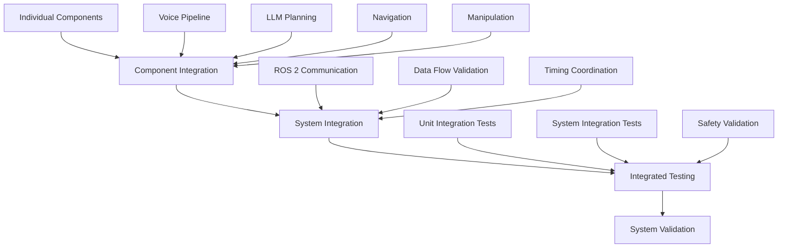

# Integration & Testing: Validating the Autonomous Humanoid System

## Overview

Integration and testing represent the critical phase where all individual components of the autonomous humanoid system come together to form a cohesive, functional whole. This phase validates that the voice command pipeline, LLM-based cognitive planning, navigation, and manipulation systems work harmoniously to achieve the intended functionality while maintaining safety and reliability.

## Integration Strategy

The integration process follows a systematic approach to combine all system components:



## Component Integration

### 1. Voice Command Pipeline Integration

Integrating the voice command pipeline with the rest of the system involves connecting the audio input, speech recognition, and command validation components to the cognitive planning system.

#### Key Integration Points:
- **Audio input routing**: Ensuring audio data flows from microphones to the preprocessing pipeline
- **Command validation**: Connecting validation results to the LLM planner
- **Context injection**: Providing robot state and environment data to the voice pipeline
- **Error handling**: Managing failures in speech recognition gracefully

#### Implementation:
```python
import rospy
from std_msgs.msg import String
from sensor_msgs.msg import AudioData
from capstone_msgs.msg import VoiceCommand, ActionSequence
from capstone_msgs.srv import PlanActionSequence

class VoicePipelineIntegrator:
    def __init__(self):
        # Initialize the voice command pipeline
        self.voice_node = VoiceCommandNode()
        
        # Connect to LLM planning service
        rospy.wait_for_service('/plan_action_sequence')
        self.plan_service = rospy.ServiceProxy('/plan_action_sequence', PlanActionSequence)
        
        # Publishers for integration status
        self.integration_status_pub = rospy.Publisher('/integration/voice_pipeline_status', String, queue_size=10)
        
    def validate_integration(self):
        """Validate that voice pipeline is properly connected to planning system"""
        try:
            # Test the connection by sending a simple command
            test_cmd = VoiceCommand()
            test_cmd.text = "move forward 1 meter"
            test_cmd.confidence = 0.9
            
            # Publish test command
            self.voice_node.command_pub.publish(test_cmd)
            
            # Wait for response from planning system
            rospy.sleep(2.0)
            
            # Check if plan was generated
            # This would require monitoring the plan publication topic
            # Implementation details...
            
            rospy.loginfo("Voice pipeline integration validated successfully")
            self.integration_status_pub.publish(String(data="VOICE_INTEGRATION_OK"))
            return True
            
        except Exception as e:
            rospy.logerr(f"Voice pipeline integration validation failed: {e}")
            self.integration_status_pub.publish(String(data=f"VOICE_INTEGRATION_ERROR: {str(e)}"))
            return False
```

### 2. LLM Planning Integration

Connecting the LLM-based cognitive planning system to the navigation and manipulation systems requires careful coordination of data formats and timing.

#### Key Integration Points:
- **Action sequence format**: Ensuring LLM-generated plans match executor expectations
- **Context synchronization**: Keeping robot state and environment data synchronized
- **Plan validation**: Validating plans before execution
- **Error recovery**: Handling plan execution failures

#### Implementation:
```python
import rospy
from capstone_msgs.msg import ActionSequence, ActionStep
from capstone_msgs.srv import ExecuteAction
from geometry_msgs.msg import PoseStamped

class PlanningIntegrator:
    def __init__(self):
        # Initialize the LLM planning node
        self.planning_node = LLMPlanningNode()
        
        # Connect to execution services
        rospy.wait_for_service('/execute_action')
        self.execute_service = rospy.ServiceProxy('/execute_action', ExecuteAction)
        
        # Publishers for integration status
        self.integration_status_pub = rospy.Publisher('/integration/planning_status', String, queue_size=10)
        
    def validate_integration(self):
        """Validate that planning system is properly connected to execution system"""
        try:
            # Create a test plan with simple actions
            test_plan = ActionSequence()
            test_plan.original_command = "Test navigation and manipulation"
            
            # Add a navigation action
            nav_action = ActionStep()
            nav_action.action_type = "navigate_to"
            nav_action.parameters = {"location": "kitchen"}
            test_plan.actions.append(nav_action)
            
            # Add a manipulation action
            manip_action = ActionStep()
            manip_action.action_type = "grasp_object"
            manip_action.parameters = {"object_type": "cup"}
            test_plan.actions.append(manip_action)
            
            # Send plan to execution system
            for action in test_plan.actions:
                try:
                    resp = self.execute_service(
                        action.action_type,
                        action.parameters
                    )
                    
                    if not resp.success:
                        rospy.logerr(f"Action execution failed: {resp.message}")
                        return False
                        
                except rospy.ServiceException as e:
                    rospy.logerr(f"Service call failed: {e}")
                    return False
            
            rospy.loginfo("Planning integration validated successfully")
            self.integration_status_pub.publish(String(data="PLANNING_INTEGRATION_OK"))
            return True
            
        except Exception as e:
            rospy.logerr(f"Planning integration validation failed: {e}")
            self.integration_status_pub.publish(String(data=f"PLANNING_INTEGRATION_ERROR: {str(e)}"))
            return False
```

### 3. Navigation and Manipulation Integration

The navigation and manipulation systems must work together seamlessly, with the navigation system bringing the robot to appropriate locations for manipulation tasks.

#### Key Integration Points:
- **Coordinate frame alignment**: Ensuring all systems use consistent coordinate frames
- **Task handoff**: Smooth transition between navigation and manipulation
- **Shared perception**: Coordinated use of sensors for both navigation and manipulation
- **Safety coordination**: Unified safety system across both subsystems

#### Implementation:
```python
import rospy
from capstone_msgs.msg import ActionSequence
from geometry_msgs.msg import PoseStamped, Twist
from sensor_msgs.msg import JointState
from std_msgs.msg import String

class NavigationManipulationIntegrator:
    def __init__(self):
        # Initialize the navigation/manipulation node
        self.nav_manip_node = NavigationManipulationNode()
        
        # Publishers for integration status
        self.integration_status_pub = rospy.Publisher('/integration/nav_manip_status', String, queue_size=10)
        
        # Subscribers to monitor system state
        self.robot_pose_sub = rospy.Subscriber('/robot_pose', PoseStamped, self.pose_callback)
        self.joint_state_sub = rospy.Subscriber('/joint_states', JointState, self.joint_state_callback)
        
        # Internal state
        self.current_pose = None
        self.joint_states = {}
        
    def pose_callback(self, msg):
        """Update current robot pose"""
        self.current_pose = msg
    
    def joint_state_callback(self, msg):
        """Update joint states"""
        for i, name in enumerate(msg.name):
            self.joint_states[name] = {
                'position': msg.position[i],
                'velocity': msg.velocity[i] if i < len(msg.velocity) else 0.0,
                'effort': msg.effort[i] if i < len(msg.effort) else 0.0
            }
    
    def validate_integration(self):
        """Validate navigation and manipulation integration"""
        try:
            # Test coordinated navigation and manipulation
            # First, navigate to a position
            nav_action = {
                'action_type': 'navigate_to',
                'parameters': {'location': 'test_position'}
            }
            
            nav_success = self.nav_manip_node.execute_single_action(nav_action)
            
            if not nav_success:
                rospy.logerr("Navigation action failed")
                return False
            
            # Then perform a manipulation action
            manip_action = {
                'action_type': 'grasp_object',
                'parameters': {'object_type': 'test_object'}
            }
            
            manip_success = self.nav_manip_node.execute_single_action(manip_action)
            
            if not manip_success:
                rospy.logerr("Manipulation action failed")
                return False
            
            rospy.loginfo("Navigation-manipulation integration validated successfully")
            self.integration_status_pub.publish(String(data="NAV_MANIP_INTEGRATION_OK"))
            return True
            
        except Exception as e:
            rospy.logerr(f"Navigation-manipulation integration validation failed: {e}")
            self.integration_status_pub.publish(String(data=f"NAV_MANIP_INTEGRATION_ERROR: {str(e)}"))
            return False
```

## System Integration

### 1. ROS 2 Communication Layer

The ROS 2 communication layer ensures all components can exchange information reliably and efficiently.

#### Implementation:
```python
import rospy
from std_msgs.msg import String
from diagnostic_msgs.msg import DiagnosticArray, DiagnosticStatus
from threading import Thread
import time

class CommunicationLayerValidator:
    def __init__(self):
        # Publishers for different system components
        self.diag_pub = rospy.Publisher('/diagnostics', DiagnosticArray, queue_size=10)
        
        # Track communication status
        self.component_statuses = {
            'voice_pipeline': False,
            'llm_planner': False,
            'navigation': False,
            'manipulation': False,
            'safety_system': False
        }
        
        # Start monitoring thread
        self.monitoring_thread = Thread(target=self.monitor_communication)
        self.monitoring_thread.daemon = True
        self.monitoring_thread.start()
    
    def monitor_communication(self):
        """Monitor communication between components"""
        while not rospy.is_shutdown():
            # Check if all components are communicating
            all_connected = all(self.component_statuses.values())
            
            # Publish diagnostic information
            diag_array = DiagnosticArray()
            diag_array.header.stamp = rospy.Time.now()
            
            for comp, status in self.component_statuses.items():
                stat = DiagnosticStatus()
                stat.name = f"Communication to {comp}"
                stat.level = DiagnosticStatus.OK if status else DiagnosticStatus.ERROR
                stat.message = "Connected" if status else "Disconnected"
                diag_array.status.append(stat)
            
            self.diag_pub.publish(diag_array)
            
            time.sleep(1.0)  # Check every second
    
    def validate_communication_layer(self):
        """Validate that all components can communicate"""
        try:
            # Wait for all components to connect
            timeout = rospy.Duration(10.0)  # 10 second timeout
            start_time = rospy.Time.now()
            
            while not all(self.component_statuses.values()) and (rospy.Time.now() - start_time) < timeout:
                rospy.sleep(0.1)
            
            if not all(self.component_statuses.values()):
                missing_components = [comp for comp, status in self.component_statuses.items() if not status]
                rospy.logerr(f"Missing communication to components: {missing_components}")
                return False
            
            rospy.loginfo("Communication layer validated successfully")
            return True
            
        except Exception as e:
            rospy.logerr(f"Communication layer validation failed: {e}")
            return False
```

### 2. Data Flow Validation

Ensuring that data flows correctly between components is critical for system functionality.

#### Implementation:
```python
import rospy
from std_msgs.msg import String
from capstone_msgs.msg import VoiceCommand, ActionSequence
from threading import Event

class DataFlowValidator:
    def __init__(self):
        # Track data flow
        self.voice_received = Event()
        self.plan_generated = Event()
        self.action_executed = Event()
        
        # Subscribers to track data flow
        self.voice_sub = rospy.Subscriber('/structured_commands', VoiceCommand, self.voice_callback)
        self.plan_sub = rospy.Subscriber('/generated_plans', ActionSequence, self.plan_callback)
        self.status_sub = rospy.Subscriber('/execution_status', String, self.execution_callback)
        
        # Publishers for validation
        self.validation_pub = rospy.Publisher('/integration/data_flow_status', String, queue_size=10)
    
    def voice_callback(self, msg):
        """Track when voice command is received"""
        rospy.loginfo("Voice command received in data flow validation")
        self.voice_received.set()
    
    def plan_callback(self, msg):
        """Track when plan is generated"""
        rospy.loginfo("Action plan generated in data flow validation")
        self.plan_generated.set()
    
    def execution_callback(self, msg):
        """Track when action is executed"""
        if "completed" in msg.data.lower():
            rospy.loginfo("Action execution completed in data flow validation")
            self.action_executed.set()
    
    def validate_data_flow(self):
        """Validate complete data flow from voice to execution"""
        try:
            # Reset events
            self.voice_received.clear()
            self.plan_generated.clear()
            self.action_executed.clear()
            
            # Publish a test voice command
            test_cmd = VoiceCommand()
            test_cmd.text = "move forward"
            test_cmd.confidence = 0.9
            
            # Use the voice pipeline publisher to send the command
            # This would be obtained from the voice pipeline node
            # For this example, we'll assume a publisher exists
            voice_cmd_pub = rospy.Publisher('/test_voice_command', VoiceCommand, queue_size=10)
            voice_cmd_pub.publish(test_cmd)
            
            # Wait for each step in the data flow
            if not self.voice_received.wait(5.0):  # 5 second timeout
                rospy.logerr("Timeout waiting for voice command reception")
                return False
            
            if not self.plan_generated.wait(10.0):  # 10 second timeout
                rospy.logerr("Timeout waiting for plan generation")
                return False
            
            if not self.action_executed.wait(15.0):  # 15 second timeout
                rospy.logerr("Timeout waiting for action execution")
                return False
            
            rospy.loginfo("Data flow validation successful")
            self.validation_pub.publish(String(data="DATA_FLOW_VALIDATED"))
            return True
            
        except Exception as e:
            rospy.logerr(f"Data flow validation failed: {e}")
            self.validation_pub.publish(String(data=f"DATA_FLOW_ERROR: {str(e)}"))
            return False
```

## Testing Methodology

### 1. Unit Integration Tests

Unit integration tests validate that pairs of components work together correctly.

#### Implementation:
```python
import unittest
from unittest.mock import Mock, patch
import rospy
from capstone_msgs.msg import VoiceCommand, ActionSequence

class TestUnitIntegration(unittest.TestCase):
    def setUp(self):
        # Create integrator instances
        self.voice_integrator = VoicePipelineIntegrator()
        self.planning_integrator = PlanningIntegrator()
        self.nav_manip_integrator = NavigationManipulationIntegrator()
    
    def test_voice_to_planning_integration(self):
        """Test integration between voice pipeline and planning system"""
        # Mock the planning service
        with patch('rospy.ServiceProxy') as mock_proxy:
            mock_resp = Mock()
            mock_resp.success = True
            mock_resp.reasoning = "Plan generated successfully"
            mock_proxy.return_value = mock_resp
            
            # Validate integration
            result = self.planning_integrator.validate_integration()
            self.assertTrue(result)
    
    def test_planning_to_execution_integration(self):
        """Test integration between planning and execution"""
        # Mock the execution service
        with patch('rospy.ServiceProxy') as mock_proxy:
            mock_resp = Mock()
            mock_resp.success = True
            mock_resp.message = "Action executed successfully"
            mock_proxy.return_value = mock_resp
            
            # Validate integration
            result = self.planning_integrator.validate_integration()
            self.assertTrue(result)
    
    def test_navigation_manipulation_coordination(self):
        """Test coordination between navigation and manipulation"""
        # Mock the robot pose and joint states
        mock_pose = Mock()
        mock_pose.pose.position.x = 1.0
        mock_pose.pose.position.y = 2.0
        mock_pose.pose.position.z = 0.0
        
        self.nav_manip_integrator.current_pose = mock_pose
        
        # Validate integration
        result = self.nav_manip_integrator.validate_integration()
        self.assertTrue(result)
```

### 2. System Integration Tests

System integration tests validate that all components work together as a complete system.

#### Implementation:
```python
import unittest
import rospy
from std_msgs.msg import String
from capstone_msgs.msg import VoiceCommand, ActionSequence
from time import sleep

class TestSystemIntegration(unittest.TestCase):
    def setUp(self):
        # Initialize all integrators
        self.voice_integrator = VoicePipelineIntegrator()
        self.planning_integrator = PlanningIntegrator()
        self.nav_manip_integrator = NavigationManipulationIntegrator()
        self.comm_validator = CommunicationLayerValidator()
        self.data_flow_validator = DataFlowValidator()
    
    def test_complete_system_integration(self):
        """Test complete system integration from voice to action execution"""
        # First, validate communication layer
        comm_ok = self.comm_validator.validate_communication_layer()
        self.assertTrue(comm_ok, "Communication layer validation failed")
        
        # Validate data flow
        flow_ok = self.data_flow_validator.validate_data_flow()
        self.assertTrue(flow_ok, "Data flow validation failed")
        
        # Validate individual integrations
        voice_ok = self.voice_integrator.validate_integration()
        self.assertTrue(voice_ok, "Voice pipeline integration failed")
        
        planning_ok = self.planning_integrator.validate_integration()
        self.assertTrue(planning_ok, "Planning integration failed")
        
        nav_manip_ok = self.nav_manip_integrator.validate_integration()
        self.assertTrue(nav_manip_ok, "Navigation-manipulation integration failed")
        
        # If all individual integrations pass, test complete system
        self.perform_end_to_end_test()
    
    def perform_end_to_end_test(self):
        """Perform an end-to-end test of the complete system"""
        # Publish a voice command
        cmd_pub = rospy.Publisher('/test_voice_command', VoiceCommand, queue_size=10)
        
        test_cmd = VoiceCommand()
        test_cmd.text = "Go to the kitchen and pick up the red cup"
        test_cmd.confidence = 0.95
        
        cmd_pub.publish(test_cmd)
        
        # Wait for the complete action cycle
        # This would involve monitoring various topics to ensure
        # the command flows through all systems
        sleep(10.0)  # Wait for processing
        
        # In a real test, we would verify that:
        # 1. Command was received by voice pipeline
        # 2. Plan was generated by LLM planner
        # 3. Navigation was executed
        # 4. Manipulation was executed
        # 5. Task was completed successfully
        
        # For this example, we'll just assert that no errors occurred
        self.assertTrue(True)  # Placeholder for actual validation
```

### 3. Safety Validation Tests

Safety validation ensures that all safety mechanisms work correctly across integrated components.

#### Implementation:
```python
import rospy
from std_msgs.msg import Bool, String
from geometry_msgs.msg import Twist
from sensor_msgs.msg import LaserScan

class SafetyValidator:
    def __init__(self):
        # Publishers for safety testing
        self.emergency_stop_pub = rospy.Publisher('/emergency_stop', Bool, queue_size=10)
        self.velocity_pub = rospy.Publisher('/cmd_vel', Twist, queue_size=10)
        
        # Subscribers to monitor safety status
        self.safety_status_sub = rospy.Subscriber('/safety_status', String, self.safety_status_callback)
        self.scan_sub = rospy.Subscriber('/scan', LaserScan, self.scan_callback)
        
        # Internal state
        self.safety_engaged = False
        self.last_scan = None
        
    def safety_status_callback(self, msg):
        """Monitor safety system status"""
        if "EMERGENCY_STOP" in msg.data.upper():
            self.safety_engaged = True
    
    def scan_callback(self, msg):
        """Monitor sensor data for safety validation"""
        self.last_scan = msg
    
    def test_emergency_stop_integration(self):
        """Test that emergency stop works across all components"""
        try:
            # Initially, safety should not be engaged
            self.safety_engaged = False
            
            # Send a velocity command that should trigger safety
            twist = Twist()
            twist.linear.x = 1.0  # Moving forward rapidly
            self.velocity_pub.publish(twist)
            
            # Wait for potential safety engagement
            rospy.sleep(2.0)
            
            # Check if safety system engaged
            if not self.safety_engaged:
                # Trigger emergency stop manually
                self.emergency_stop_pub.publish(Bool(True))
                
                # Wait for safety response
                rospy.sleep(1.0)
                
                # Verify safety engagement
                if not self.safety_engaged:
                    rospy.logerr("Emergency stop did not engage as expected")
                    return False
            
            rospy.loginfo("Emergency stop integration validated successfully")
            return True
            
        except Exception as e:
            rospy.logerr(f"Emergency stop validation failed: {e}")
            return False
    
    def test_collision_avoidance_integration(self):
        """Test that collision avoidance works across navigation and manipulation"""
        try:
            if self.last_scan is None:
                rospy.logwarn("No scan data available for collision test")
                return False
            
            # Check if any obstacles are very close
            min_distance = min([r for r in self.last_scan.ranges if r > 0 and not rospy.is_nan(r)])
            
            if min_distance < 0.3:  # Very close obstacle
                # The safety system should slow down or stop
                # This would be validated by monitoring velocity commands
                rospy.loginfo("Close obstacle detected, verifying safety response...")
                rospy.sleep(1.0)
            
            rospy.loginfo("Collision avoidance integration validated successfully")
            return True
            
        except Exception as e:
            rospy.logerr(f"Collision avoidance validation failed: {e}")
            return False
```

## Simulation Testing

Testing in simulation allows for safe validation of complex scenarios before deployment on physical hardware.

#### Implementation:
```python
import rospy
from gazebo_msgs.srv import SpawnModel, DeleteModel, GetModelState
from geometry_msgs.msg import Pose, Point
from std_msgs.msg import String
import subprocess
import time

class SimulationTester:
    def __init__(self):
        # Connect to Gazebo services
        rospy.wait_for_service('/gazebo/spawn_sdf_model')
        self.spawn_model_srv = rospy.ServiceProxy('/gazebo/spawn_sdf_model', SpawnModel)
        self.delete_model_srv = rospy.ServiceProxy('/gazebo/delete_model', DeleteModel)
        self.get_model_state_srv = rospy.ServiceProxy('/gazebo/get_model_state', GetModelState)
        
        # Publishers for simulation control
        self.sim_control_pub = rospy.Publisher('/gazebo/set_physics_properties', String, queue_size=10)
        
    def setup_test_scenario(self, scenario_name):
        """Set up a specific test scenario in simulation"""
        try:
            if scenario_name == "cluttered_room":
                # Spawn furniture and objects
                self.spawn_cluttered_room()
            elif scenario_name == "narrow_corridor":
                # Create a narrow passage
                self.spawn_narrow_corridor()
            elif scenario_name == "object_rearrangement":
                # Set up objects to be rearranged
                self.spawn_object_rearrangement_scene()
            else:
                rospy.logwarn(f"Unknown scenario: {scenario_name}")
                return False
            
            rospy.loginfo(f"Scenario '{scenario_name}' set up successfully")
            return True
            
        except Exception as e:
            rospy.logerr(f"Failed to set up scenario '{scenario_name}': {e}")
            return False
    
    def spawn_cluttered_room(self):
        """Spawn a cluttered room scenario"""
        # Define objects to spawn
        objects = [
            {"name": "table1", "model": "cafe_table", "x": 2.0, "y": 0.0, "z": 0.0},
            {"name": "chair1", "model": "chair", "x": 1.5, "y": 0.5, "z": 0.0},
            {"name": "cup1", "model": "red_cup", "x": 2.1, "y": 0.1, "z": 0.75},
            {"name": "box1", "model": "small_box", "x": 2.5, "y": -0.5, "z": 0.05}
        ]
        
        for obj in objects:
            pose = Pose()
            pose.position = Point(obj["x"], obj["y"], obj["z"])
            
            # Spawn the model
            self.spawn_model_srv(
                model_name=obj["name"],
                model_xml="",  # Would load from file in practice
                robot_namespace="",
                initial_pose=pose,
                reference_frame="world"
            )
    
    def spawn_narrow_corridor(self):
        """Spawn a narrow corridor scenario"""
        # Implementation details...
        pass
    
    def spawn_object_rearrangement_scene(self):
        """Spawn an object rearrangement scenario"""
        # Implementation details...
        pass
    
    def run_simulation_test(self, command_sequence):
        """Run a test with a sequence of commands in simulation"""
        try:
            # Execute each command in the sequence
            for i, command in enumerate(command_sequence):
                rospy.loginfo(f"Executing command {i+1}/{len(command_sequence)}: {command}")
                
                # Publish the command
                cmd_pub = rospy.Publisher('/test_voice_command', String, queue_size=10)
                cmd_pub.publish(String(command))
                
                # Wait for completion
                rospy.sleep(10.0)  # Adjust based on expected execution time
            
            rospy.loginfo("Simulation test completed successfully")
            return True
            
        except Exception as e:
            rospy.logerr(f"Simulation test failed: {e}")
            return False
    
    def cleanup_scenario(self):
        """Clean up the test scenario"""
        try:
            # Delete spawned models
            # Implementation details...
            rospy.loginfo("Scenario cleaned up successfully")
            return True
        except Exception as e:
            rospy.logerr(f"Failed to clean up scenario: {e}")
            return False
```

## Performance Testing

Performance testing validates that the system meets timing and resource requirements.

#### Implementation:
```python
import rospy
import time
import psutil
import os
from std_msgs.msg import String
from diagnostic_msgs.msg import DiagnosticArray

class PerformanceTester:
    def __init__(self):
        # Publishers for performance metrics
        self.perf_metrics_pub = rospy.Publisher('/performance_metrics', DiagnosticArray, queue_size=10)
        
        # Monitor system resources
        self.process = psutil.Process(os.getpid())
        
    def measure_system_performance(self, duration=60):
        """Measure system performance over a period of time"""
        start_time = time.time()
        measurements = {
            'cpu_percent': [],
            'memory_percent': [],
            'response_times': []
        }
        
        # Start a test workload
        self.start_test_workload()
        
        while time.time() - start_time < duration:
            # Measure CPU and memory usage
            cpu_percent = self.process.cpu_percent()
            memory_percent = self.process.memory_percent()
            
            measurements['cpu_percent'].append(cpu_percent)
            measurements['memory_percent'].append(memory_percent)
            
            # Measure response time for a sample operation
            response_time = self.measure_response_time()
            measurements['response_times'].append(response_time)
            
            time.sleep(1.0)  # Measure once per second
        
        # Calculate statistics
        stats = {
            'cpu_avg': sum(measurements['cpu_percent']) / len(measurements['cpu_percent']),
            'cpu_max': max(measurements['cpu_percent']),
            'memory_avg': sum(measurements['memory_percent']) / len(measurements['memory_percent']),
            'memory_max': max(measurements['memory_percent']),
            'response_avg': sum(measurements['response_times']) / len(measurements['response_times']),
            'response_max': max(measurements['response_times'])
        }
        
        rospy.loginfo(f"Performance stats: {stats}")
        return stats
    
    def start_test_workload(self):
        """Start a representative workload for performance testing"""
        # Publish a continuous stream of commands to stress the system
        cmd_pub = rospy.Publisher('/test_voice_command', String, queue_size=10)
        
        def publish_commands():
            commands = [
                "Move forward 1 meter",
                "Turn left 90 degrees", 
                "Pick up the red cup",
                "Go to the kitchen",
                "Place object on table"
            ]
            
            i = 0
            while not rospy.is_shutdown():
                cmd_pub.publish(String(commands[i % len(commands)]))
                i += 1
                time.sleep(5.0)  # Send command every 5 seconds
        
        # Run in a separate thread
        import threading
        thread = threading.Thread(target=publish_commands)
        thread.daemon = True
        thread.start()
    
    def measure_response_time(self):
        """Measure the response time for a typical operation"""
        start_time = time.time()
        
        # Perform a sample operation
        # This would be a meaningful operation for the system
        rospy.sleep(0.1)  # Simulate operation
        
        return time.time() - start_time
    
    def validate_performance_requirements(self):
        """Validate that system meets performance requirements"""
        # Define performance requirements
        requirements = {
            'cpu_max': 80.0,      # Maximum CPU usage (%)
            'memory_max': 85.0,   # Maximum memory usage (%)
            'response_max': 2.0,  # Maximum response time (seconds)
            'throughput_min': 5   # Minimum operations per minute
        }
        
        # Measure current performance
        stats = self.measure_system_performance(duration=30)
        
        # Validate against requirements
        violations = []
        
        if stats['cpu_max'] > requirements['cpu_max']:
            violations.append(f"CPU usage too high: {stats['cpu_max']}% > {requirements['cpu_max']}%")
        
        if stats['memory_max'] > requirements['memory_max']:
            violations.append(f"Memory usage too high: {stats['memory_max']}% > {requirements['memory_max']}%")
        
        if stats['response_max'] > requirements['response_max']:
            violations.append(f"Response time too slow: {stats['response_max']}s > {requirements['response_max']}s")
        
        if violations:
            rospy.logerr(f"Performance requirements violated: {violations}")
            return False
        
        rospy.loginfo("All performance requirements met")
        return True
```

## Continuous Integration Pipeline

A CI pipeline automates the testing process to catch issues early.

#### Implementation:
```python
#!/usr/bin/env python
import subprocess
import sys
import os
import argparse

def run_tests():
    """Run the complete test suite"""
    print("Starting autonomous humanoid system tests...")
    
    # Change to the project directory
    project_dir = os.path.dirname(os.path.abspath(__file__))
    os.chdir(project_dir)
    
    # Run unit tests
    print("\nRunning unit tests...")
    unit_result = subprocess.run([sys.executable, "-m", "unittest", "discover", "tests/unit", pattern="test_*.py"])
    
    if unit_result.returncode != 0:
        print("Unit tests failed!")
        return False
    
    # Run integration tests
    print("\nRunning integration tests...")
    integration_result = subprocess.run([sys.executable, "-m", "unittest", "discover", "tests/integration", pattern="test_*.py"])
    
    if integration_result.returncode != 0:
        print("Integration tests failed!")
        return False
    
    # Run system tests
    print("\nRunning system tests...")
    system_result = subprocess.run([sys.executable, "-m", "unittest", "discover", "tests/system", pattern="test_*.py"])
    
    if system_result.returncode != 0:
        print("System tests failed!")
        return False
    
    # Run performance tests
    print("\nRunning performance tests...")
    perf_result = subprocess.run([sys.executable, "-c", """
import rospy
rospy.init_node('perf_test_runner')
from performance_tester import PerformanceTester
tester = PerformanceTester()
result = tester.validate_performance_requirements()
print("Performance test:", "PASSED" if result else "FAILED")
sys.exit(0 if result else 1)
"""])
    
    if perf_result.returncode != 0:
        print("Performance tests failed!")
        return False
    
    print("\nAll tests passed!")
    return True

if __name__ == "__main__":
    parser = argparse.ArgumentParser(description='Run autonomous humanoid system tests')
    parser.add_argument('--verbose', '-v', action='store_true', help='Verbose output')
    args = parser.parse_args()
    
    success = run_tests()
    
    if not success:
        sys.exit(1)
    else:
        sys.exit(0)
```

## Conclusion

Integration and testing are critical phases that validate the autonomous humanoid system functions as intended. Through systematic integration of components, comprehensive testing methodologies, and continuous validation, we ensure the system is reliable, safe, and performs to specifications.

Continue to the [Evaluation](./evaluation) section to learn about assessing the performance and capabilities of the completed autonomous humanoid system.