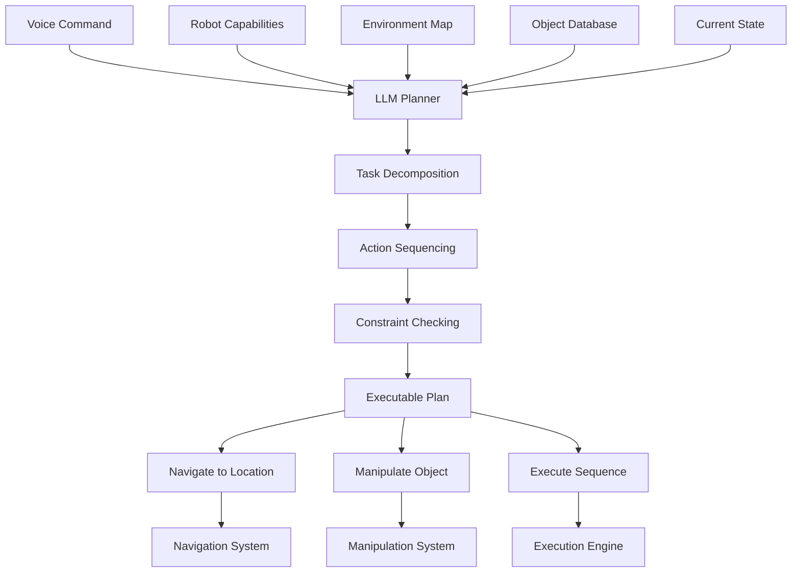

# LLM-Based Cognitive Planning

## Overview

The LLM-based cognitive planning system serves as the central intelligence of the autonomous humanoid, translating high-level voice commands into sequences of executable robotic actions. This system leverages the reasoning capabilities of Large Language Models to understand complex commands, decompose them into primitive actions, and generate task plans that account for the robot's capabilities and environmental constraints.

## Architecture

The cognitive planning system integrates with the voice command pipeline and other system components:



## Core Components

### 1. LLM Integration Layer

The LLM integration layer manages communication with the language model API and handles prompt construction and response parsing.

#### Key Features:
- **Prompt templating**: Standardized templates for different types of commands
- **Context injection**: Incorporation of robot state, environment data, and capabilities
- **Response parsing**: Extraction of structured action sequences from LLM responses
- **Error handling**: Management of API failures and malformed responses

#### Implementation:
```python
import openai
import json
from typing import Dict, List, Any
import rospy

class LLMPlanner:
    def __init__(self, api_key: str, model: str = "gpt-4"):
        openai.api_key = api_key
        self.model = model
        self.client = openai.OpenAI(api_key=api_key)
        
        # Define action schema for response parsing
        self.action_schema = {
            "type": "object",
            "properties": {
                "actions": {
                    "type": "array",
                    "items": {
                        "type": "object",
                        "properties": {
                            "action_type": {"type": "string"},
                            "parameters": {"type": "object"},
                            "description": {"type": "string"}
                        },
                        "required": ["action_type", "parameters", "description"]
                    }
                },
                "reasoning": {"type": "string"}
            },
            "required": ["actions", "reasoning"]
        }
    
    def plan_action_sequence(self, command: str, context: Dict[str, Any]) -> List[Dict]:
        """
        Generate a sequence of actions based on the command and context
        """
        prompt = self.construct_prompt(command, context)
        
        try:
            response = self.client.chat.completions.create(
                model=self.model,
                messages=[
                    {"role": "system", "content": self.get_system_prompt()},
                    {"role": "user", "content": prompt}
                ],
                temperature=0.1,
                max_tokens=1000,
                response_format={"type": "json_object"}
            )
            
            response_json = json.loads(response.choices[0].message.content)
            return response_json.get("actions", [])
        
        except Exception as e:
            rospy.logerr(f"LLM planning error: {e}")
            return self.generate_fallback_plan(command)
    
    def construct_prompt(self, command: str, context: Dict[str, Any]) -> str:
        """
        Construct the prompt with command and contextual information
        """
        prompt = f"""
        You are an intelligent planning system for an autonomous humanoid robot. 
        Your task is to decompose high-level commands into sequences of executable actions.
        
        Command: "{command}"
        
        Context Information:
        - Robot Capabilities: {context.get('capabilities', {})}
        - Current Position: {context.get('current_position', {})}
        - Available Objects: {context.get('available_objects', [])}
        - Environment Layout: {context.get('environment_layout', {})}
        - Safety Constraints: {context.get('safety_constraints', {})}
        
        Please respond with a JSON object containing:
        1. "reasoning": Your thought process for decomposing the command
        2. "actions": An array of action objects with:
           - "action_type": The type of action (navigate, detect, grasp, place, etc.)
           - "parameters": Specific parameters for the action
           - "description": Human-readable description of the action
        
        Action types available: navigate_to, detect_object, grasp_object, place_object, 
        speak_response, wait, check_condition, execute_sequence
        """
        return prompt
    
    def get_system_prompt(self) -> str:
        """
        Return the system prompt that defines the LLM's role
        """
        return """
        You are an intelligent planning system for an autonomous humanoid robot. 
        Your role is to decompose high-level commands into sequences of executable actions.
        
        Guidelines:
        1. Always consider safety first - ensure actions comply with safety constraints
        2. Break down complex commands into simple, executable steps
        3. Account for the robot's physical limitations and capabilities
        4. Include error handling and verification steps where appropriate
        5. Ensure each action is achievable with the robot's available tools
        6. Consider the environment and spatial relationships between objects
        7. If uncertain about an object or location, include a detection step
        """
    
    def generate_fallback_plan(self, command: str) -> List[Dict]:
        """
        Generate a basic plan if LLM fails
        """
        # Simple fallback for common commands
        if "go to" in command.lower() or "move to" in command.lower():
            return [{
                "action_type": "navigate_to",
                "parameters": {"location": "unknown"},
                "description": "Navigate to specified location"
            }]
        elif "pick up" in command.lower() or "grasp" in command.lower():
            return [
                {
                    "action_type": "detect_object",
                    "parameters": {"object_type": "unknown"},
                    "description": "Detect the object to be grasped"
                },
                {
                    "action_type": "grasp_object",
                    "parameters": {"object_id": "unknown"},
                    "description": "Grasp the detected object"
                }
            ]
        else:
            return [{
                "action_type": "speak_response",
                "parameters": {"text": "Unable to understand command"},
                "description": "Report inability to understand command"
            }]
```

### 2. Task Decomposition Engine

The task decomposition engine takes high-level goals and breaks them down into primitive actions that the robot can execute.

#### Key Features:
- **Hierarchical decomposition**: Breaking complex tasks into subtasks
- **Dependency management**: Ensuring actions are sequenced correctly
- **Capability matching**: Matching tasks to available robot capabilities
- **Resource allocation**: Managing robot resources during task execution

#### Implementation:
```python
from typing import List, Dict, Any
from enum import Enum

class ActionType(Enum):
    NAVIGATE_TO = "navigate_to"
    DETECT_OBJECT = "detect_object"
    GRASP_OBJECT = "grasp_object"
    PLACE_OBJECT = "place_object"
    SPEAK_RESPONSE = "speak_response"
    WAIT = "wait"
    CHECK_CONDITION = "check_condition"
    EXECUTE_SEQUENCE = "execute_sequence"

class TaskDecomposer:
    def __init__(self):
        self.action_templates = {
            "clean_room": [
                {"action_type": "detect_object", "parameters": {"object_type": "trash"}},
                {"action_type": "grasp_object", "parameters": {"object_id": "dynamic"}},
                {"action_type": "navigate_to", "parameters": {"location": "trash_bin"}},
                {"action_type": "place_object", "parameters": {"location": "trash_bin"}}
            ],
            "bring_item": [
                {"action_type": "detect_object", "parameters": {"object_type": "dynamic"}},
                {"action_type": "grasp_object", "parameters": {"object_id": "dynamic"}},
                {"action_type": "navigate_to", "parameters": {"location": "destination"}},
                {"action_type": "place_object", "parameters": {"location": "destination"}}
            ],
            "find_person": [
                {"action_type": "navigate_to", "parameters": {"location": "common_area"}},
                {"action_type": "detect_object", "parameters": {"object_type": "person"}},
                {"action_type": "speak_response", "parameters": {"text": "Person located"}}
            ]
        }
    
    def decompose_task(self, command: str, capabilities: List[str], 
                      environment: Dict[str, Any]) -> List[Dict]:
        """
        Decompose a high-level command into a sequence of primitive actions
        """
        # First, try to match the command to a known template
        matched_template = self.match_command_to_template(command)
        
        if matched_template:
            return self.instantiate_template(matched_template, command, environment)
        
        # If no template matches, return the raw LLM plan
        return self.generate_generic_decomposition(command, capabilities, environment)
    
    def match_command_to_template(self, command: str) -> str:
        """
        Match the command to a known task template
        """
        command_lower = command.lower()
        
        if "clean" in command_lower and "room" in command_lower:
            return "clean_room"
        elif "bring" in command_lower or "get" in command_lower:
            return "bring_item"
        elif "find" in command_lower and "person" in command_lower:
            return "find_person"
        
        return None
    
    def instantiate_template(self, template_name: str, command: str, 
                           environment: Dict[str, Any]) -> List[Dict]:
        """
        Instantiate a template with specific parameters from the command
        """
        template = self.action_templates[template_name]
        instantiated_actions = []
        
        for action in template:
            # Clone the action to avoid modifying the template
            inst_action = action.copy()
            
            # Replace dynamic parameters based on command
            if inst_action["action_type"] == "detect_object":
                obj_type = self.extract_object_type(command)
                inst_action["parameters"]["object_type"] = obj_type
            
            elif inst_action["action_type"] == "navigate_to":
                location = self.extract_location(command, environment)
                inst_action["parameters"]["location"] = location
            
            elif inst_action["action_type"] == "grasp_object":
                # Object ID would be determined dynamically after detection
                inst_action["parameters"]["object_id"] = "dynamic"
            
            instantiated_actions.append(inst_action)
        
        return instantiated_actions
    
    def extract_object_type(self, command: str) -> str:
        """
        Extract object type from command using simple NLP
        """
        # This is a simplified version - in practice, use more sophisticated NLP
        words = command.lower().split()
        
        # Common object categories
        objects = {
            "cup", "bottle", "book", "pen", "phone", "keys", 
            "trash", "box", "plate", "fork", "knife", "spoon"
        }
        
        for word in words:
            if word in objects:
                return word
        
        # If no specific object found, try to infer from context
        if "drink" in command.lower():
            return "beverage"
        elif "read" in command.lower():
            return "reading_material"
        elif "trash" in command.lower():
            return "waste"
        
        return "unknown"
    
    def extract_location(self, command: str, environment: Dict[str, Any]) -> str:
        """
        Extract destination location from command
        """
        # This is a simplified version - in practice, use more sophisticated NLP
        words = command.lower().split()
        
        # Common locations in the environment
        locations = environment.get("named_locations", [])
        
        for word in words:
            for loc in locations:
                if word in loc.lower():
                    return loc
        
        # If no specific location found, try common destinations
        if "kitchen" in command.lower():
            return "kitchen"
        elif "bedroom" in command.lower():
            return "bedroom"
        elif "living room" in command.lower() or "livingroom" in command.lower():
            return "living_room"
        elif "trash" in command.lower():
            return "trash_bin"
        
        return "unknown"
    
    def generate_generic_decomposition(self, command: str, capabilities: List[str], 
                                    environment: Dict[str, Any]) -> List[Dict]:
        """
        Generate a generic decomposition when no template matches
        """
        # For now, return an empty list - this would typically call the LLM
        return []
```

### 3. Action Sequencing and Validation

The action sequencing component ensures that generated action sequences are valid and executable.

#### Key Features:
- **Sequence validation**: Checking that actions form a valid sequence
- **Precondition checking**: Ensuring each action's prerequisites are met
- **Conflict detection**: Identifying potential conflicts between actions
- **Optimization**: Improving efficiency of action sequences

#### Implementation:
```python
from typing import List, Dict, Any, Tuple

class ActionSequencer:
    def __init__(self):
        # Define preconditions for each action type
        self.preconditions = {
            "grasp_object": ["robot_at_object_location", "object_detected"],
            "place_object": ["object_grasped"],
            "navigate_to": ["robot_operational"],
            "detect_object": ["robot_operational", "sensor_operational"]
        }
        
        # Define effects of each action type
        self.effects = {
            "navigate_to": ["robot_at_location"],
            "detect_object": ["object_detected"],
            "grasp_object": ["object_grasped"],
            "place_object": ["object_placed", "object_not_grasped"]
        }
    
    def validate_sequence(self, actions: List[Dict], initial_state: Dict[str, Any]) -> Tuple[bool, str]:
        """
        Validate that the action sequence is executable
        """
        current_state = initial_state.copy()
        
        for i, action in enumerate(actions):
            action_type = action.get("action_type")
            
            # Check preconditions
            preconditions = self.preconditions.get(action_type, [])
            for precondition in preconditions:
                if precondition not in current_state or not current_state[precondition]:
                    return False, f"Action {i} ({action_type}) missing precondition: {precondition}"
            
            # Apply effects
            effects = self.effects.get(action_type, [])
            for effect in effects:
                current_state[effect] = True
                
                # Handle negative effects
                if effect.startswith("object_not_"):
                    positive_effect = effect.replace("object_not_", "object_")
                    if positive_effect in current_state:
                        del current_state[positive_effect]
        
        return True, "Valid sequence"
    
    def optimize_sequence(self, actions: List[Dict]) -> List[Dict]:
        """
        Optimize the action sequence for efficiency
        """
        optimized = []
        
        i = 0
        while i < len(actions):
            current = actions[i]
            
            # Look ahead for opportunities to combine or eliminate actions
            if (i < len(actions) - 1 and 
                current["action_type"] == "navigate_to" and
                actions[i+1]["action_type"] == "navigate_to"):
                # Combine consecutive navigations if they're to the same location
                if current["parameters"]["location"] == actions[i+1]["parameters"]["location"]:
                    # Skip the duplicate navigation
                    optimized.append(current)
                    i += 2
                    continue
            
            optimized.append(current)
            i += 1
        
        return optimized
```

### 4. Integration with ROS 2

The LLM planning system integrates with the ROS 2 ecosystem:

```python
import rospy
from std_msgs.msg import String
from geometry_msgs.msg import Pose
from capstone_msgs.msg import VoiceCommand, ActionSequence
from capstone_msgs.srv import PlanActionSequence

class LLMPlanningNode:
    def __init__(self):
        rospy.init_node('llm_planning_node')
        
        # Publishers
        self.plan_pub = rospy.Publisher('/generated_plans', ActionSequence, queue_size=10)
        self.status_pub = rospy.Publisher('/planning_status', String, queue_size=10)
        
        # Subscribers
        self.command_sub = rospy.Subscriber('/structured_commands', VoiceCommand, self.command_callback)
        
        # Service server
        self.plan_service = rospy.Service('/plan_action_sequence', PlanActionSequence, self.handle_plan_request)
        
        # Initialize components
        self.llm_planner = LLMPlanner(api_key=rospy.get_param('~openai_api_key'))
        self.task_decomposer = TaskDecomposer()
        self.action_sequencer = ActionSequencer()
        
    def command_callback(self, command_msg):
        """
        Handle incoming voice commands and generate action plans
        """
        try:
            # Gather context information
            context = self.gather_context()
            
            # Plan action sequence using LLM
            actions = self.llm_planner.plan_action_sequence(command_msg.text, context)
            
            # Validate the sequence
            is_valid, reason = self.action_sequencer.validate_sequence(actions, context.get("initial_state", {}))
            
            if is_valid:
                # Optimize the sequence
                optimized_actions = self.action_sequencer.optimize_sequence(actions)
                
                # Publish the plan
                plan_msg = ActionSequence()
                plan_msg.actions = optimized_actions
                plan_msg.original_command = command_msg.text
                plan_msg.confidence = command_msg.confidence
                
                self.plan_pub.publish(plan_msg)
                
                rospy.loginfo(f"Generated plan for command: {command_msg.text}")
                self.status_pub.publish(String(data=f"Plan generated for: {command_msg.text}"))
            else:
                rospy.logerr(f"Invalid plan generated: {reason}")
                self.status_pub.publish(String(data=f"Plan validation failed: {reason}"))
                
        except Exception as e:
            rospy.logerr(f"Error in LLM planning: {e}")
            self.status_pub.publish(String(data=f"Planning error: {str(e)}"))
    
    def handle_plan_request(self, req):
        """
        Handle service requests for action planning
        """
        try:
            context = self.gather_context()
            actions = self.llm_planner.plan_action_sequence(req.command, context)
            
            is_valid, reason = self.action_sequencer.validate_sequence(actions, context.get("initial_state", {}))
            
            if is_valid:
                optimized_actions = self.action_sequencer.optimize_sequence(actions)
                
                # Create response
                resp = PlanActionSequence._response_class()
                resp.success = True
                resp.actions = optimized_actions
                resp.reasoning = "Plan generated successfully"
                
                return resp
            else:
                resp = PlanActionSequence._response_class()
                resp.success = False
                resp.reasoning = f"Plan validation failed: {reason}"
                
                return resp
                
        except Exception as e:
            rospy.logerr(f"Service planning error: {e}")
            
            resp = PlanActionSequence._response_class()
            resp.success = False
            resp.reasoning = f"Planning error: {str(e)}"
            
            return resp
    
    def gather_context(self) -> dict:
        """
        Gather context information for planning
        """
        # This would typically query other nodes for current state
        return {
            "capabilities": ["navigation", "manipulation", "speech"],
            "current_position": {"x": 0.0, "y": 0.0, "z": 0.0},
            "available_objects": ["cup", "book", "keys"],
            "environment_layout": {"rooms": ["kitchen", "living_room", "bedroom"]},
            "safety_constraints": ["avoid_people", "stay_in_designated_areas"],
            "initial_state": {
                "robot_operational": True,
                "sensor_operational": True,
                "object_grasped": False
            }
        }
```

## Safety Considerations

### Command Validation
- Implement strict validation of LLM-generated action sequences
- Include safety checks for each action type
- Maintain a whitelist of allowed actions

### Fail-Safe Mechanisms
- Implement timeout mechanisms for long-running planning operations
- Include fallback plans for when LLM fails to generate valid sequences
- Ensure graceful degradation when planning fails

### Human Oversight
- Provide mechanisms for human intervention during plan execution
- Log all planning decisions for audit purposes
- Include confirmation steps for sensitive operations

## Performance Optimization

### Caching Strategies
- Cache frequently used plans for common commands
- Implement plan similarity matching to reuse existing plans
- Store successful plan patterns for future use

### Resource Management
- Monitor API usage and costs for LLM services
- Implement rate limiting to prevent excessive API calls
- Use local models for simple planning tasks when possible

## Testing and Validation

### Unit Tests
```python
import unittest
from unittest.mock import Mock, patch

class TestLLMPlanning(unittest.TestCase):
    def setUp(self):
        self.planner = LLMPlanner(api_key="test-key")
        self.decomposer = TaskDecomposer()
    
    @patch('openai.OpenAI')
    def test_plan_clean_room(self, mock_openai):
        # Mock LLM response
        mock_response = Mock()
        mock_response.choices = [Mock()]
        mock_response.choices[0].message.content = '''
        {
            "reasoning": "User wants to clean the room, so I need to find trash and dispose of it",
            "actions": [
                {
                    "action_type": "detect_object",
                    "parameters": {"object_type": "trash"},
                    "description": "Find trash in the room"
                },
                {
                    "action_type": "grasp_object",
                    "parameters": {"object_id": "trash_item"},
                    "description": "Pick up the trash"
                },
                {
                    "action_type": "navigate_to",
                    "parameters": {"location": "trash_bin"},
                    "description": "Go to the trash bin"
                },
                {
                    "action_type": "place_object",
                    "parameters": {"location": "trash_bin"},
                    "description": "Dispose of the trash"
                }
            ]
        }
        '''
        mock_openai.return_value.chat.completions.create.return_value = mock_response
        
        context = {
            "capabilities": ["navigation", "manipulation"],
            "current_position": {"x": 0.0, "y": 0.0},
            "available_objects": ["paper", "bottle"],
            "environment_layout": {"rooms": ["living_room", "kitchen"]},
            "safety_constraints": ["avoid_people"]
        }
        
        actions = self.planner.plan_action_sequence("Clean the room", context)
        
        self.assertEqual(len(actions), 4)
        self.assertEqual(actions[0]["action_type"], "detect_object")
        self.assertEqual(actions[1]["action_type"], "grasp_object")
        self.assertEqual(actions[2]["action_type"], "navigate_to")
        self.assertEqual(actions[3]["action_type"], "place_object")
    
    def test_task_decomposition(self):
        capabilities = ["navigation", "manipulation"]
        environment = {
            "named_locations": ["kitchen", "bedroom", "living_room", "trash_bin"]
        }
        
        # Test clean room template
        actions = self.decomposer.decompose_task("Clean the room", capabilities, environment)
        self.assertGreaterEqual(len(actions), 2)  # At least detect and grasp actions
        
        # Test bring item template
        actions = self.decomposer.decompose_task("Bring me the cup", capabilities, environment)
        self.assertGreaterEqual(len(actions), 2)  # At least detect and grasp actions
```

### Integration Tests
- Test end-to-end planning from voice command to action sequence
- Validate plan safety and feasibility
- Test error handling and fallback mechanisms

## Conclusion

The LLM-based cognitive planning system provides the autonomous humanoid with sophisticated reasoning capabilities, enabling it to understand complex commands and translate them into executable action sequences. By combining the power of large language models with structured planning techniques, the system can handle a wide variety of tasks while ensuring safety and feasibility.

Continue to the [Navigation & Manipulation](./navigation-manipulation) section to learn about implementing the systems that enable the robot to physically interact with its environment.