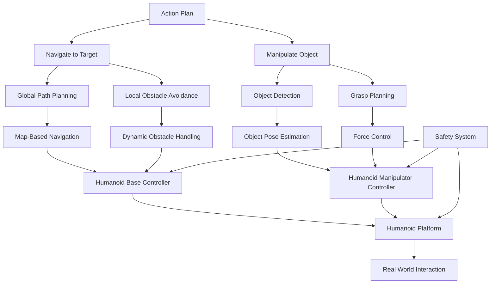

# Navigation & Manipulation: Enabling Physical Interaction

## Overview

The navigation and manipulation systems are the physical embodiment of the autonomous humanoid's capabilities, allowing it to move through its environment and interact with objects. This section covers the implementation of both navigation for locomotion and manipulation for object interaction, two critical components that enable the robot to execute the plans generated by the LLM-based cognitive planner.

## Architecture

The navigation and manipulation systems work together to enable the robot to physically execute tasks:



## Navigation System

### 1. Global Path Planning

The global path planner computes a high-level path from the robot's current position to the goal location, taking into account static obstacles and environmental constraints.

#### Key Features:
- **Map-based planning**: Uses occupancy grid maps for path computation
- **Cost-aware routing**: Considers terrain difficulty and safety factors
- **Dynamic replanning**: Updates paths when the environment changes
- **Multi-modal navigation**: Handles different types of terrain and obstacles

#### Implementation:
```python
import rospy
import numpy as np
from nav_msgs.msg import OccupancyGrid, Path
from geometry_msgs.msg import PoseStamped, Point
from visualization_msgs.msg import Marker
import heapq
from typing import List, Tuple

class GlobalPathPlanner:
    def __init__(self):
        # Subscribe to map and publish paths
        self.map_sub = rospy.Subscriber('/map', OccupancyGrid, self.map_callback)
        self.path_pub = rospy.Publisher('/global_plan', Path, queue_size=1)
        self.visualization_pub = rospy.Publisher('/path_visualization', Marker, queue_size=1)
        
        # Store the map
        self.map_data = None
        self.map_resolution = 0.05  # meters per cell
        self.map_origin = [0.0, 0.0, 0.0]  # x, y, theta in map frame
        
        # Initialize path planning algorithm
        self.path_algorithm = "astar"  # Could also be "dijkstra", "rrt", etc.
    
    def map_callback(self, msg):
        """Callback to store the occupancy grid map"""
        self.map_data = msg
        self.map_resolution = msg.info.resolution
        self.map_origin = [
            msg.info.origin.position.x,
            msg.info.origin.position.y,
            msg.info.origin.orientation.z  # Simplified
        ]
    
    def plan_path(self, start_pose: PoseStamped, goal_pose: PoseStamped) -> Path:
        """Plan a path from start to goal using A* algorithm"""
        if self.map_data is None:
            rospy.logwarn("No map available for path planning")
            return Path()
        
        # Convert poses to map coordinates
        start_cell = self.pose_to_map_coords(start_pose.pose)
        goal_cell = self.pose_to_map_coords(goal_pose.pose)
        
        # Run A* pathfinding
        path_cells = self.a_star_search(start_cell, goal_cell)
        
        if not path_cells:
            rospy.logwarn("No valid path found")
            return Path()
        
        # Convert path back to world coordinates
        path_msg = Path()
        path_msg.header.frame_id = "map"
        path_msg.header.stamp = rospy.Time.now()
        
        for cell in path_cells:
            world_pose = self.map_coords_to_pose(cell)
            pose_stamped = PoseStamped()
            pose_stamped.header.frame_id = "map"
            pose_stamped.header.stamp = rospy.Time.now()
            pose_stamped.pose = world_pose
            path_msg.poses.append(pose_stamped)
        
        # Publish the path
        self.path_pub.publish(path_msg)
        
        # Visualize the path
        self.visualize_path(path_msg)
        
        return path_msg
    
    def pose_to_map_coords(self, pose) -> Tuple[int, int]:
        """Convert world pose to map cell coordinates"""
        x = int((pose.position.x - self.map_origin[0]) / self.map_resolution)
        y = int((pose.position.y - self.map_origin[1]) / self.map_resolution)
        return (x, y)
    
    def map_coords_to_pose(self, coords: Tuple[int, int]) -> PoseStamped:
        """Convert map cell coordinates to world pose"""
        x = coords[0] * self.map_resolution + self.map_origin[0]
        y = coords[1] * self.map_resolution + self.map_origin[1]
        
        pose = PoseStamped()
        pose.position.x = x
        pose.position.y = y
        pose.position.z = 0.0  # Assume flat ground
        return pose
    
    def a_star_search(self, start: Tuple[int, int], goal: Tuple[int, int]) -> List[Tuple[int, int]]:
        """A* pathfinding algorithm implementation"""
        # Convert map data to 2D grid
        width = self.map_data.info.width
        height = self.map_data.info.height
        grid = np.array(self.map_data.data).reshape(height, width)
        
        # Define movement directions (8-connected)
        directions = [
            (-1, -1), (-1, 0), (-1, 1),
            (0, -1),           (0, 1),
            (1, -1),  (1, 0),  (1, 1)
        ]
        
        # Heuristic function (Euclidean distance)
        def heuristic(a, b):
            return np.sqrt((a[0] - b[0])**2 + (a[1] - b[1])**2)
        
        # Priority queue for A*
        open_set = [(0, start)]
        came_from = {}
        g_score = {start: 0}
        f_score = {start: heuristic(start, goal)}
        
        while open_set:
            current = heapq.heappop(open_set)[1]
            
            if current == goal:
                # Reconstruct path
                path = []
                while current in came_from:
                    path.append(current)
                    current = came_from[current]
                path.append(start)
                return path[::-1]  # Reverse to get start->goal path
            
            for dx, dy in directions:
                neighbor = (current[0] + dx, current[1] + dy)
                
                # Check bounds
                if not (0 <= neighbor[0] < width and 0 <= neighbor[1] < height):
                    continue
                
                # Check if cell is occupied (value > 50 means obstacle)
                if grid[neighbor[1], neighbor[0]] > 50:
                    continue
                
                # Calculate tentative g_score
                tentative_g_score = g_score[current] + np.sqrt(dx**2 + dy**2)
                
                if neighbor not in g_score or tentative_g_score < g_score[neighbor]:
                    came_from[neighbor] = current
                    g_score[neighbor] = tentative_g_score
                    f_score[neighbor] = tentative_g_score + heuristic(neighbor, goal)
                    heapq.heappush(open_set, (f_score[neighbor], neighbor))
        
        # No path found
        return []
    
    def visualize_path(self, path_msg: Path):
        """Visualize the planned path in RViz"""
        marker = Marker()
        marker.header.frame_id = "map"
        marker.header.stamp = rospy.Time.now()
        marker.ns = "path"
        marker.id = 0
        marker.type = Marker.LINE_STRIP
        marker.action = Marker.ADD
        
        # Set the scale of the marker
        marker.scale.x = 0.05  # Line width
        
        # Set the color (green)
        marker.color.r = 0.0
        marker.color.g = 1.0
        marker.color.b = 0.0
        marker.color.a = 1.0
        
        # Set the points
        for pose_stamped in path_msg.poses:
            point = Point()
            point.x = pose_stamped.pose.position.x
            point.y = pose_stamped.pose.position.y
            point.z = 0.05  # Slightly above ground for visibility
            marker.points.append(point)
        
        self.visualization_pub.publish(marker)
```

### 2. Local Obstacle Avoidance

The local obstacle avoidance system handles dynamic obstacles and fine-tunes the robot's path in real-time.

#### Key Features:
- **Real-time obstacle detection**: Using LIDAR and cameras for dynamic obstacle detection
- **Velocity obstacles**: Computing safe velocities to avoid collisions
- **Smooth trajectory generation**: Creating smooth paths around obstacles
- **Emergency stopping**: Immediate stopping when collision is imminent

#### Implementation:
```python
import rospy
from sensor_msgs.msg import LaserScan, PointCloud2
from geometry_msgs.msg import Twist, Vector3
from visualization_msgs.msg import Marker
import numpy as np
from typing import List, Tuple

class LocalObstacleAvoider:
    def __init__(self):
        # Publishers and subscribers
        self.cmd_vel_pub = rospy.Publisher('/cmd_vel', Twist, queue_size=1)
        self.laser_sub = rospy.Subscriber('/scan', LaserScan, self.laser_callback)
        self.pointcloud_sub = rospy.Subscriber('/points', PointCloud2, self.pc_callback)
        
        # Visualization
        self.obstacle_pub = rospy.Publisher('/local_obstacles', Marker, queue_size=1)
        
        # Parameters
        self.robot_radius = 0.3  # meters
        self.safe_distance = 0.5  # meters
        self.max_velocity = 0.5  # m/s
        self.rotation_speed = 0.5  # rad/s
        
        # Internal state
        self.laser_data = None
        self.obstacles = []
        self.target_direction = Vector3(1, 0, 0)  # Initially moving forward
        
    def laser_callback(self, msg):
        """Process laser scan data to detect obstacles"""
        self.laser_data = msg
        self.detect_obstacles_from_laser()
    
    def pc_callback(self, msg):
        """Process point cloud data for obstacle detection"""
        # Process point cloud for 3D obstacle detection
        # Implementation details...
        pass
    
    def detect_obstacles_from_laser(self):
        """Detect obstacles from laser scan data"""
        if self.laser_data is None:
            return
        
        ranges = self.laser_data.ranges
        angle_min = self.laser_data.angle_min
        angle_increment = self.laser_data.angle_increment
        
        self.obstacles = []
        
        for i, range_val in enumerate(ranges):
            if range_val < self.safe_distance and not np.isnan(range_val):
                angle = angle_min + i * angle_increment
                x = range_val * np.cos(angle)
                y = range_val * np.sin(angle)
                self.obstacles.append((x, y))
    
    def compute_velocity_command(self, target_direction: Vector3) -> Twist:
        """Compute velocity command based on target direction and obstacles"""
        cmd = Twist()
        
        # If no obstacles detected, move toward target
        if not self.obstacles:
            cmd.linear.x = min(self.max_velocity, np.linalg.norm([target_direction.x, target_direction.y]))
            cmd.angular.z = 0.0
            return cmd
        
        # Find safe direction to move
        safe_direction = self.find_safe_direction(target_direction)
        
        if safe_direction is not None:
            # Move in safe direction
            cmd.linear.x = min(self.max_velocity, np.linalg.norm(safe_direction))
            cmd.angular.z = np.arctan2(safe_direction[1], safe_direction[0])
        else:
            # Emergency stop if no safe direction found
            cmd.linear.x = 0.0
            cmd.angular.z = 0.0
            rospy.logwarn("Emergency stop: No safe direction found!")
        
        return cmd
    
    def find_safe_direction(self, target_direction: Vector3) -> Tuple[float, float]:
        """Find a safe direction to move considering obstacles"""
        # Simple sampling-based approach
        num_samples = 36  # Sample every 10 degrees
        best_direction = None
        best_score = -float('inf')
        
        for i in range(num_samples):
            angle = 2 * np.pi * i / num_samples
            direction = (np.cos(angle), np.sin(angle))
            
            # Score based on closeness to target and obstacle clearance
            target_alignment = np.dot(direction, (target_direction.x, target_direction.y))
            obstacle_clearance = self.compute_obstacle_clearance(direction)
            
            score = 0.7 * target_alignment + 0.3 * obstacle_clearance
            
            if score > best_score and obstacle_clearance > 0:
                best_score = score
                best_direction = direction
        
        return best_direction
    
    def compute_obstacle_clearance(self, direction: Tuple[float, float]) -> float:
        """Compute clearance in a given direction"""
        # Check if moving in this direction would hit any obstacles
        for obs_x, obs_y in self.obstacles:
            # Simple check: if obstacle is in front of robot in this direction
            obs_angle = np.arctan2(obs_y, obs_x)
            dir_angle = np.arctan2(direction[1], direction[0])
            
            angle_diff = abs(obs_angle - dir_angle)
            if angle_diff > np.pi:
                angle_diff = 2 * np.pi - angle_diff
            
            # If obstacle is roughly in the direction we're moving
            if angle_diff < np.pi / 4:  # Within 45 degrees
                dist_to_obs = np.sqrt(obs_x**2 + obs_y**2)
                if dist_to_obs < self.safe_distance:
                    return -1  # Unsafe direction
        
        return 1  # Safe direction
    
    def visualize_obstacles(self):
        """Visualize detected obstacles in RViz"""
        if not self.obstacles:
            return
        
        marker = Marker()
        marker.header.frame_id = "base_link"
        marker.header.stamp = rospy.Time.now()
        marker.ns = "obstacles"
        marker.id = 0
        marker.type = Marker.POINTS
        marker.action = Marker.ADD
        
        # Set the scale
        marker.scale.x = 0.1
        marker.scale.y = 0.1
        
        # Set the color (red)
        marker.color.r = 1.0
        marker.color.a = 1.0
        
        # Set the points
        for x, y in self.obstacles:
            point = Point()
            point.x = x
            point.y = y
            point.z = 0.0
            marker.points.append(point)
        
        self.obstacle_pub.publish(marker)
```

### 3. Humanoid Base Controller

The humanoid base controller manages the low-level locomotion of the robot.

#### Key Features:
- **Balance control**: Maintaining balance during locomotion
- **Footstep planning**: Planning foot placements for stable walking
- **Terrain adaptation**: Adjusting gait for different terrains
- **Stair climbing**: Specialized controllers for stairs

#### Implementation:
```python
import rospy
from std_msgs.msg import Float64
from sensor_msgs.msg import JointState
from geometry_msgs.msg import Twist, Pose
import numpy as np

class HumanoidBaseController:
    def __init__(self):
        # Publishers for joint commands
        self.left_hip_pub = rospy.Publisher('/left_hip_controller/command', Float64, queue_size=1)
        self.right_hip_pub = rospy.Publisher('/right_hip_controller/command', Float64, queue_size=1)
        self.left_knee_pub = rospy.Publisher('/left_knee_controller/command', Float64, queue_size=1)
        self.right_knee_pub = rospy.Publisher('/right_knee_controller/command', Float64, queue_size=1)
        self.left_ankle_pub = rospy.Publisher('/left_ankle_controller/command', Float64, queue_size=1)
        self.right_ankle_pub = rospy.Publisher('/right_ankle_controller/command', Float64, queue_size=1)
        
        # Subscriber for velocity commands
        self.vel_sub = rospy.Subscriber('/cmd_vel', Twist, self.velocity_callback)
        
        # State estimation
        self.joint_states_sub = rospy.Subscriber('/joint_states', JointState, self.joint_states_callback)
        
        # Walking parameters
        self.step_length = 0.3  # meters
        self.step_height = 0.05  # meters
        self.step_duration = 1.0  # seconds
        self.balance_margin = 0.1  # meters
        
        # Internal state
        self.current_joint_positions = {}
        self.desired_velocity = Twist()
        self.current_phase = "stance_left"  # "stance_left", "stance_right", "swing_left", "swing_right"
        self.phase_timer = 0.0
        
    def velocity_callback(self, msg):
        """Receive velocity commands and update walking pattern"""
        self.desired_velocity = msg
        # Adjust walking pattern based on desired velocity
        self.update_walking_pattern()
    
    def joint_states_callback(self, msg):
        """Update current joint positions"""
        for i, name in enumerate(msg.name):
            self.current_joint_positions[name] = msg.position[i]
    
    def update_walking_pattern(self):
        """Update the walking pattern based on desired velocity"""
        linear_vel = self.desired_velocity.linear.x
        angular_vel = self.desired_velocity.angular.z
        
        # Adjust step parameters based on desired velocity
        adjusted_step_length = self.step_length * (linear_vel / 0.5)  # Normalize to 0.5 m/s max
        
        # Implement walking controller logic
        self.execute_step(adjusted_step_length, angular_vel)
    
    def execute_step(self, step_length: float, angular_vel: float):
        """Execute a single step of the walking pattern"""
        # This is a simplified walking controller
        # In a real implementation, this would involve complex balance control
        
        if self.current_phase == "stance_left":
            # Right leg swings forward
            self.move_right_leg_forward(step_length, angular_vel)
            self.current_phase = "swing_right"
        elif self.current_phase == "stance_right":
            # Left leg swings forward
            self.move_left_leg_forward(step_length, angular_vel)
            self.current_phase = "swing_left"
        elif self.current_phase == "swing_left":
            # Left leg returns to stance
            self.lower_left_leg()
            self.current_phase = "stance_left"
        elif self.current_phase == "swing_right":
            # Right leg returns to stance
            self.lower_right_leg()
            self.current_phase = "stance_right"
        
        # Update phase timer
        self.phase_timer += 0.01  # Assuming 100Hz control loop
        
        if self.phase_timer >= self.step_duration / 2:
            self.phase_timer = 0.0
            # Switch to next phase
    
    def move_right_leg_forward(self, step_length: float, angular_vel: float):
        """Move right leg forward for stepping"""
        # Calculate target joint angles for right leg
        hip_angle = 0.1  # Lift hip slightly
        knee_angle = -0.2  # Bend knee to lift foot
        ankle_angle = 0.0  # Keep ankle neutral
        
        # Apply angular velocity adjustment for turning
        if angular_vel > 0:
            # Turning right - adjust left leg more
            hip_angle += angular_vel * 0.1
        elif angular_vel < 0:
            # Turning left - adjust right leg more
            hip_angle -= angular_vel * 0.1
        
        # Publish commands
        self.right_hip_pub.publish(Float64(hip_angle))
        self.right_knee_pub.publish(Float64(knee_angle))
        self.right_ankle_pub.publish(Float64(ankle_angle))
    
    def move_left_leg_forward(self, step_length: float, angular_vel: float):
        """Move left leg forward for stepping"""
        # Calculate target joint angles for left leg
        hip_angle = 0.1  # Lift hip slightly
        knee_angle = -0.2  # Bend knee to lift foot
        ankle_angle = 0.0  # Keep ankle neutral
        
        # Apply angular velocity adjustment for turning
        if angular_vel > 0:
            # Turning right - adjust left leg more
            hip_angle += angular_vel * 0.1
        elif angular_vel < 0:
            # Turning left - adjust right leg more
            hip_angle -= angular_vel * 0.1
        
        # Publish commands
        self.left_hip_pub.publish(Float64(hip_angle))
        self.left_knee_pub.publish(Float64(knee_angle))
        self.left_ankle_pub.publish(Float64(ankle_angle))
    
    def lower_right_leg(self):
        """Lower right leg to ground"""
        self.right_hip_pub.publish(Float64(0.0))
        self.right_knee_pub.publish(Float64(0.0))
        self.right_ankle_pub.publish(Float64(0.0))
    
    def lower_left_leg(self):
        """Lower left leg to ground"""
        self.left_hip_pub.publish(Float64(0.0))
        self.left_knee_pub.publish(Float64(0.0))
        self.left_ankle_pub.publish(Float64(0.0))
```

## Manipulation System

### 1. Object Detection and Pose Estimation

The object detection system identifies objects in the environment and estimates their poses for manipulation.

#### Key Features:
- **Multi-sensor fusion**: Combines RGB and depth data for robust detection
- **Real-time processing**: Efficient algorithms for live operation
- **Category recognition**: Identifies object categories for appropriate grasping
- **Pose estimation**: Estimates 6D pose of objects for precise manipulation

#### Implementation:
```python
import rospy
import cv2
import numpy as np
from sensor_msgs.msg import Image, CameraInfo
from geometry_msgs.msg import PointStamped, PoseStamped
from cv_bridge import CvBridge
import tf2_ros
from visualization_msgs.msg import Marker
from std_msgs.msg import Header

class ObjectDetector:
    def __init__(self):
        # Initialize CV bridge
        self.bridge = CvBridge()
        
        # Subscribers
        self.image_sub = rospy.Subscriber('/camera/rgb/image_raw', Image, self.image_callback)
        self.depth_sub = rospy.Subscriber('/camera/depth/image_raw', Image, self.depth_callback)
        self.camera_info_sub = rospy.Subscriber('/camera/rgb/camera_info', CameraInfo, self.camera_info_callback)
        
        # Publishers
        self.object_pub = rospy.Publisher('/detected_objects', Marker, queue_size=10)
        self.pose_pub = rospy.Publisher('/object_poses', PoseStamped, queue_size=10)
        
        # TF buffer for coordinate transformations
        self.tf_buffer = tf2_ros.Buffer()
        self.tf_listener = tf2_ros.TransformListener(self.tf_buffer)
        
        # Internal state
        self.latest_rgb_image = None
        self.latest_depth_image = None
        self.camera_matrix = None
        self.distortion_coeffs = None
        
        # Object detection model (using a placeholder - would use YOLO, etc. in practice)
        self.detection_model = self.initialize_detection_model()
    
    def initialize_detection_model(self):
        """Initialize object detection model"""
        # Placeholder for actual model initialization
        # In practice, this could be YOLO, SSD, or similar
        return None
    
    def image_callback(self, msg):
        """Process RGB image for object detection"""
        try:
            cv_image = self.bridge.imgmsg_to_cv2(msg, "bgr8")
            self.latest_rgb_image = cv_image
            self.process_image()
        except Exception as e:
            rospy.logerr(f"Error processing image: {e}")
    
    def depth_callback(self, msg):
        """Process depth image for pose estimation"""
        try:
            depth_image = self.bridge.imgmsg_to_cv2(msg, "32FC1")
            self.latest_depth_image = depth_image
        except Exception as e:
            rospy.logerr(f"Error processing depth image: {e}")
    
    def camera_info_callback(self, msg):
        """Store camera intrinsic parameters"""
        self.camera_matrix = np.array(msg.K).reshape(3, 3)
        self.distortion_coeffs = np.array(msg.D)
    
    def process_image(self):
        """Process image to detect objects and estimate poses"""
        if self.latest_rgb_image is None or self.camera_matrix is None:
            return
        
        # Run object detection on the image
        detections = self.run_object_detection(self.latest_rgb_image)
        
        for detection in detections:
            # Estimate 3D pose using depth information
            pose_3d = self.estimate_pose_3d(detection, self.latest_depth_image)
            
            if pose_3d is not None:
                # Transform pose to map frame
                transformed_pose = self.transform_pose_to_map_frame(pose_3d)
                
                # Publish the detected object
                self.publish_detected_object(detection, transformed_pose)
    
    def run_object_detection(self, image):
        """Run object detection on the image"""
        # Placeholder implementation - in practice, use a trained model
        # This is a simplified example using color-based detection
        
        # Convert to HSV for color-based segmentation
        hsv = cv2.cvtColor(image, cv2.COLOR_BGR2HSV)
        
        # Define range for red objects (example)
        lower_red = np.array([0, 50, 50])
        upper_red = np.array([10, 255, 255])
        mask1 = cv2.inRange(hsv, lower_red, upper_red)
        
        lower_red = np.array([170, 50, 50])
        upper_red = np.array([180, 255, 255])
        mask2 = cv2.inRange(hsv, lower_red, upper_red)
        
        mask = mask1 + mask2
        
        # Find contours
        contours, _ = cv2.findContours(mask, cv2.RETR_EXTERNAL, cv2.CHAIN_APPROX_SIMPLE)
        
        detections = []
        for contour in contours:
            area = cv2.contourArea(contour)
            if area > 500:  # Filter out small contours
                # Get bounding box
                x, y, w, h = cv2.boundingRect(contour)
                
                detection = {
                    'bbox': (x, y, w, h),
                    'center': (x + w//2, y + h//2),
                    'area': area,
                    'label': 'red_object'  # Placeholder label
                }
                detections.append(detection)
        
        return detections
    
    def estimate_pose_3d(self, detection, depth_image):
        """Estimate 3D pose of detected object using depth information"""
        if depth_image is None:
            return None
        
        center_x, center_y = detection['center']
        
        # Get depth at the center of the detection
        depth_value = depth_image[center_y, center_x]
        
        if np.isnan(depth_value) or depth_value == 0:
            # Try to find a valid depth nearby
            for radius in range(1, 10):
                for dy in range(-radius, radius + 1):
                    for dx in range(-radius, radius + 1):
                        ny, nx = center_y + dy, center_x + dx
                        if 0 <= ny < depth_image.shape[0] and 0 <= nx < depth_image.shape[1]:
                            val = depth_image[ny, nx]
                            if not np.isnan(val) and val != 0:
                                depth_value = val
                                center_x, center_y = nx, ny
                                break
                    else:
                        continue
                    break
                else:
                    continue
                break
        
        if np.isnan(depth_value) or depth_value == 0:
            return None
        
        # Convert pixel coordinates to 3D world coordinates
        fx = self.camera_matrix[0, 0]
        fy = self.camera_matrix[1, 1]
        cx = self.camera_matrix[0, 2]
        cy = self.camera_matrix[1, 2]
        
        x = (center_x - cx) * depth_value / fx
        y = (center_y - cy) * depth_value / fy
        z = depth_value
        
        # Create PoseStamped message
        pose = PoseStamped()
        pose.header.frame_id = "camera_rgb_optical_frame"
        pose.pose.position.x = x
        pose.pose.position.y = y
        pose.pose.position.z = z
        # Set orientation (identity for now)
        pose.pose.orientation.w = 1.0
        
        return pose
    
    def transform_pose_to_map_frame(self, pose):
        """Transform pose from camera frame to map frame"""
        try:
            # Lookup transform from camera to map
            transform = self.tf_buffer.lookup_transform(
                "map", 
                pose.header.frame_id,
                rospy.Time(0),
                rospy.Duration(1.0)
            )
            
            # Apply transform to pose
            # This is a simplified transformation - in practice, use tf2_geometry_msgs
            transformed_pose = PoseStamped()
            transformed_pose.header = Header()
            transformed_pose.header.stamp = rospy.Time.now()
            transformed_pose.header.frame_id = "map"
            
            # Apply rotation and translation
            # Simplified transformation (full implementation would use quaternion math)
            transformed_pose.pose.position.x = (
                transform.transform.translation.x + 
                pose.pose.position.x * transform.transform.rotation.w
            )
            # Further transformation would be needed for full 3D transform
            
            return transformed_pose
        except Exception as e:
            rospy.logerr(f"Could not transform pose: {e}")
            return pose  # Return original if transform fails
    
    def publish_detected_object(self, detection, pose):
        """Publish detected object as a visualization marker"""
        marker = Marker()
        marker.header.frame_id = "map"
        marker.header.stamp = rospy.Time.now()
        marker.ns = "objects"
        marker.id = hash(detection['label']) % 1000  # Simple ID assignment
        marker.type = Marker.CUBE
        marker.action = Marker.ADD
        
        # Set the scale based on detection area
        scale_factor = min(0.3, np.sqrt(detection['area']) / 100.0)
        marker.scale.x = scale_factor
        marker.scale.y = scale_factor
        marker.scale.z = scale_factor
        
        # Set the color based on object type
        if 'red' in detection['label']:
            marker.color.r = 1.0
        else:
            marker.color.g = 1.0
        marker.color.a = 0.8
        
        # Set the position
        marker.pose = pose.pose
        
        self.object_pub.publish(marker)
```

### 2. Grasp Planning

The grasp planning system determines how to grasp objects based on their shape, size, and position.

#### Key Features:
- **Shape-aware grasping**: Adapts grasp strategy to object shape
- **Force optimization**: Calculates optimal forces for secure grasps
- **Collision-free planning**: Ensures grasp approach doesn't collide with environment
- **Multi-finger coordination**: Coordinates multiple fingers for complex grasps

#### Implementation:
```python
import rospy
import numpy as np
from geometry_msgs.msg import Pose, Point, Quaternion
from std_msgs.msg import Float64
from visualization_msgs.msg import Marker
from tf.transformations import quaternion_from_euler, euler_from_quaternion
from typing import List, Tuple, Dict

class GraspPlanner:
    def __init__(self):
        # Publisher for visualization
        self.grasp_candidate_pub = rospy.Publisher('/grasp_candidates', Marker, queue_size=10)
        
        # Parameters
        self.grasp_width_range = (0.02, 0.1)  # meters
        self.approach_distance = 0.1  # meters
        self.lift_distance = 0.05  # meters
        
    def plan_grasp(self, object_pose: Pose, object_type: str) -> List[Pose]:
        """Plan grasp poses for an object based on its type and pose"""
        grasp_poses = []
        
        # Different grasp strategies based on object type
        if object_type in ["cup", "bottle", "mug"]:
            grasp_poses = self.plan_cylindrical_grasp(object_pose)
        elif object_type in ["book", "box", "plate"]:
            grasp_poses = self.plan_prismatic_grasp(object_pose)
        elif object_type in ["pen", "tool", "stick"]:
            grasp_poses = self.plan_rod_grasp(object_pose)
        else:
            # Default grasp strategy
            grasp_poses = self.plan_generic_grasp(object_pose)
        
        # Filter grasp candidates for collisions and accessibility
        valid_grasps = self.filter_grasps_for_collisions(grasp_poses, object_pose)
        
        # Sort grasps by quality score
        scored_grasps = [(g, self.score_grasp(g, object_pose)) for g in valid_grasps]
        scored_grasps.sort(key=lambda x: x[1], reverse=True)
        
        # Return top grasp candidates
        return [grasp for grasp, score in scored_grasps[:5]]
    
    def plan_cylindrical_grasp(self, object_pose: Pose) -> List[Pose]:
        """Plan grasps for cylindrical objects like cups or bottles"""
        grasps = []
        
        # Top-down grasp
        top_down_grasp = Pose()
        top_down_grasp.position = object_pose.position
        top_down_grasp.position.z += 0.1  # Above the object
        q = quaternion_from_euler(0, np.pi/2, 0)  # Gripper pointing down
        top_down_grasp.orientation = Quaternion(*q)
        grasps.append(top_down_grasp)
        
        # Side grasp at middle height
        side_grasp = Pose()
        side_grasp.position = object_pose.position
        side_grasp.position.x += 0.08  # Offset to the side
        q = quaternion_from_euler(0, 0, 0)  # Gripper horizontal
        side_grasp.orientation = Quaternion(*q)
        grasps.append(side_grasp)
        
        # Opposite side grasp
        opposite_grasp = Pose()
        opposite_grasp.position = object_pose.position
        opposite_grasp.position.x -= 0.08  # Offset to the opposite side
        q = quaternion_from_euler(0, 0, np.pi)  # Gripper rotated 180°
        opposite_grasp.orientation = Quaternion(*q)
        grasps.append(opposite_grasp)
        
        return grasps
    
    def plan_prismatic_grasp(self, object_pose: Pose) -> List[Pose]:
        """Plan grasps for prismatic objects like books or boxes"""
        grasps = []
        
        # Grasp along longest dimension
        for axis in [(1, 0, 0), (0, 1, 0)]:  # X and Y axes
            # Positive direction
            grasp = Pose()
            grasp.position = object_pose.position
            grasp.position.x += 0.08 * axis[0]
            grasp.position.y += 0.08 * axis[1]
            q = quaternion_from_euler(0, 0, np.arctan2(axis[1], axis[0]))
            grasp.orientation = Quaternion(*q)
            grasps.append(grasp)
            
            # Negative direction
            grasp_neg = Pose()
            grasp_neg.position = object_pose.position
            grasp_neg.position.x -= 0.08 * axis[0]
            grasp_neg.position.y -= 0.08 * axis[1]
            q = quaternion_from_euler(0, 0, np.arctan2(-axis[1], -axis[0]))
            grasp_neg.orientation = Quaternion(*q)
            grasps.append(grasp_neg)
        
        return grasps
    
    def plan_rod_grasp(self, object_pose: Pose) -> List[Pose]:
        """Plan grasps for rod-like objects"""
        grasps = []
        
        # Grasp perpendicular to the rod
        perpendicular_grasp = Pose()
        perpendicular_grasp.position = object_pose.position
        q = quaternion_from_euler(0, np.pi/2, 0)
        perpendicular_grasp.orientation = Quaternion(*q)
        grasps.append(perpendicular_grasp)
        
        # Grasp along the rod
        parallel_grasp = Pose()
        parallel_grasp.position = object_pose.position
        q = quaternion_from_euler(0, 0, 0)
        parallel_grasp.orientation = Quaternion(*q)
        grasps.append(parallel_grasp)
        
        return grasps
    
    def plan_generic_grasp(self, object_pose: Pose) -> List[Pose]:
        """Generic grasp planning for unknown object types"""
        grasps = []
        
        # Approach from multiple directions
        for angle in np.linspace(0, 2*np.pi, 8, endpoint=False):
            grasp = Pose()
            grasp.position = object_pose.position
            grasp.position.x += 0.08 * np.cos(angle)
            grasp.position.y += 0.08 * np.sin(angle)
            q = quaternion_from_euler(0, 0, angle + np.pi/2)
            grasp.orientation = Quaternion(*q)
            grasps.append(grasp)
        
        return grasps
    
    def filter_grasps_for_collisions(self, grasp_poses: List[Pose], object_pose: Pose) -> List[Pose]:
        """Filter grasp poses to remove those that would cause collisions"""
        # This is a simplified collision check
        # In practice, this would interface with a collision checking system
        
        valid_grasps = []
        
        for grasp in grasp_poses:
            # Check if grasp is too close to ground or other obstacles
            if grasp.position.z > 0.05:  # Above ground
                # Check if approach direction is clear
                approach_clear = True  # Simplified check
                
                if approach_clear:
                    valid_grasps.append(grasp)
        
        return valid_grasps
    
    def score_grasp(self, grasp_pose: Pose, object_pose: Pose) -> float:
        """Score a grasp based on quality metrics"""
        # Distance from object center
        pos_diff = np.array([
            grasp_pose.position.x - object_pose.position.x,
            grasp_pose.position.y - object_pose.position.y,
            grasp_pose.position.z - object_pose.position.z
        ])
        distance_score = max(0, 1 - np.linalg.norm(pos_diff)/0.2)  # Normalize to 0-1
        
        # Orientation alignment (prefer grasps aligned with gravity for top-down grasps)
        z_axis = np.array([0, 0, 1])
        # Convert quaternion to rotation matrix to get gripper orientation
        # Simplified scoring
        orientation_score = 0.5  # Placeholder
        
        # Combine scores
        total_score = 0.6 * distance_score + 0.4 * orientation_score
        
        return total_score
    
    def visualize_grasp_candidates(self, grasp_poses: List[Pose]):
        """Visualize grasp candidates in RViz"""
        marker = Marker()
        marker.header.frame_id = "map"
        marker.header.stamp = rospy.Time.now()
        marker.ns = "grasps"
        marker.id = 0
        marker.type = Marker.ARROW
        marker.action = Marker.ADD
        
        # Set the scale
        marker.scale.x = 0.1  # Shaft length
        marker.scale.y = 0.02  # Head diameter
        marker.scale.z = 0.02  # Shaft diameter
        
        # Set the color (blue for grasp candidates)
        marker.color.b = 1.0
        marker.color.a = 1.0
        
        for i, grasp in enumerate(grasp_poses):
            # For arrows, we need start and end points
            # Start at object position, end at grasp position
            start_point = Point()
            start_point.x = grasp.position.x - 0.05 * np.cos(i * np.pi/4)  # Slightly offset
            start_point.y = grasp.position.y - 0.05 * np.sin(i * np.pi/4)
            start_point.z = grasp.position.z
            
            end_point = Point()
            end_point.x = grasp.position.x
            end_point.y = grasp.position.y
            end_point.z = grasp.position.z
            
            marker.points = [start_point, end_point]
            marker.id = i
            self.grasp_candidate_pub.publish(marker)
```

### 3. Force Control and Manipulation

The force control system manages the forces applied during manipulation to ensure safe and effective interaction.

#### Key Features:
- **Impedance control**: Adapts robot stiffness to task requirements
- **Force limiting**: Prevents excessive forces that could damage objects or the robot
- **Compliance control**: Allows compliant motion for assembly tasks
- **Grasp stability**: Monitors and adjusts grasp forces for object security

#### Implementation:
```python
import rospy
from std_msgs.msg import Float64
from geometry_msgs.msg import WrenchStamped
from sensor_msgs.msg import JointState
import numpy as np

class ForceController:
    def __init__(self):
        # Publishers for joint effort commands
        self.joint_effort_pubs = {
            'left_shoulder_pitch': rospy.Publisher('/left_shoulder_pitch_controller/command', Float64, queue_size=1),
            'left_shoulder_roll': rospy.Publisher('/left_shoulder_roll_controller/command', Float64, queue_size=1),
            'left_elbow': rospy.Publisher('/left_elbow_controller/command', Float64, queue_size=1),
            'left_wrist_pitch': rospy.Publisher('/left_wrist_pitch_controller/command', Float64, queue_size=1),
            'left_wrist_yaw': rospy.Publisher('/left_wrist_yaw_controller/command', Float64, queue_size=1),
            'left_gripper': rospy.Publisher('/left_gripper_controller/command', Float64, queue_size=1),
        }
        
        # Subscriber for force/torque sensor
        self.ft_sensor_sub = rospy.Subscriber('/wrist_ft_sensor', WrenchStamped, self.ft_sensor_callback)
        self.joint_state_sub = rospy.Subscriber('/joint_states', JointState, self.joint_state_callback)
        
        # Parameters
        self.max_force = 50.0  # Newtons
        self.max_torque = 5.0  # Newton-meters
        self.safety_margin = 0.8  # Use 80% of max values
        self.impedance_params = {
            'stiffness': 1000,  # N/m or Nm/rad
            'damping': 20       # Ns/m or Nms/rad
        }
        
        # Internal state
        self.current_force = np.zeros(3)  # x, y, z forces
        self.current_torque = np.zeros(3)  # x, y, z torques
        self.current_joints = {}
        self.desired_force = np.zeros(3)
        self.desired_torque = np.zeros(3)
        
    def ft_sensor_callback(self, msg):
        """Update current force/torque measurements"""
        self.current_force = np.array([
            msg.wrench.force.x,
            msg.wrench.force.y,
            msg.wrench.force.z
        ])
        self.current_torque = np.array([
            msg.wrench.torque.x,
            msg.wrench.torque.y,
            msg.wrench.torque.z
        ])
    
    def joint_state_callback(self, msg):
        """Update current joint positions"""
        for i, name in enumerate(msg.name):
            if name in self.current_joints:
                self.current_joints[name] = {
                    'position': msg.position[i],
                    'velocity': msg.velocity[i] if i < len(msg.velocity) else 0.0,
                    'effort': msg.effort[i] if i < len(msg.effort) else 0.0
                }
    
    def set_desired_force(self, force_vector: np.ndarray, torque_vector: np.ndarray):
        """Set the desired force and torque at the end effector"""
        self.desired_force = force_vector
        self.desired_torque = torque_vector
    
    def compute_impedance_control(self, desired_pose, current_pose):
        """Compute impedance control forces"""
        # Calculate position and orientation errors
        pos_error = desired_pose.position - current_pose.position
        # For simplicity, assuming orientation error calculation
        ori_error = np.array([0, 0, 0])  # Placeholder
        
        # Compute impedance forces
        stiffness = self.impedance_params['stiffness']
        damping = self.impedance_params['damping']
        
        pos_impedance_force = stiffness * pos_error
        vel_feedback = damping * (np.zeros(3) - np.zeros(3))  # Placeholder for velocity
        
        # Combine forces
        total_force = pos_impedance_force + vel_feedback
        
        return total_force
    
    def enforce_force_limits(self, commanded_force, commanded_torque):
        """Enforce force and torque limits"""
        # Limit forces
        limited_force = np.clip(commanded_force, 
                               -self.max_force * self.safety_margin,
                               self.max_force * self.safety_margin)
        
        # Limit torques
        limited_torque = np.clip(commanded_torque,
                                -self.max_torque * self.safety_margin,
                                self.max_torque * self.safety_margin)
        
        return limited_force, limited_torque
    
    def execute_grasp(self, grasp_pose, object_weight=0.5):
        """Execute a grasp with appropriate force control"""
        # Calculate required grip force based on object weight
        required_grip_force = object_weight * 9.81 * 2.0  # Safety factor of 2
        
        # Set desired forces for grasping
        self.set_desired_force(np.array([0, 0, required_grip_force]), np.zeros(3))
        
        # Control the gripper to achieve the required force
        self.control_gripper_force(required_grip_force)
        
        # Monitor grasp stability
        if self.is_grasp_stable():
            rospy.loginfo("Grasp successful")
            return True
        else:
            rospy.logwarn("Grasp unstable")
            return False
    
    def control_gripper_force(self, target_force):
        """Control the gripper to apply the target force"""
        # Simple proportional controller for gripper force
        kp = 0.1  # Proportional gain
        current_grip_effort = self.current_joints.get('left_gripper', {}).get('effort', 0)
        
        # Calculate required effort adjustment
        force_error = target_force - np.abs(self.current_force[2])  # Z-axis force
        effort_adjustment = kp * force_error
        
        # Apply the adjustment
        new_effort = current_grip_effort + effort_adjustment
        new_effort = np.clip(new_effort, -1.0, 1.0)  # Limit to actuator range
        
        self.joint_effort_pubs['left_gripper'].publish(Float64(new_effort))
    
    def is_grasp_stable(self):
        """Check if the grasp is stable"""
        # Check if forces are within expected range
        current_z_force = abs(self.current_force[2])
        expected_force = self.desired_force[2]
        
        # Allow 20% tolerance
        return abs(current_z_force - expected_force) < 0.2 * expected_force
    
    def execute_manipulation_task(self, task_type, params):
        """Execute a specific manipulation task"""
        if task_type == "lift_object":
            return self.lift_object(params.get("height", 0.1))
        elif task_type == "place_object":
            return self.place_object(params.get("position"))
        elif task_type == "pour_liquid":
            return self.pour_liquid(params.get("angle", 0.5), params.get("duration", 2.0))
        else:
            rospy.logwarn(f"Unknown manipulation task: {task_type}")
            return False
    
    def lift_object(self, height):
        """Lift an object to the specified height"""
        # Increase vertical force to overcome gravity
        lift_force = 9.81 * 0.5  # Assuming 0.5kg object
        self.set_desired_force(np.array([0, 0, lift_force]), np.zeros(3))
        
        # Execute the lift motion
        # This would involve calling the arm controller to move upward
        rospy.loginfo(f"Lifting object by {height} meters")
        
        return True
    
    def place_object(self, position):
        """Place an object at the specified position"""
        # Reduce grip force gradually to release object
        self.control_gripper_force(0.0)
        
        rospy.loginfo(f"Placing object at position: {position}")
        
        return True
```

## Integration with ROS 2

The navigation and manipulation systems integrate with the ROS 2 ecosystem:

```python
import rospy
from std_msgs.msg import String
from geometry_msgs.msg import PoseStamped, Twist
from capstone_msgs.msg import ActionSequence, ActionStep
from capstone_msgs.srv import ExecuteAction

class NavigationManipulationNode:
    def __init__(self):
        rospy.init_node('nav_manip_node')
        
        # Publishers
        self.status_pub = rospy.Publisher('/nav_manip_status', String, queue_size=10)
        
        # Subscribers
        self.plan_sub = rospy.Subscriber('/generated_plans', ActionSequence, self.plan_callback)
        
        # Service server
        self.exec_service = rospy.Service('/execute_action', ExecuteAction, self.handle_execute_request)
        
        # Initialize components
        self.global_planner = GlobalPathPlanner()
        self.local_avoider = LocalObstacleAvoider()
        self.base_controller = HumanoidBaseController()
        self.object_detector = ObjectDetector()
        self.grasp_planner = GraspPlanner()
        self.force_controller = ForceController()
        
        # State
        self.current_goal = None
        self.executing_action = False
        
    def plan_callback(self, plan_msg):
        """Handle incoming action plans"""
        rospy.loginfo(f"Received plan with {len(plan_msg.actions)} actions")
        
        # Execute the plan
        self.execute_plan(plan_msg.actions)
    
    def execute_plan(self, actions):
        """Execute a sequence of actions"""
        for i, action in enumerate(actions):
            rospy.loginfo(f"Executing action {i+1}/{len(actions)}: {action['action_type']}")
            
            success = self.execute_single_action(action)
            
            if not success:
                rospy.logerr(f"Action {i+1} failed: {action['action_type']}")
                self.status_pub.publish(String(data=f"Plan execution failed at action {i+1}"))
                return False
        
        rospy.loginfo("Plan execution completed successfully")
        self.status_pub.publish(String(data="Plan execution completed"))
        return True
    
    def execute_single_action(self, action):
        """Execute a single action based on its type"""
        action_type = action.get('action_type')
        
        if action_type == 'navigate_to':
            return self.execute_navigation_action(action)
        elif action_type == 'detect_object':
            return self.execute_detection_action(action)
        elif action_type == 'grasp_object':
            return self.execute_grasp_action(action)
        elif action_type == 'place_object':
            return self.execute_place_action(action)
        elif action_type == 'speak_response':
            return self.execute_speak_action(action)
        else:
            rospy.logwarn(f"Unknown action type: {action_type}")
            return False
    
    def execute_navigation_action(self, action):
        """Execute navigation action"""
        try:
            # Get target location from action parameters
            target_location = action.get('parameters', {}).get('location', 'unknown')
            
            # For now, use a predefined location map
            # In practice, this would come from a semantic map
            location_map = {
                'kitchen': PoseStamped(),
                'bedroom': PoseStamped(), 
                'living_room': PoseStamped(),
                'trash_bin': PoseStamped()
            }
            
            if target_location in location_map:
                goal_pose = location_map[target_location]
                # Set appropriate coordinates for the location
                # This would be populated from a semantic map
                pass
            else:
                rospy.logwarn(f"Unknown location: {target_location}")
                return False
            
            # Plan and execute navigation
            path = self.global_planner.plan_path(self.get_current_pose(), goal_pose)
            
            # Follow the path using local obstacle avoidance
            self.follow_path_with_local_avoidance(path)
            
            return True
        except Exception as e:
            rospy.logerr(f"Navigation action failed: {e}")
            return False
    
    def execute_detection_action(self, action):
        """Execute object detection action"""
        try:
            # Trigger object detection
            object_type = action.get('parameters', {}).get('object_type', 'any')
            
            # Process latest sensor data to detect objects
            # The object detector runs continuously, so we just get the latest results
            rospy.sleep(1.0)  # Allow time for detection
            
            return True
        except Exception as e:
            rospy.logerr(f"Detection action failed: {e}")
            return False
    
    def execute_grasp_action(self, action):
        """Execute grasping action"""
        try:
            # Get object ID from action parameters
            object_id = action.get('parameters', {}).get('object_id', 'unknown')
            
            # If object_id is 'dynamic', we need to detect the object first
            if object_id == 'dynamic':
                # Use the last detected object
                # In practice, this would use object tracking
                pass
            
            # Plan grasp for the object
            # For now, use a dummy pose
            dummy_pose = PoseStamped()
            dummy_pose.pose.position.x = 0.5
            dummy_pose.pose.position.y = 0.0
            dummy_pose.pose.position.z = 0.8
            
            grasp_poses = self.grasp_planner.plan_grasp(dummy_pose.pose, "unknown_object")
            
            if grasp_poses:
                # Execute the best grasp
                success = self.force_controller.execute_grasp(grasp_poses[0])
                return success
            else:
                rospy.logwarn("No valid grasp found")
                return False
        except Exception as e:
            rospy.logerr(f"Grasp action failed: {e}")
            return False
    
    def execute_place_action(self, action):
        """Execute placing action"""
        try:
            # Get placement location from parameters
            location = action.get('parameters', {}).get('location', 'default')
            
            # Execute placing maneuver
            # For now, just release the object
            params = {'position': location}
            success = self.force_controller.execute_manipulation_task('place_object', params)
            
            return success
        except Exception as e:
            rospy.logerr(f"Place action failed: {e}")
            return False
    
    def execute_speak_action(self, action):
        """Execute speech action"""
        try:
            text = action.get('parameters', {}).get('text', '')
            rospy.loginfo(f"Speaking: {text}")
            # In practice, this would interface with a text-to-speech system
            return True
        except Exception as e:
            rospy.logerr(f"Speak action failed: {e}")
            return False
    
    def handle_execute_request(self, req):
        """Handle service request to execute an action"""
        action = {
            'action_type': req.action_type,
            'parameters': req.parameters
        }
        
        success = self.execute_single_action(action)
        
        # Create response
        resp = ExecuteAction._response_class()
        resp.success = success
        resp.message = "Action executed" if success else "Action failed"
        
        return resp
    
    def get_current_pose(self):
        """Get the current pose of the robot"""
        # In practice, this would come from localization system
        pose = PoseStamped()
        pose.header.frame_id = "map"
        pose.header.stamp = rospy.Time.now()
        return pose
    
    def follow_path_with_local_avoidance(self, path):
        """Follow a path while using local obstacle avoidance"""
        # This would implement a path following algorithm
        # that uses local obstacle avoidance to navigate around dynamic obstacles
        rospy.loginfo("Following path with local obstacle avoidance")
        
        # For now, just simulate path following
        for i, pose in enumerate(path.poses):
            rospy.loginfo(f"Moving to waypoint {i+1}/{len(path.poses)}")
            rospy.sleep(0.5)  # Simulate movement time
```

## Safety Considerations

### Navigation Safety
- Implement speed limits in human-populated areas
- Maintain safe distances from people and obstacles
- Include emergency stop capabilities
- Use validated maps to avoid unmapped obstacles

### Manipulation Safety
- Limit forces and torques to prevent damage
- Implement collision detection and avoidance
- Use soft grasping for fragile objects
- Include grasp monitoring to detect slippage

### System-Wide Safety
- Implement operational boundaries
- Monitor system health continuously
- Include graceful degradation modes
- Maintain human oversight capabilities

## Performance Optimization

### Real-time Performance
- Optimize path planning algorithms for real-time execution
- Use efficient data structures for spatial queries
- Implement multi-threading for perception and planning

### Resource Management
- Monitor computational resource usage
- Implement model simplification where possible
- Use hardware acceleration for perception tasks

## Testing and Validation

### Unit Tests
```python
import unittest
from unittest.mock import Mock, patch
import numpy as np

class TestNavigationManipulation(unittest.TestCase):
    def setUp(self):
        self.nav_manip_node = NavigationManipulationNode()
    
    def test_global_path_planning(self):
        # Test path planning between two points
        start_pose = Mock()
        start_pose.pose.position.x = 0.0
        start_pose.pose.position.y = 0.0
        
        goal_pose = Mock()
        goal_pose.pose.position.x = 5.0
        goal_pose.pose.position.y = 5.0
        
        # Mock map data for testing
        self.nav_manip_node.global_planner.map_data = Mock()
        self.nav_manip_node.global_planner.map_data.info.width = 100
        self.nav_manip_node.global_planner.map_data.info.height = 100
        self.nav_manip_node.global_planner.map_data.info.resolution = 0.1
        self.nav_manip_node.global_planner.map_data.data = [0] * 10000  # Free space
        
        path = self.nav_manip_node.global_planner.plan_path(start_pose, goal_pose)
        
        # Path should exist and have multiple waypoints
        self.assertGreater(len(path.poses), 1)
    
    def test_grasp_planning(self):
        # Test grasp planning for a cylindrical object
        from geometry_msgs.msg import Pose
        
        object_pose = Pose()
        object_pose.position.x = 1.0
        object_pose.position.y = 0.0
        object_pose.position.z = 0.8
        
        grasp_poses = self.nav_manip_node.grasp_planner.plan_cylindrical_grasp(object_pose)
        
        # Should generate multiple grasp candidates
        self.assertGreater(len(grasp_poses), 0)
        
        # Each grasp should have a valid position and orientation
        for grasp in grasp_poses:
            self.assertIsNotNone(grasp.position)
            self.assertIsNotNone(grasp.orientation)
```

### Integration Tests
- Test complete navigation tasks in simulation
- Validate manipulation tasks with various objects
- Test obstacle avoidance in dynamic environments
- Verify safety systems engage appropriately

## Conclusion

The navigation and manipulation systems form the physical embodiment of the autonomous humanoid, enabling it to move through its environment and interact with objects. Through careful integration of path planning, obstacle avoidance, perception, grasp planning, and force control, the robot can execute complex tasks safely and effectively.

Continue to the [Integration & Testing](./integration-testing) section to learn about combining all system components and validating the complete autonomous humanoid system.