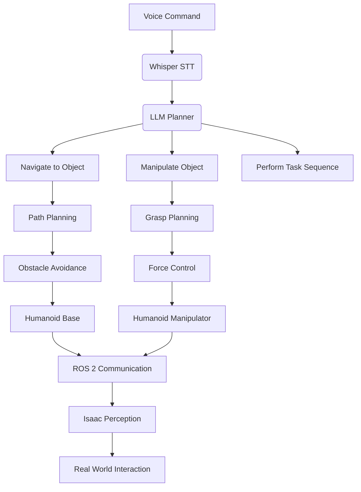

# Capstone Project Overview: The Autonomous Humanoid

## Project Goals and Objectives

The Autonomous Humanoid capstone project represents the culmination of your journey through the Physical AI & Humanoid Robotics curriculum. This ambitious undertaking integrates all the technologies and concepts covered in the previous modules to create a sophisticated, AI-powered humanoid robot capable of understanding and executing complex tasks through natural language interaction.

### Primary Objectives

1. **Voice Command Recognition**: Implement a robust voice command recognition system using OpenAI Whisper to enable natural human-robot interaction
2. **Cognitive Planning**: Develop an LLM-based cognitive planning system that translates high-level commands into sequences of executable robotic actions
3. **Autonomous Navigation**: Create a navigation system that enables the robot to safely traverse complex environments while avoiding obstacles
4. **Object Manipulation**: Implement computer vision and manipulation capabilities for identifying and interacting with objects in the environment
5. **Integrated Operation**: Combine all subsystems into a cohesive, reliable autonomous humanoid system

### Key Technologies and Frameworks

This project leverages the following technologies learned throughout the course:

- **ROS 2 (Robot Operating System 2)**: For communication between robot components and distributed computing
- **NVIDIA Isaac™**: For perception, planning, and control algorithms optimized for robotics
- **OpenAI Whisper**: For speech-to-text conversion and voice command interpretation
- **Large Language Models (LLMs)**: For cognitive planning and task decomposition
- **Computer Vision**: For object detection, recognition, and scene understanding
- **Motion Planning**: For trajectory generation and obstacle avoidance

### Expected Outcomes

Upon completion of this capstone project, you will have:

- A fully functional autonomous humanoid robot system (simulated or physical)
- Deep understanding of how to integrate multiple AI and robotics technologies
- Experience in developing complex, multi-component robotic systems
- Knowledge of safety considerations and best practices for autonomous robots
- A portfolio project demonstrating advanced robotics and AI integration

## Project Phases

The capstone project is organized into several interconnected phases:

### Phase 1: System Architecture and Design
Design the overall system architecture, defining interfaces between components and establishing communication protocols.

### Phase 2: Voice Command Pipeline
Implement the voice recognition and natural language understanding components that allow the robot to receive and interpret commands.

### Phase 3: LLM-Based Cognitive Planning
Develop the planning system that translates high-level goals into sequences of low-level robotic actions.

### Phase 4: Navigation and Manipulation
Implement the navigation and manipulation capabilities that enable the robot to physically interact with its environment.

### Phase 5: Integration and Testing
Combine all components into a unified system and conduct comprehensive testing to ensure reliability and safety.

### Phase 6: Evaluation and Optimization
Assess the performance of the autonomous humanoid and identify areas for improvement.

## Technical Requirements

### Hardware Requirements
- Humanoid robot platform (simulated in Gazebo/Unity or physical)
- RGB-D camera for perception
- Microphone for voice command input
- Computing platform capable of running ROS 2 and AI models

### Software Requirements
- Ubuntu 20.04 LTS or later
- ROS 2 Humble Hawksbill or later
- NVIDIA Isaac™ SDK
- Python 3.8 or later
- OpenAI Whisper
- Compatible LLM API access (e.g., OpenAI GPT, Anthropic Claude)

## Safety Considerations

Safety is paramount when developing autonomous robotic systems. Throughout this project, you must:

- Implement emergency stop mechanisms
- Ensure safe motion planning and obstacle avoidance
- Validate all actions before execution
- Monitor system behavior continuously
- Establish clear operational boundaries

## Getting Started

Before diving into implementation, familiarize yourself with the [System Architecture](./system-architecture) to understand how all components interconnect. Then proceed through each phase sequentially, building upon the foundations established in earlier modules.

Continue to the [System Architecture](./system-architecture) section to begin the implementation journey.