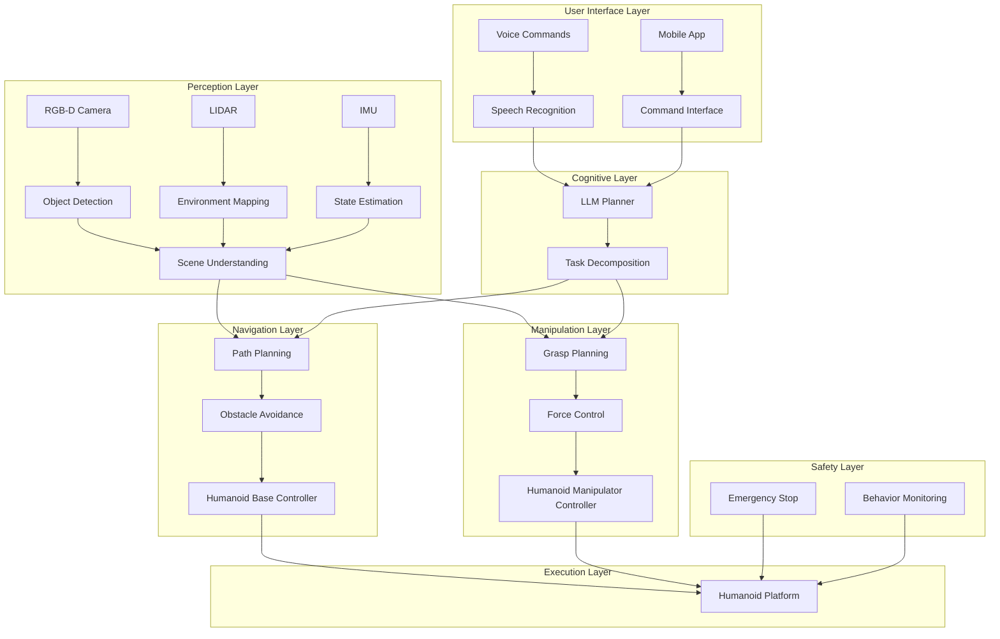

# System Architecture: The Autonomous Humanoid

## Overview

The Autonomous Humanoid system is a complex integration of multiple technologies and frameworks designed to enable natural human-robot interaction, cognitive planning, and physical task execution. This document outlines the overall system architecture, component interactions, and data flow patterns.

## High-Level Architecture

The system is organized into several interconnected layers, each responsible for specific aspects of the robot's functionality:

## Core Components

### 1. Voice Command Interface

The voice command interface serves as the primary input mechanism for the autonomous humanoid. It processes natural language commands and converts them into structured instructions for the cognitive planning system.

- **Technology Stack**: OpenAI Whisper for speech-to-text conversion
- **Input**: Audio stream from microphone
- **Output**: Structured command objects
- **Key Features**:
  - Real-time speech recognition
  - Noise cancellation and audio preprocessing
  - Command validation and error handling

### 2. LLM-Based Cognitive Planner

The cognitive planner is the brain of the system, responsible for interpreting high-level commands and decomposing them into executable robotic actions.

- **Technology Stack**: Large Language Model (e.g., GPT-4, Claude) with domain-specific prompting
- **Input**: Natural language commands from voice interface
- **Output**: Sequenced task plans with dependencies
- **Key Features**:
  - Natural language understanding
  - Task decomposition into primitive actions
  - Context awareness and memory
  - Error recovery and replanning

### 3. Perception System

The perception system provides the robot with awareness of its environment and the objects within it.

- **Technology Stack**: NVIDIA Isaac™ Perception, OpenCV, ROS 2 perception packages
- **Input**: RGB-D camera, LIDAR, IMU data
- **Output**: 3D environment map, object poses, scene understanding
- **Key Features**:
  - Object detection and recognition
  - 3D scene reconstruction
  - Simultaneous Localization and Mapping (SLAM)
  - Dynamic obstacle detection

### 4. Navigation System

The navigation system enables the robot to move safely through its environment while avoiding obstacles.

- **Technology Stack**: ROS 2 Navigation2, NVIDIA Isaac™ Navigation
- **Input**: Environment map, target pose, current robot state
- **Output**: Velocity commands for base movement
- **Key Features**:
  - Global path planning
  - Local obstacle avoidance
  - Dynamic replanning
  - Safety constraints enforcement

### 5. Manipulation System

The manipulation system controls the robot's arms and end effectors to interact with objects.

- **Technology Stack**: MoveIt2, NVIDIA Isaac™ Manipulation
- **Input**: Object pose, grasp parameters, task requirements
- **Output**: Joint trajectories for manipulator control
- **Key Features**:
  - Grasp planning and execution
  - Force control for delicate operations
  - Collision avoidance
  - Task-space control

## Data Flow Architecture

The system follows a distributed architecture with ROS 2 as the communication backbone:

### Message Types and Topics

- `/audio_input` - Raw audio data from microphone
- `/voice_commands` - Recognized voice commands
- `/robot_state` - Current state of the robot (position, joint angles, etc.)
- `/environment_map` - 3D map of the environment
- `/detected_objects` - Poses and properties of detected objects
- `/planned_path` - Global navigation path
- `/velocity_commands` - Base velocity commands
- `/joint_commands` - Manipulator joint commands
- `/task_status` - Current task execution status

### Communication Patterns

- **Publish/Subscribe**: Used for sensor data, robot state, and object detection
- **Services**: Used for synchronous operations like path planning
- **Actions**: Used for long-running tasks like navigation and manipulation

## Safety Architecture

Safety is a critical concern in autonomous humanoid systems. The architecture includes multiple safety layers:

### Hardware Safety

- Emergency stop buttons accessible to operators
- Collision detection sensors
- Joint torque limiting
- Safe motion envelopes

### Software Safety

- Behavior monitoring and validation
- Command filtering and sanitization
- Graceful degradation on component failures
- Safe state recovery procedures

### Operational Safety

- Operational boundaries and constraints
- Human supervision requirements
- Logging and audit trails
- Anomaly detection

## Integration Points

The system integrates with several external services and platforms:

### Cloud Services

- LLM API endpoints for cognitive planning
- Speech recognition services as backup
- Remote monitoring and logging

### Simulation Environment

- Gazebo integration for testing and validation
- Unity digital twin for visualization
- Hardware-in-the-loop simulation

## Performance Considerations

### Real-Time Requirements

- Voice command processing: < 500ms
- Path planning: < 100ms
- Control loop: 50-100Hz
- Perception update: 10-30Hz

### Resource Management

- GPU utilization for AI models
- Memory management for perception
- Network bandwidth for cloud services
- Power consumption optimization

## Scalability and Extensibility

The architecture is designed to be scalable and extensible:

- Plugin-based component architecture
- Modular design for easy updates
- Support for additional sensors and actuators
- Multi-robot coordination capabilities

## Conclusion

This system architecture provides a robust foundation for the Autonomous Humanoid project, enabling the integration of advanced AI and robotics technologies while maintaining safety and reliability. Each component is designed to work cohesively with others, creating a unified system capable of complex autonomous behaviors.

Continue to the [Voice Command Pipeline](./voice-command-pipeline) section to learn about implementing the voice recognition system.