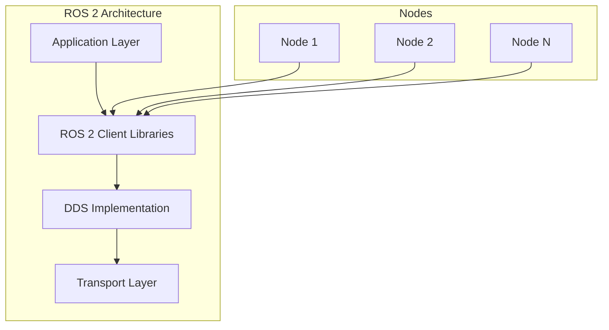
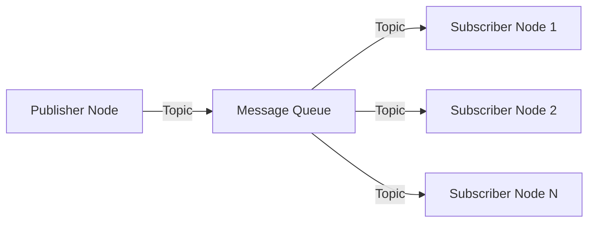
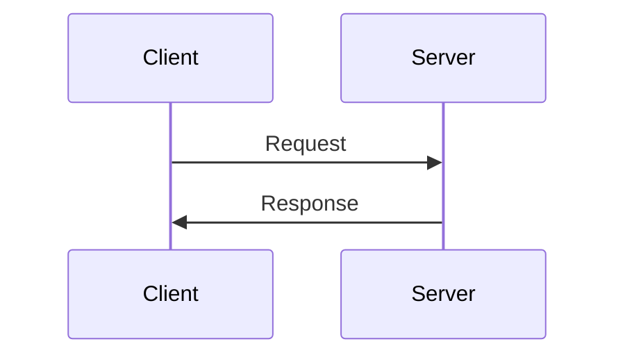
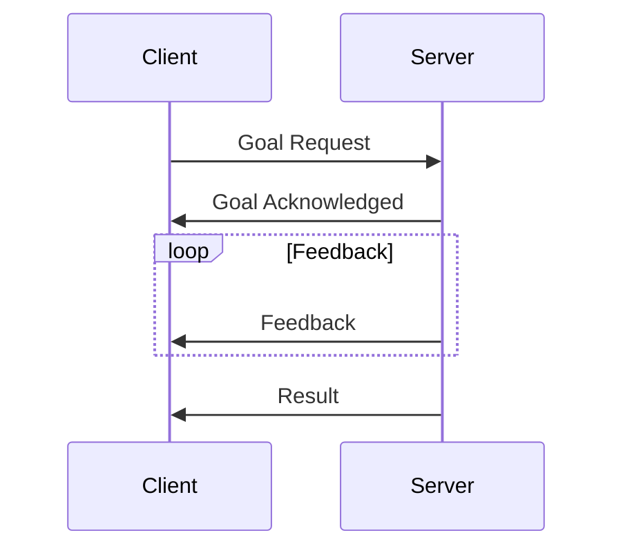

# ROS 2 Theory and Architecture

## Architecture Overview

ROS 2 follows a distributed architecture based on the Data Distribution Service (DDS) middleware. This architecture enables communication between different processes, whether they're running on the same machine or distributed across multiple machines.

## DDS (Data Distribution Service)

DDS is a middleware protocol and API standard for distributed, real-time, publish-subscribe communication. It's designed to address the needs of applications that require high performance, reliability, and real-time communication.

### DDS Concepts

- **Domain**: A DDS domain represents a communication plane. Nodes in the same domain can communicate with each other.
- **Participant**: A DDS participant represents an application in a domain.
- **Topic**: A topic defines the data type and name for communication.
- **Publisher/Subscriber**: Publishers send data on topics, subscribers receive data from topics.
- **DataWriter/DataReader**: These are the actual entities that write and read data.

## Client Libraries

ROS 2 provides client libraries that abstract the underlying DDS implementation:

- **rclcpp**: C++ client library
- **rclpy**: Python client library
- **rcl**: The common client library layer
- **rmw**: ROS Middleware Interface

## Nodes

A node is the fundamental unit of computation in ROS 2. It's a process that performs computation and communicates with other nodes through messages.

### Node Characteristics

- Each node has a unique name within a domain
- Nodes can be written in different programming languages
- Nodes communicate through topics, services, actions, and parameters
- Nodes can be organized into namespaces for better organization

## Communication Patterns

ROS 2 supports several communication patterns:

### 1. Publish-Subscribe (Topics)

The publish-subscribe pattern is used for one-way, asynchronous communication. Publishers send messages to topics, and subscribers receive messages from topics.

### 2. Request-Response (Services)

Services provide synchronous, bidirectional communication. A client sends a request and waits for a response from a server.

### 3. Action-Based Communication

Actions are used for long-running tasks that may provide feedback during execution. They support goals, results, and feedback.

## Quality of Service (QoS)

QoS policies allow you to configure how messages are delivered in terms of reliability, durability, and other characteristics:

- **Reliability**: Best effort or reliable delivery
- **Durability**: Volatile or transient local
- **History**: Keep all or keep last N messages
- **Deadline**: Maximum time between consecutive messages
- **Liveliness**: How to determine if a publisher is alive

## Lifecycle Management

ROS 2 provides a lifecycle system that allows nodes to transition through different states:

- **Unconfigured**: Initial state
- **Inactive**: Configured but not active
- **Active**: Running and operational
- **Finalized**: Cleaned up and ready for destruction

## Time Management

ROS 2 provides sophisticated time management capabilities:

- **System Time**: Real-world time from the operating system
- **Simulation Time**: Time from a simulation environment
- **ROS Time**: A unified time interface that can use either system or simulation time

## Parameter System

Parameters in ROS 2 are key-value pairs that can be configured at runtime:

- Parameters can be declared with types, descriptions, and constraints
- Parameters can be set at launch time or during runtime
- Parameter changes can be monitored and validated

## Security Architecture

ROS 2 includes security features based on DDS Security specification:

- **Authentication**: Verifying the identity of participants
- **Access Control**: Controlling what participants can access
- **Encryption**: Encrypting data in transit and at rest

## Build System (colcon)

ROS 2 uses the colcon build system, which is more flexible than the catkin build system used in ROS 1:

- Supports multiple build systems (CMake, ament_cmake, etc.)
- Can build packages in parallel
- Provides better dependency management

## Summary

The ROS 2 architecture provides a robust foundation for developing complex robotic systems. Its middleware-based approach, combined with standardized communication patterns and quality of service policies, enables the development of distributed, real-time robotic applications. Understanding this architecture is crucial for effectively using ROS 2 in humanoid robotics applications where reliability, performance, and safety are paramount.