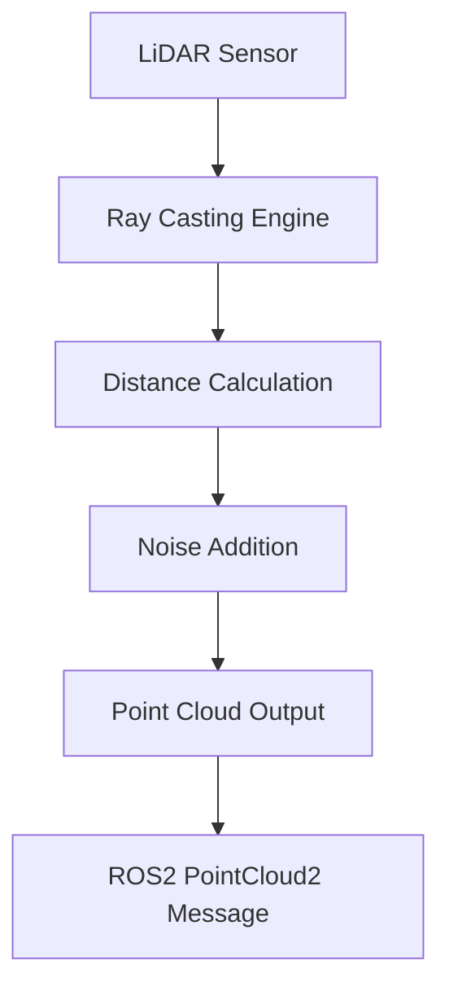

# Key Concepts in Digital Twin Simulation

This section explores the fundamental concepts that underpin digital twin technology in robotics, with a focus on humanoid robot simulation. Understanding these concepts is essential for creating effective and accurate virtual representations of physical systems.

## Simulation Fidelity

Simulation fidelity refers to how accurately a digital twin represents the real-world system. It's a multi-dimensional concept that includes:

### Visual Fidelity
- **Photorealistic rendering**: Creating visually accurate representations
- **Material properties**: Simulating realistic textures, reflectance, and appearance
- **Lighting models**: Accurately simulating real-world lighting conditions
- **Environmental effects**: Including weather, shadows, and atmospheric conditions

### Physical Fidelity
- **Accurate physics models**: Implementing precise equations of motion
- **Material properties**: Correct mass, friction, and elasticity parameters
- **Dynamic behavior**: Accurately simulating movement and interactions
- **Energy conservation**: Maintaining realistic energy transfer and dissipation

### Temporal Fidelity
- **Real-time performance**: Maintaining synchronization with real-world time
- **Causality**: Ensuring cause-and-effect relationships are preserved
- **Latency modeling**: Accounting for communication and processing delays
- **Synchronization**: Coordinating multiple simulation components

## Sensor Simulation

Accurate sensor simulation is crucial for creating useful digital twins. Key sensor types in humanoid robotics include:

### LiDAR Simulation
- **Ray casting**: Simulating laser beam propagation and reflection
- **Point cloud generation**: Creating 3D spatial data from distance measurements
- **Noise modeling**: Adding realistic imperfections and uncertainties
- **Field of view**: Accurately representing sensor limitations

### Depth Camera Simulation
- **Pinhole camera model**: Projecting 3D points to 2D image plane
- **Depth calculation**: Determining distance to objects in view
- **Distortion modeling**: Simulating lens imperfections
- **Resolution effects**: Accounting for pixel limitations

### IMU Simulation
- **Accelerometer modeling**: Simulating linear acceleration measurement
- **Gyroscope modeling**: Simulating angular velocity measurement
- **Bias and drift**: Adding realistic sensor imperfections
- **Noise characteristics**: Modeling random variations

## Real-time Simulation

Real-time simulation is critical for applications like hardware-in-the-loop testing and teleoperation:

### Fixed Time Step Integration
- **Consistency**: Ensuring deterministic behavior across runs
- **Stability**: Maintaining numerical stability in physics calculations
- **Synchronization**: Coordinating with real-world timing

### Adaptive Time Stepping
- **Efficiency**: Adjusting step size based on system complexity
- **Accuracy**: Maintaining precision during complex interactions
- **Performance**: Balancing computation time with accuracy

### Parallel Processing
- **Multi-threading**: Distributing calculations across CPU cores
- **GPU acceleration**: Leveraging graphics hardware for physics
- **Load balancing**: Optimizing resource utilization

## Hardware-in-the-Loop (HIL) Simulation

HIL simulation connects real hardware components to virtual environments:

### Architecture
- **Real sensors** → Virtual environment
- **Virtual actuators** → Real controllers
- **Mixed reality** → Combined testing scenarios

### Benefits
- **Validation**: Testing real components in virtual environments
- **Safety**: Protecting hardware during dangerous tests
- **Flexibility**: Testing with virtual environments that don't exist physically

## Domain Randomization

Domain randomization helps bridge the sim-to-real gap by introducing variations:

### Physical Parameters
- Mass variations
- Friction coefficients
- Elasticity parameters
- Center of mass positions

### Visual Parameters
- Texture variations
- Lighting conditions
- Camera parameters
- Environmental conditions

### Sensor Parameters
- Noise characteristics
- Bias and drift
- Delay variations
- Calibration parameters

## Digital Twin Lifecycle

The digital twin concept encompasses the entire lifecycle of a robotic system:

### Design Phase
- **Concept validation**: Testing theoretical designs in simulation
- **Parameter optimization**: Finding optimal design parameters
- **Performance prediction**: Estimating real-world performance

### Development Phase
- **Control algorithm testing**: Validating control strategies
- **Behavior validation**: Ensuring safe and effective operation
- **Integration testing**: Verifying component interactions

### Deployment Phase
- **Remote monitoring**: Tracking real robot performance
- **Predictive maintenance**: Identifying potential failures
- **Performance optimization**: Adjusting parameters based on real data

### Continuous Improvement
- **Data feedback**: Using real-world data to improve simulation
- **Model updates**: Refining digital twin accuracy
- **Scenario expansion**: Adding new testing conditions

## Safety Considerations

Safety is paramount in digital twin simulation, especially for humanoid robots:

### Simulation Safety
- **Constraint validation**: Ensuring simulated robots don't exceed physical limits
- **Collision avoidance**: Preventing damaging interactions in simulation
- **Emergency stops**: Implementing virtual safety mechanisms

### Transition Safety
- **Validation protocols**: Ensuring safe transfer from sim to real
- **Gradual deployment**: Phased introduction of behaviors from simulation
- **Monitoring systems**: Tracking performance during transition

## Performance Metrics

Evaluating digital twin effectiveness requires appropriate metrics:

### Accuracy Metrics
- **Position error**: Difference between simulated and real positions
- **Velocity error**: Difference in motion characteristics
- **Force/torque error**: Difference in interaction forces

### Performance Metrics
- **Simulation speed**: Real-time factor (RTF) achieved
- **Computational efficiency**: Resource utilization
- **Stability**: Consistency of simulation over time

Understanding these key concepts enables the development of effective digital twins that accurately represent physical robotic systems while providing the benefits of virtual testing and validation.