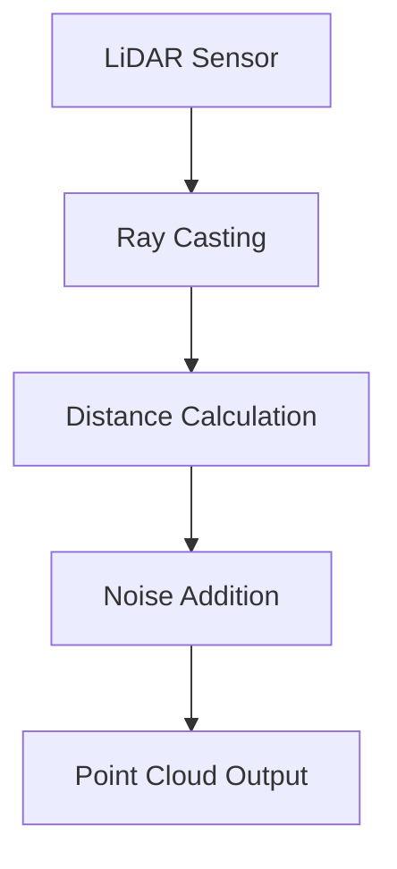

# Theoretical Foundations of Robotic Simulation

Robotic simulation relies on several fundamental theories from physics, mathematics, and computer science. Understanding these theoretical foundations is crucial for creating accurate and useful digital twins of humanoid robots.

## Physics Simulation

### Rigid Body Dynamics

The foundation of robotic simulation is rigid body dynamics, which describes the motion of solid objects under the influence of forces and torques. The equations of motion for a rigid body are given by:

- **Translational motion**: F = ma
- **Rotational motion**: τ = Iα

Where:
- F is the net force applied to the body
- m is the mass of the body
- a is the linear acceleration
- τ is the net torque applied to the body
- I is the moment of inertia
- α is the angular acceleration

### Collision Detection and Response

Accurate collision detection is essential for realistic simulation. Common approaches include:

- **Bounding Volume Hierarchies (BVH)**: Using simple geometric shapes to approximate complex objects
- **Separating Axis Theorem (SAT)**: Determining if convex shapes are intersecting
- **GJK Algorithm**: Efficient collision detection for convex shapes

Collision response involves calculating the resulting forces and impulses when objects make contact, considering factors like friction and restitution coefficients.

### Contact Mechanics

When two objects come into contact, the simulation must calculate the contact forces. This involves:

- **Normal forces**: Preventing objects from penetrating each other
- **Friction forces**: Modeling the resistance to sliding motion
- **Contact points**: Determining where forces are applied

## Sensor Simulation

### LiDAR Simulation

LiDAR sensors emit laser pulses and measure the time it takes for them to return after reflecting off objects. In simulation, this is modeled by:

1. Casting rays from the sensor origin in multiple directions
2. Calculating the distance to the nearest object in each direction
3. Adding noise models to simulate real-world imperfections



### Depth Camera Simulation

Depth cameras capture distance information for each pixel in an image. Simulation involves:

- **Pinhole camera model**: Projecting 3D points onto a 2D image plane
- **Depth calculation**: Determining distance from camera to objects
- **Noise modeling**: Simulating sensor limitations and environmental factors

### IMU Simulation

Inertial Measurement Units (IMUs) measure linear acceleration and angular velocity. In simulation:

- **Accelerometer**: Measures proper acceleration (including gravity)
- **Gyroscope**: Measures angular velocity
- **Noise models**: Include bias, drift, and random noise characteristics

## Control Theory in Simulation

### Forward Dynamics vs. Inverse Dynamics

- **Forward Dynamics**: Given joint torques, calculate resulting motion
- **Inverse Dynamics**: Given desired motion, calculate required joint torques

Both are essential for realistic simulation and control of humanoid robots.

### Real-time Constraints

Simulation environments must balance accuracy with computational efficiency to maintain real-time performance:

- **Fixed time steps**: Ensuring consistent physics calculations
- **Adaptive stepping**: Adjusting step size based on system complexity
- **Parallel processing**: Distributing calculations across multiple cores

## Fidelity and Validation

### Simulation Fidelity

The fidelity of a simulation refers to how accurately it represents the real world. Key factors include:

- **Visual fidelity**: How realistic the graphics appear
- **Physical fidelity**: How accurately physics are simulated
- **Sensor fidelity**: How closely virtual sensors match real ones
- **Temporal fidelity**: How accurately timing and causality are preserved

### Domain Randomization

To bridge the sim-to-real gap, domain randomization introduces variations in simulation parameters:

- Randomizing physical properties (mass, friction, etc.)
- Adding visual variations (textures, lighting)
- Introducing sensor noise and delays
- Varying environmental conditions

### System Identification

Validating simulation accuracy involves comparing simulated and real robot behavior:

- Parameter estimation for physical models
- System response comparison
- Error quantification and minimization

## Hardware-in-the-Loop (HIL) Simulation

HIL simulation connects real hardware components to the simulation:

- Real sensors providing data to the virtual environment
- Virtual actuators controlled by real controllers
- Mixed reality testing scenarios

This approach helps validate both the simulation and the real hardware components.

## Mathematical Models

### State Space Representation

Robot dynamics can be represented in state space form:

```
dx/dt = f(x, u, t)
y = g(x, u, t)
```

Where:
- x is the state vector (positions, velocities)
- u is the input vector (torques, forces)
- y is the output vector (sensor readings)
- f and g are system functions

### Numerical Integration

Simulations use numerical integration to solve differential equations:

- **Euler method**: Simple but less accurate
- **Runge-Kutta methods**: More accurate but computationally expensive
- **Symplectic integrators**: Preserve energy in conservative systems

Understanding these theoretical foundations enables the creation of more accurate and useful digital twins for humanoid robotics development.