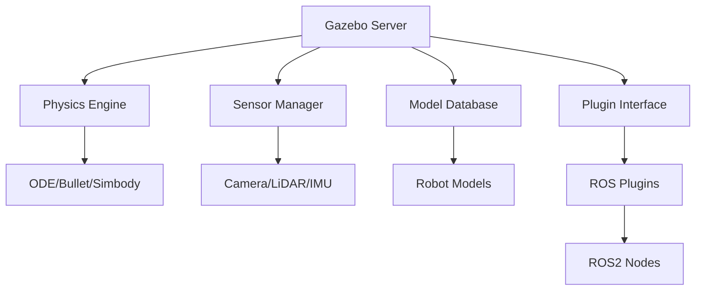
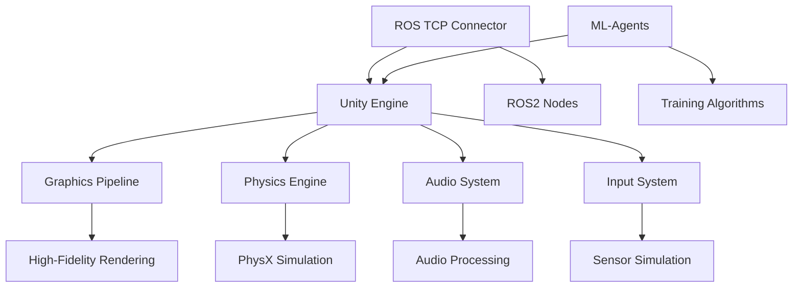

# Simulation Tools: Gazebo and Unity

This section provides an in-depth look at the two primary simulation platforms used in humanoid robotics: Gazebo and Unity. Both tools offer unique advantages and capabilities for creating digital twins of robotic systems.

## Gazebo: The Open-Source Robotics Simulator

Gazebo is a powerful open-source 3D simulation environment that has become the de facto standard for robotics simulation, particularly in the ROS ecosystem.

### Core Features

#### Physics Engine
- **ODE (Open Dynamics Engine)**: Provides accurate rigid body dynamics
- **Bullet Physics**: Alternative physics engine with different characteristics
- **Simbody**: Multibody dynamics engine for complex articulated systems
- **DART**: Dynamic Animation and Robotics Toolkit

#### Sensor Simulation
- **Camera sensors**: RGB, depth, and stereo cameras
- **LiDAR sensors**: 2D and 3D laser range finders
- **IMU sensors**: Accelerometers and gyroscopes
- **Force/Torque sensors**: Joint and contact force measurements
- **GPS and magnetometer**: Global positioning and orientation

#### ROS Integration
- **Direct ROS/ROS2 interface**: Native communication with ROS nodes
- **Message types**: Full support for standard ROS message formats
- **TF frames**: Automatic transformation publishing
- **URDF support**: Direct import of robot models from URDF files

### Gazebo Architecture



### Setting up Gazebo for Humanoid Robotics

#### Installation
```bash
# Install Gazebo Garden (or latest version)
sudo apt-get install gazebo

# Install ROS2 Gazebo packages
sudo apt-get install ros-humble-gazebo-ros-pkgs
sudo apt-get install ros-humble-gazebo-plugins
```

#### Basic Launch File
```xml
<?xml version="1.0"?>
<launch>
  <!-- Start Gazebo with world -->
  <include file="$(find gazebo_ros)/launch/empty_world.launch">
    <arg name="world_name" value="$(find my_robot_description)/worlds/my_world.world"/>
    <arg name="paused" value="false"/>
    <arg name="use_sim_time" value="true"/>
    <arg name="gui" value="true"/>
    <arg name="headless" value="false"/>
    <arg name="debug" value="false"/>
  </include>
  
  <!-- Spawn robot model -->
  <node name="spawn_urdf" pkg="gazebo_ros" type="spawn_entity.py" 
        args="-file $(find my_robot_description)/urdf/my_robot.urdf -entity my_robot" 
        output="screen"/>
</launch>
```

### Gazebo Strengths
- **Open source**: Free to use and modify
- **ROS integration**: Seamless communication with ROS/ROS2
- **Physics accuracy**: High-fidelity physics simulation
- **Extensibility**: Plugin architecture for custom functionality
- **Community**: Large user base and extensive documentation

### Gazebo Limitations
- **Graphics quality**: Lower visual fidelity compared to game engines
- **Learning curve**: Complex configuration for advanced features
- **Performance**: Can be resource-intensive for complex scenes

## Unity: The Game Engine Approach

Unity is a commercial game engine that has been adapted for robotics simulation, offering high-quality graphics and advanced visualization capabilities.

### Core Features

#### Graphics Engine
- **High-fidelity rendering**: Photorealistic visual output
- **Lighting system**: Advanced global illumination and shadows
- **Material system**: Realistic surface properties
- **Post-processing**: Advanced visual effects

#### Physics Engine
- **NVIDIA PhysX**: Industry-standard physics simulation
- **Collision detection**: Advanced algorithms for complex shapes
- **Joint systems**: Constraints and articulation bodies
- **Fluid simulation**: Advanced environmental interactions

#### ML-Agents Integration
- **Reinforcement learning**: Built-in RL algorithms
- **Training environments**: Specialized for AI development
- **Observation spaces**: Customizable sensor data
- **Action spaces**: Flexible control interfaces

### Unity Robotics Simulation Framework

Unity provides specialized tools for robotics:

#### Unity Robotics Hub
- **URDF Importer**: Direct import of ROS robot models
- **ROS TCP Connector**: Communication with ROS/ROS2
- **Robotics Library**: Pre-built components for common tasks

#### ML-Agents Toolkit
- **Behavior Designer**: Visual tool for creating AI behaviors
- **Trainer configuration**: YAML-based training setup
- **Curriculum learning**: Progressive difficulty training
- **Multi-agent support**: Simultaneous training of multiple agents

### Unity Architecture for Robotics



### Setting up Unity for Robotics

#### Installation
1. Download Unity Hub from unity.com
2. Install Unity 2021.3 LTS or later
3. Install required packages:
   - Unity Robotics Package
   - ML-Agents Toolkit
   - URDF Importer

#### Basic Robot Setup
```csharp
using UnityEngine;
using Unity.Robotics;
using Unity.Robotics.ROSTCPConnector;

public class RobotController : MonoBehaviour
{
    public float linearVelocity = 1.0f;
    public float angularVelocity = 1.0f;
    
    private ROSConnection ros;
    private string robotTopic = "robot/cmd_vel";
    
    void Start()
    {
        ros = ROSConnection.instance;
    }
    
    void Update()
    {
        // Example: Send velocity commands to robot
        if (Input.GetKeyDown(KeyCode.Space))
        {
            var cmdMsg = new Twist();
            cmdMsg.linear = new Vector3(linearVelocity, 0, 0);
            cmdMsg.angular = new Vector3(0, 0, angularVelocity);
            
            ros.Send<Unity.Robotics.ROSTCPConnector.Messages.Twist>(robotTopic, cmdMsg);
        }
    }
}
```

### Unity Strengths
- **Visual quality**: High-fidelity graphics rendering
- **AI integration**: Excellent for machine learning applications
- **Cross-platform**: Deploy to multiple platforms
- **Asset store**: Extensive library of models and tools
- **User interface**: Intuitive visual editor

### Unity Limitations
- **Licensing**: Commercial license required for larger projects
- **Physics complexity**: May require more setup for complex dynamics
- **ROS integration**: Less native than Gazebo's ROS integration

## Comparison: Gazebo vs Unity

| Feature | Gazebo | Unity |
|---------|--------|-------|
| **Cost** | Free (Open Source) | Commercial (Free for small projects) |
| **ROS Integration** | Native, seamless | Requires ROS TCP Connector |
| **Graphics Quality** | Moderate | High |
| **Physics Accuracy** | High | High |
| **Learning Curve** | Moderate to steep | Moderate |
| **AI/ML Support** | Moderate | Excellent (ML-Agents) |
| **Community** | Large robotics community | Large game development community |
| **Platform Support** | Linux-focused | Cross-platform |

## Choosing the Right Tool

### Use Gazebo When:
- You need tight ROS/ROS2 integration
- Physics accuracy is paramount
- You're working with standard robotic sensors
- You want to minimize licensing costs
- You're developing for Linux-based systems

### Use Unity When:
- High-quality graphics are important
- You're developing AI/ML models
- You need cross-platform deployment
- You want intuitive visual development tools
- You're creating user interfaces or AR/VR applications

## Best Practices for Both Platforms

### Model Optimization
- Use simplified collision meshes for physics calculations
- Optimize visual meshes separately from collision meshes
- Implement level-of-detail (LOD) systems for complex models
- Use instancing for repeated objects

### Performance Optimization
- Limit the number of active physics bodies
- Use fixed time steps for consistent behavior
- Implement efficient sensor update rates
- Profile and optimize rendering pipelines

### Validation Strategies
- Compare simulation results with real-world data
- Implement domain randomization for robustness
- Use multiple simulation scenarios for validation
- Document simulation parameters and assumptions

Both Gazebo and Unity offer powerful capabilities for creating digital twins of humanoid robots. The choice between them depends on your specific requirements, budget, and technical constraints.