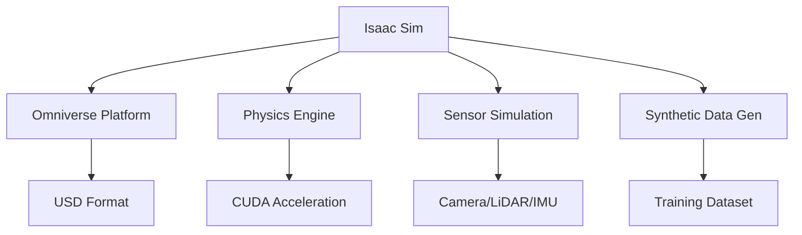

# Introduction to NVIDIA Isaac™ for AI Robotics

NVIDIA Isaac™ represents a revolutionary approach to robotics development, combining high-performance computing, advanced simulation, and AI to create intelligent robotic systems. This platform addresses the complex challenges of developing AI-powered robots by providing a complete ecosystem of tools and frameworks.

## The Need for AI in Robotics

Traditional robotics relied heavily on pre-programmed behaviors and deterministic algorithms. However, as robots move into unstructured environments and interact with humans, they require more adaptive and intelligent capabilities:

- **Perception**: Understanding complex environments through vision, audio, and other sensors
- **Decision Making**: Reasoning about actions in dynamic environments
- **Learning**: Adapting to new situations and improving performance over time
- **Navigation**: Safely moving through complex environments

## NVIDIA Isaac™ Ecosystem

The NVIDIA Isaac™ platform consists of several interconnected components:

### Isaac Sim
Isaac Sim is a high-fidelity simulation environment built on NVIDIA Omniverse. It enables:

- **Photorealistic rendering**: Creating visually accurate simulation environments
- **Synthetic data generation**: Producing labeled training data for AI models
- **Physics simulation**: Accurate modeling of real-world physics
- **Sensor simulation**: Realistic emulation of cameras, LiDAR, and other sensors

### Isaac ROS
Isaac ROS provides hardware-accelerated perception and navigation packages:

- **Hardware acceleration**: Leverages NVIDIA GPUs for accelerated processing
- **ROS 2 integration**: Seamless integration with the ROS 2 ecosystem
- **Production-ready**: Optimized for deployment on NVIDIA Jetson and other platforms
- **Modular design**: Flexible components that can be combined as needed

### Isaac Lab
Isaac Lab is a reinforcement learning framework for robotic manipulation:

- **RL environments**: Physics-based simulation for training
- **Policy optimization**: Algorithms for learning robot behaviors
- **Transfer learning**: Techniques for bridging simulation and reality
- **Benchmarking**: Standardized evaluation protocols

## Key Advantages of Isaac™

### Hardware Acceleration
NVIDIA Isaac™ leverages GPU computing to accelerate AI workloads:

- **Real-time inference**: Processing sensor data in real-time
- **Parallel computation**: Handling multiple AI models simultaneously
- **Energy efficiency**: Optimized for edge deployment on platforms like Jetson

### Synthetic Data Generation
Isaac Sim enables the creation of large, diverse datasets:

- **Labeled data**: Automatic annotation of simulation data
- **Variety**: Generating diverse scenarios and conditions
- **Safety**: Creating dangerous scenarios without risk
- **Cost efficiency**: Reducing need for expensive data collection

### Simulation-to-Reality Transfer
Techniques to bridge the gap between simulation and reality:

- **Domain randomization**: Training models to be robust to domain differences
- **Sim-to-real algorithms**: Methods for adapting simulation-trained models
- **Validation frameworks**: Testing transfer effectiveness

## Isaac™ for Humanoid Robotics

Humanoid robots present unique challenges that Isaac™ addresses effectively:

### Perception Challenges
- **3D understanding**: Processing complex 3D environments
- **Human interaction**: Recognizing and responding to human behavior
- **Dynamic environments**: Adapting to constantly changing conditions

### Control Challenges
- **Balance**: Maintaining stability during locomotion
- **Manipulation**: Precise control of dexterous hands
- **Locomotion**: Walking and navigating in human environments

### Learning Challenges
- **Sample efficiency**: Learning complex behaviors with limited samples
- **Safety**: Ensuring safe learning in real environments
- **Generalization**: Applying learned behaviors to new situations

## Getting Started with Isaac™

The Isaac™ platform is designed to be accessible to both researchers and practitioners:

### Development Environment
- **Isaac Sim**: For simulation and data generation
- **Isaac ROS**: For perception and navigation
- **Isaac Lab**: For reinforcement learning
- **Isaac Apps**: For reference implementations

### Hardware Requirements
- **NVIDIA GPU**: For hardware acceleration
- **CUDA support**: For GPU computing
- **Sufficient RAM**: For handling large models and datasets

## Module Overview

In this module, we'll explore each component of the Isaac™ platform in detail:

- Setting up Isaac Sim for humanoid robot simulation
- Creating photorealistic environments and synthetic datasets
- Implementing hardware-accelerated perception with Isaac ROS
- Configuring navigation systems for humanoid robots
- Applying reinforcement learning techniques for robot control

By the end of this module, you'll have a comprehensive understanding of how to leverage NVIDIA Isaac™ to create intelligent, AI-powered humanoid robots.