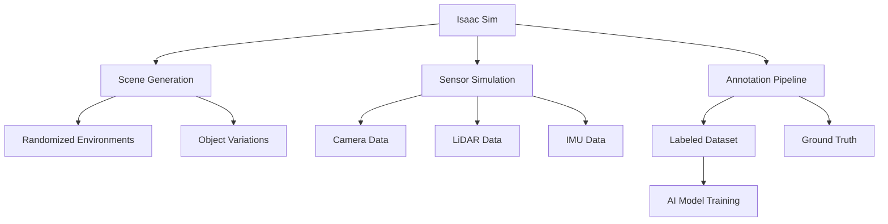

# Key Concepts in AI Robotics with Isaac™

This section explores the fundamental concepts that underpin AI-powered robotics using NVIDIA Isaac™. Understanding these concepts is essential for effectively leveraging Isaac™ technologies in humanoid robot development.

## Synthetic Data Generation

### The Need for Synthetic Data

Real-world data collection for robotics is expensive, time-consuming, and potentially dangerous. Synthetic data generation addresses these challenges:

#### Advantages of Synthetic Data
- **Safety**: Creating dangerous scenarios without risk
- **Cost efficiency**: Eliminating need for expensive data collection campaigns
- **Labeling**: Automatic ground truth annotation
- **Variety**: Generating diverse scenarios and conditions
- **Scalability**: Producing unlimited amounts of data

### Isaac Sim for Synthetic Data

Isaac Sim provides a comprehensive platform for synthetic data generation:

#### Photorealistic Rendering
- **RTX technology**: Ray tracing for realistic lighting and reflections
- **Material properties**: Accurate simulation of surface appearances
- **Environmental effects**: Weather, lighting, and atmospheric conditions
- **Sensor simulation**: Realistic camera, LiDAR, and IMU data

#### Domain Randomization
- **Appearance variation**: Randomizing textures, colors, and lighting
- **Geometric variation**: Modifying object shapes and sizes
- **Physical properties**: Varying friction, mass, and other parameters
- **Environmental conditions**: Changing backgrounds and contexts

### Data Pipeline Architecture

#### Asset Creation
- **3D models**: Creating or importing realistic robot and environment models
- **Materials**: Defining realistic surface properties
- **Lighting**: Setting up realistic illumination conditions
- **Animation**: Creating dynamic scenarios and movements

#### Data Collection
- **Scenarios**: Designing diverse situations for data collection
- **Sensor placement**: Positioning virtual sensors optimally
- **Collection parameters**: Setting exposure, frequency, and resolution
- **Quality assurance**: Ensuring data quality and consistency

## Hardware Acceleration

### GPU Computing in Robotics

Modern robotics applications demand significant computational resources. GPU acceleration addresses these needs:

#### Parallel Processing
- **SIMD architecture**: Single Instruction, Multiple Data processing
- **Massive parallelism**: Thousands of cores for concurrent computation
- **Memory bandwidth**: High-speed data transfer capabilities
- **Specialized units**: Tensor cores for AI workloads

#### CUDA Programming
- **Thread hierarchy**: Organizing parallel computations
- **Memory management**: Optimizing data movement and storage
- **Stream processing**: Concurrent kernel execution
- **Cooperative kernels**: Multi-grid synchronization

### Isaac ROS Acceleration

Isaac ROS packages leverage hardware acceleration for robotics applications:

#### Perception Acceleration
- **Image processing**: GPU-accelerated filtering and enhancement
- **Deep learning inference**: TensorRT-optimized neural networks
- **Point cloud processing**: GPU-accelerated geometric operations
- **Sensor fusion**: Parallel data integration

#### Navigation Acceleration
- **Path planning**: GPU-accelerated graph search algorithms
- **Collision checking**: Parallel obstacle detection
- **Trajectory optimization**: GPU-accelerated optimization
- **Localization**: Accelerated particle filtering

### Jetson Platform Integration

NVIDIA Jetson provides edge AI computing for robotics:

#### Hardware Specifications
- **GPU**: Dedicated graphics processing for AI workloads
- **CPU**: ARM processors for general computation
- **Memory**: High-bandwidth memory for data processing
- **Connectivity**: Interfaces for sensors and actuators

#### Software Stack
- **JetPack**: Complete software suite for Jetson
- **CUDA**: GPU computing platform
- **TensorRT**: Deep learning inference optimizer
- **Isaac ROS**: Robotics packages with acceleration

## Visual SLAM (VSLAM)

### SLAM Fundamentals

Simultaneous Localization and Mapping is critical for autonomous navigation:

#### Core Problem
- **Localization**: Determining robot position in unknown environment
- **Mapping**: Building environmental representation
- **Data association**: Matching observations to map features
- **Loop closure**: Recognizing previously visited locations

### Isaac ROS VSLAM Solutions

Isaac ROS provides hardware-accelerated VSLAM solutions:

#### Isaac ROS Stereo Image Proc
- **Rectification**: Correcting lens distortion and alignment
- **Disparity computation**: Computing depth from stereo pairs
- **Point cloud generation**: Creating 3D representations
- **GPU acceleration**: Leveraging CUDA for performance

#### Isaac ROS Visual Slam
- **Feature detection**: GPU-accelerated keypoint extraction
- **Tracking**: Following features across frames
- **Pose estimation**: Computing camera motion
- **Map building**: Constructing environmental representation

### SLAM Pipeline Components

#### Front-end Processing
- **Feature extraction**: Identifying distinctive image points
- **Feature matching**: Corresponding features across frames
- **Motion estimation**: Computing relative camera motion
- **Tracking**: Maintaining feature correspondence

#### Back-end Optimization
- **Bundle adjustment**: Optimizing camera poses and 3D points
- **Loop closure**: Detecting revisited locations
- **Graph optimization**: Refining pose estimates
- **Map maintenance**: Managing map size and quality

## Navigation and Path Planning

### Navigation Stack Overview

The navigation stack enables autonomous robot movement:

#### Perception Layer
- **Obstacle detection**: Identifying navigational hazards
- **Free space mapping**: Determining traversable areas
- **Semantic understanding**: Interpreting environmental meaning
- **Dynamic object tracking**: Monitoring moving obstacles

#### Planning Layer
- **Global planning**: Computing high-level route
- **Local planning**: Generating immediate motion commands
- **Trajectory optimization**: Smoothing and refining paths
- **Re-planning**: Adapting to environmental changes

#### Control Layer
- **Path following**: Executing planned trajectories
- **Obstacle avoidance**: Reacting to unexpected obstacles
- **Stability control**: Maintaining robot balance
- **Motion execution**: Sending commands to actuators

### Nav2 for Humanoid Robots

Nav2 provides a flexible navigation framework for ROS 2:

#### Architecture Components
- **Planners**: Global and local path planning algorithms
- **Controllers**: Trajectory execution and feedback control
- **Recovery behaviors**: Handling navigation failures
- **Lifecycle manager**: Coordinating system components

#### Humanoid-Specific Considerations
- **Bipedal kinematics**: Accounting for legged locomotion
- **Balance constraints**: Maintaining stability during movement
- **Step planning**: Computing footstep locations
- **Terrain adaptation**: Adjusting gait for different surfaces

## Reinforcement Learning in Robotics

### RL for Robot Control

Reinforcement learning enables robots to learn complex behaviors:

#### Problem Formulation
- **State space**: Robot and environment observations
- **Action space**: Available robot control commands
- **Reward function**: Quantifying task success
- **Policy**: Mapping states to actions

### Isaac Lab Framework

Isaac Lab provides a comprehensive RL framework for robotics:

#### Environment Design
- **Task definition**: Specifying robot objectives
- **Observation space**: Defining sensor inputs
- **Action space**: Specifying control outputs
- **Reward shaping**: Designing effective reward functions

#### Training Infrastructure
- **Parallel simulation**: Training multiple agents simultaneously
- **GPU acceleration**: Leveraging hardware for faster training
- **Policy optimization**: Advanced RL algorithms
- **Transfer learning**: Adapting simulation-trained policies

### Learning Paradigms

#### Model-Free RL
- **Policy gradient**: Direct policy optimization
- **Value-based**: Learning action-value functions
- **Actor-critic**: Combining policy and value learning
- **Sample efficiency**: Maximizing learning from limited data

#### Model-Based RL
- **World models**: Learning environment dynamics
- **Planning**: Using models for decision making
- **Imagination**: Simulating future scenarios
- **Generalization**: Applying learned models to new tasks

## Safety and Validation

### Safe AI in Robotics

Safety is paramount in AI-powered robotics, especially for humanoid systems:

#### Safety-by-Design
- **Fail-safe mechanisms**: Ensuring safe behavior during failures
- **Constraint enforcement**: Preventing unsafe actions
- **Redundancy**: Multiple safety systems for critical functions
- **Verification**: Mathematically proving safety properties

#### Safe Exploration
- **Safe RL**: Learning without violating safety constraints
- **Shield synthesis**: Runtime enforcement of safety properties
- **Risk-aware planning**: Considering uncertainty in planning
- **Human oversight**: Maintaining human-in-the-loop control

### Validation Techniques

#### Simulation Validation
- **Unit testing**: Validating individual components
- **Integration testing**: Testing component interactions
- **Scenario testing**: Validating behavior across situations
- **Edge case testing**: Testing unusual conditions

#### Real-World Validation
- **Progressive deployment**: Gradually increasing complexity
- **Safety margins**: Conservative parameters for real deployment
- **Monitoring systems**: Tracking robot behavior during operation
- **Fallback procedures**: Safe behaviors when issues arise

## Multi-Modal Perception

### Sensor Integration

Robots use multiple sensors for comprehensive environmental understanding:

#### Visual Perception
- **RGB cameras**: Color and texture information
- **Depth sensors**: 3D geometric information
- **Thermal cameras**: Temperature-based sensing
- **Event cameras**: High-speed dynamic information

#### Range Sensing
- **LiDAR**: Accurate 3D point clouds
- **Radar**: All-weather distance measurement
- **Sonar**: Short-range obstacle detection
- **Structured light**: Precise depth measurement

#### Inertial Sensing
- **IMU**: Acceleration and angular velocity
- **Gyroscopes**: Angular rate measurement
- **Accelerometers**: Linear acceleration
- **Magnetometers**: Magnetic field sensing

### Fusion Strategies

#### Early Fusion
- **Raw data fusion**: Combining sensor data at lowest level
- **Increased resolution**: Higher-dimensional input representation
- **Computational cost**: Higher processing requirements

#### Late Fusion
- **Decision fusion**: Combining processed sensor outputs
- **Robustness**: Isolation of sensor failures
- **Flexibility**: Independent sensor processing

#### Deep Fusion
- **Learned fusion**: Neural networks learning optimal combination
- **End-to-end training**: Joint optimization of fusion and task
- **Adaptability**: Learning to weight sensors based on context

Understanding these key concepts enables effective implementation of AI-powered robotic systems using NVIDIA Isaac™ technologies, particularly for humanoid robot applications.