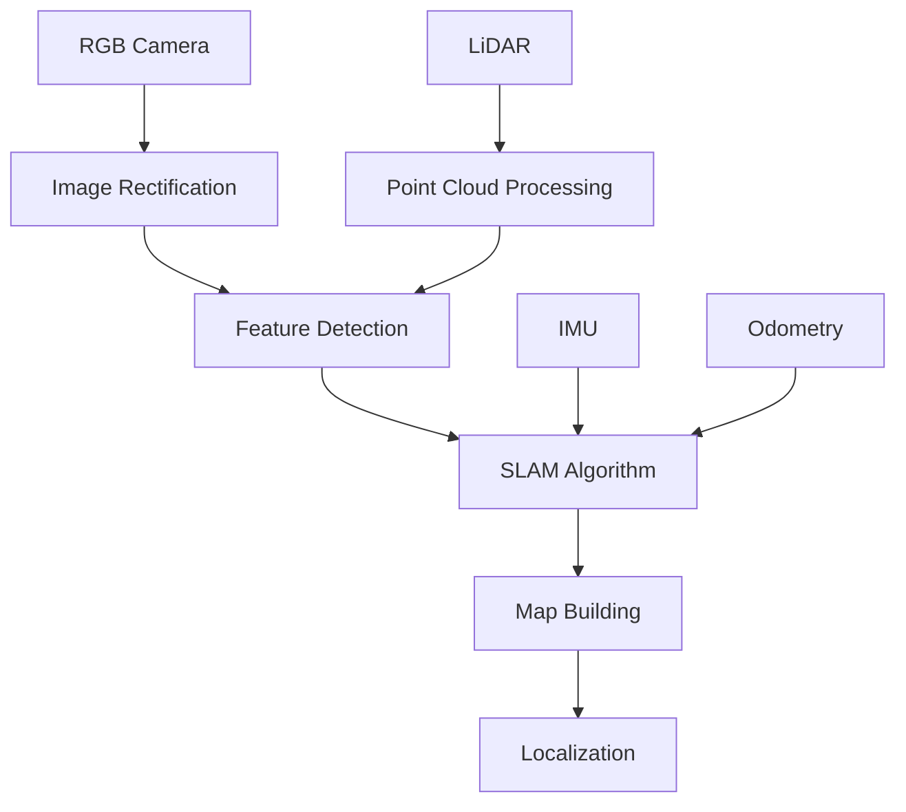

# Lab 2: NVIDIA Isaac Perception Pipeline and VSLAM Implementation

In this lab, you'll implement a perception pipeline using NVIDIA Isaac's hardware-accelerated computer vision capabilities, including Visual Simultaneous Localization and Mapping (VSLAM) for humanoid robots. You'll learn to process sensor data, detect objects, and create maps for navigation.

## Learning Objectives

By the end of this lab, you will be able to:
- Implement a perception pipeline using Isaac ROS packages
- Configure and run VSLAM algorithms for mapping environments
- Integrate multiple sensors (cameras, LiDAR) for robust perception
- Process and interpret sensor data for navigation decisions
- Optimize perception algorithms for real-time performance
- Evaluate the accuracy of localization and mapping

## Prerequisites

Before starting this lab, ensure you have:
- Completed Lab 1: Setting Up Isaac Sim for Humanoid Robot Simulation
- NVIDIA Isaac Sim properly installed and configured
- Isaac ROS packages installed and accessible
- Basic understanding of ROS 2 concepts and topics
- Experience with Python programming for robotics
- A humanoid robot model with sensors configured in Isaac Sim

## Step 1: Setting Up the Perception Pipeline

First, let's establish the foundation for our perception pipeline by configuring the necessary Isaac ROS nodes:

1. Launch Isaac Sim with your humanoid robot model
2. Ensure sensors (camera, LiDAR) are properly configured
3. Create a new ROS 2 workspace for perception nodes

### Perception Pipeline Architecture:


### Basic Perception Node Setup:
```python
import rclpy
from rclpy.node import Node
from sensor_msgs.msg import Image, PointCloud2, Imu
from nav_msgs.msg import Odometry
from geometry_msgs.msg import PoseStamped
from cv_bridge import CvBridge
import cv2
import numpy as np

class PerceptionPipeline(Node):
    def __init__(self):
        super().__init__('perception_pipeline')
        
        # Initialize CV bridge
        self.cv_bridge = CvBridge()
        
        # Create subscribers for sensor data
        self.image_sub = self.create_subscription(
            Image,
            '/camera/rgb/image_raw',
            self.image_callback,
            10
        )
        
        self.lidar_sub = self.create_subscription(
            PointCloud2,
            '/scan',
            self.lidar_callback,
            10
        )
        
        self.imu_sub = self.create_subscription(
            Imu,
            '/imu/data',
            self.imu_callback,
            10
        )
        
        self.odom_sub = self.create_subscription(
            Odometry,
            '/odom',
            self.odom_callback,
            10
        )
        
        # Publisher for processed data
        self.pose_pub = self.create_publisher(PoseStamped, '/robot_pose', 10)
        
        self.get_logger().info('Perception pipeline initialized')

    def image_callback(self, msg):
        """Process incoming image data"""
        try:
            cv_image = self.cv_bridge.imgmsg_to_cv2(msg, "bgr8")
            
            # Apply preprocessing (resize, normalize, etc.)
            processed_image = self.preprocess_image(cv_image)
            
            # Run feature detection
            features = self.detect_features(processed_image)
            
            # Publish features for SLAM
            self.publish_features(features)
            
        except Exception as e:
            self.get_logger().error(f'Error processing image: {str(e)}')

    def lidar_callback(self, msg):
        """Process incoming LiDAR data"""
        # Convert PointCloud2 to numpy array
        points = self.pointcloud2_to_array(msg)
        
        # Extract relevant features from point cloud
        obstacles = self.extract_obstacles(points)
        
        # Publish obstacle information
        self.publish_obstacles(obstacles)

    def imu_callback(self, msg):
        """Process IMU data for orientation"""
        # Extract orientation and angular velocity
        orientation = msg.orientation
        angular_velocity = msg.angular_velocity
        
        # Use for sensor fusion in SLAM
        self.update_orientation_estimate(orientation, angular_velocity)

    def odom_callback(self, msg):
        """Process odometry data"""
        # Extract pose and twist information
        pose = msg.pose.pose
        twist = msg.twist.twist
        
        # Use for motion prediction in SLAM
        self.update_motion_model(pose, twist)

    def preprocess_image(self, image):
        """Apply preprocessing to image"""
        # Resize image to standard size
        resized = cv2.resize(image, (640, 480))
        
        # Apply Gaussian blur to reduce noise
        blurred = cv2.GaussianBlur(resized, (5, 5), 0)
        
        return blurred

    def detect_features(self, image):
        """Detect features in the image"""
        # Convert to grayscale
        gray = cv2.cvtColor(image, cv2.COLOR_BGR2GRAY)
        
        # Use ORB detector for feature extraction
        orb = cv2.ORB_create(nfeatures=500)
        keypoints, descriptors = orb.detectAndCompute(gray, None)
        
        # Draw keypoints for visualization
        feature_img = cv2.drawKeypoints(image, keypoints, None)
        
        return {
            'keypoints': keypoints,
            'descriptors': descriptors,
            'image_with_features': feature_img
        }

    def pointcloud2_to_array(self, cloud_msg):
        """Convert PointCloud2 message to numpy array"""
        import sensor_msgs.point_cloud2 as pc2
        points_list = []
        
        for point in pc2.read_points(cloud_msg, skip_nans=True, field_names=("x", "y", "z")):
            points_list.append([point[0], point[1], point[2]])
        
        return np.array(points_list)

    def extract_obstacles(self, points):
        """Extract obstacles from point cloud"""
        # Simple threshold-based obstacle detection
        # Filter points within certain height range (ground plane removal)
        height_threshold = 0.2  # meters
        obstacle_points = points[(points[:, 2] > height_threshold)]
        
        return obstacle_points

    def publish_features(self, features):
        """Publish extracted features"""
        # In a real implementation, you would publish features to a SLAM node
        pass

    def publish_obstacles(self, obstacles):
        """Publish obstacle information"""
        # In a real implementation, you would publish obstacles to navigation stack
        pass

    def update_orientation_estimate(self, orientation, angular_velocity):
        """Update orientation estimate using IMU data"""
        # Fusion algorithm would go here
        pass

    def update_motion_model(self, pose, twist):
        """Update motion model using odometry"""
        # Motion prediction for SLAM
        pass

def main(args=None):
    rclpy.init(args=args)
    
    perception_node = PerceptionPipeline()
    
    try:
        rclpy.spin(perception_node)
    except KeyboardInterrupt:
        pass
    finally:
        perception_node.destroy_node()
        rclpy.shutdown()

if __name__ == '__main__':
    main()
```

## Step 2: Implementing VSLAM with Isaac ROS

Now let's implement the Visual SLAM component using Isaac ROS packages:

1. Configure the Isaac ROS Visual SLAM node
2. Set up camera calibration parameters
3. Connect the perception pipeline to the SLAM algorithm

### Isaac ROS VSLAM Configuration:
```yaml
# config/vslam_config.yaml
visual_slam_node:
  ros__parameters:
    enable_debug_mode: false
    enable_rectified_pose_output: true
    force_image_transport_to_cpu: false
    input_viz_thresh: 0.5
    map_publish_period: 1.0
    max_num_features: 1000
    min_num_features: 100
    num_tracking_features: 500
    optical_center_x: 320.0
    optical_center_y: 240.0
    pyramid_level: 3
    stereo_baseline: 0.209
    stereo_gamma_thresh: 2.0
    stereo_matching_kernel_size: 21
    stereo_max_disparity: 64
    stereo_post_filtering: true
    stereo_speckle_filtering: true
    stereo_texture_filtering: true
    tracking_rate_hz: 10.0
    viz_3d_map: false
    viz_feature_tracks: true
    viz_local_map: true
    viz_odometry: true
    viz_tracked_features: true
    z_threshold: 0.5
```

### VSLAM Integration Node:
```python
import rclpy
from rclpy.node import Node
from sensor_msgs.msg import Image, CameraInfo
from geometry_msgs.msg import TransformStamped
from tf2_ros import TransformBroadcaster
from isaac_ros_visual_slam_msgs.msg import TrackedFeatures
from nav_msgs.msg import Odometry
from std_msgs.msg import Header
import tf_transformations
import numpy as np

class IsaacVSLAMNode(Node):
    def __init__(self):
        super().__init__('isaac_vslam_node')
        
        # Create subscribers for camera and camera info
        self.left_image_sub = self.create_subscription(
            Image,
            '/camera/left/image_rect_color',
            self.left_image_callback,
            10
        )
        
        self.right_image_sub = self.create_subscription(
            Image,
            '/camera/right/image_rect_color',
            self.right_image_callback,
            10
        )
        
        self.left_info_sub = self.create_subscription(
            CameraInfo,
            '/camera/left/camera_info',
            self.left_info_callback,
            10
        )
        
        self.right_info_sub = self.create_subscription(
            CameraInfo,
            '/camera/right/camera_info',
            self.right_info_callback,
            10
        )
        
        # Subscriber for tracked features from Isaac VSLAM
        self.tracked_features_sub = self.create_subscription(
            TrackedFeatures,
            '/visual_slam/tracked_features',
            self.tracked_features_callback,
            10
        )
        
        # Publisher for robot pose
        self.odom_pub = self.create_publisher(Odometry, '/visual_slam/odometry', 10)
        
        # TF broadcaster
        self.tf_broadcaster = TransformBroadcaster(self)
        
        # Store camera calibration
        self.left_cam_info = None
        self.right_cam_info = None
        
        # Store latest images
        self.latest_left_image = None
        self.latest_right_image = None
        
        self.get_logger().info('Isaac VSLAM node initialized')

    def left_image_callback(self, msg):
        """Handle left camera image"""
        self.latest_left_image = msg
        self.process_stereo_pair()

    def right_image_callback(self, msg):
        """Handle right camera image"""
        self.latest_right_image = msg
        self.process_stereo_pair()

    def left_info_callback(self, msg):
        """Handle left camera info"""
        self.left_cam_info = msg

    def right_info_callback(self, msg):
        """Handle right camera info"""
        self.right_cam_info = msg

    def tracked_features_callback(self, msg):
        """Handle tracked features from Isaac VSLAM"""
        # Process the tracked features
        self.process_tracked_features(msg)

    def process_stereo_pair(self):
        """Process stereo image pair if both are available"""
        if self.latest_left_image and self.latest_right_image:
            # In a real implementation, this would feed into the VSLAM algorithm
            # For now, we just log that we have a stereo pair
            self.get_logger().info('Processing stereo pair')
            
            # Reset images after processing
            self.latest_left_image = None
            self.latest_right_image = None

    def process_tracked_features(self, tracked_features_msg):
        """Process tracked features to estimate pose"""
        # Extract pose information from tracked features
        # This is simplified - in reality, Isaac VSLAM handles this internally
        pose = self.estimate_pose_from_features(tracked_features_msg)
        
        # Publish odometry
        self.publish_odometry(pose)
        
        # Broadcast transform
        self.broadcast_transform(pose)

    def estimate_pose_from_features(self, tracked_features_msg):
        """Estimate robot pose from tracked features"""
        # Simplified pose estimation
        # In practice, this would be handled by the Isaac VSLAM algorithm
        position = np.array([0.0, 0.0, 0.0])  # Placeholder
        orientation = np.array([0.0, 0.0, 0.0, 1.0])  # Placeholder quaternion
        
        return position, orientation

    def publish_odometry(self, pose):
        """Publish odometry message"""
        position, orientation = pose
        
        odom_msg = Odometry()
        odom_msg.header.stamp = self.get_clock().now().to_msg()
        odom_msg.header.frame_id = 'map'
        odom_msg.child_frame_id = 'base_link'
        
        # Set position
        odom_msg.pose.pose.position.x = float(position[0])
        odom_msg.pose.pose.position.y = float(position[1])
        odom_msg.pose.pose.position.z = float(position[2])
        
        # Set orientation
        odom_msg.pose.pose.orientation.x = float(orientation[0])
        odom_msg.pose.pose.orientation.y = float(orientation[1])
        odom_msg.pose.pose.orientation.z = float(orientation[2])
        odom_msg.pose.pose.orientation.w = float(orientation[3])
        
        # Publish the message
        self.odom_pub.publish(odom_msg)

    def broadcast_transform(self, pose):
        """Broadcast transform from map to base_link"""
        position, orientation = pose
        
        t = TransformStamped()
        t.header.stamp = self.get_clock().now().to_msg()
        t.header.frame_id = 'map'
        t.child_frame_id = 'base_link'
        
        # Set translation
        t.transform.translation.x = float(position[0])
        t.transform.translation.y = float(position[1])
        t.transform.translation.z = float(position[2])
        
        # Set rotation
        t.transform.rotation.x = float(orientation[0])
        t.transform.rotation.y = float(orientation[1])
        t.transform.rotation.z = float(orientation[2])
        t.transform.rotation.w = float(orientation[3])
        
        # Send the transformation
        self.tf_broadcaster.sendTransform(t)

def main(args=None):
    rclpy.init(args=args)
    
    vslam_node = IsaacVSLAMNode()
    
    try:
        rclpy.spin(vslam_node)
    except KeyboardInterrupt:
        pass
    finally:
        vslam_node.destroy_node()
        rclpy.shutdown()

if __name__ == '__main__':
    main()
```

## Step 3: Integrating Multiple Sensors for Robust Perception

Let's create a sensor fusion node that combines data from multiple sensors:

### Sensor Fusion Node:
```python
import rclpy
from rclpy.node import Node
from sensor_msgs.msg import Image, PointCloud2, Imu, LaserScan
from geometry_msgs.msg import PoseWithCovarianceStamped, TwistWithCovarianceStamped
from tf2_ros import TransformListener, Buffer
from tf2_geometry_msgs import do_transform_pose
from visualization_msgs.msg import MarkerArray
import numpy as np
from scipy.spatial.transform import Rotation as R
from collections import deque
import threading
import time

class SensorFusionNode(Node):
    def __init__(self):
        super().__init__('sensor_fusion_node')
        
        # Initialize variables
        self.current_pose = None
        self.pose_covariance = np.eye(6)
        self.velocity = None
        self.recent_poses = deque(maxlen=10)
        
        # Create subscribers for all sensor data
        self.vslam_sub = self.create_subscription(
            PoseWithCovarianceStamped,
            '/visual_slam/pose',
            self.vslam_callback,
            10
        )
        
        self.odom_sub = self.create_subscription(
            PoseWithCovarianceStamped,
            '/wheel_odom/pose',
            self.odom_callback,
            10
        )
        
        self.imu_sub = self.create_subscription(
            Imu,
            '/imu/data',
            self.imu_callback,
            10
        )
        
        self.lidar_sub = self.create_subscription(
            LaserScan,
            '/scan',
            self.lidar_callback,
            10
        )
        
        # Publisher for fused pose
        self.fused_pose_pub = self.create_publisher(
            PoseWithCovarianceStamped, 
            '/fused_pose', 
            10
        )
        
        # Publisher for visualization
        self.marker_pub = self.create_publisher(MarkerArray, '/sensor_fusion_markers', 10)
        
        # TF buffer and listener
        self.tf_buffer = Buffer()
        self.tf_listener = TransformListener(self.tf_buffer, self)
        
        # Lock for thread safety
        self.data_lock = threading.Lock()
        
        # Timer for fusion updates
        self.fusion_timer = self.create_timer(0.1, self.run_fusion_step)
        
        self.get_logger().info('Sensor fusion node initialized')

    def vslam_callback(self, msg):
        """Handle VSLAM pose estimates"""
        with self.data_lock:
            self.vslam_pose = msg
            
            # Add to recent poses for smoothing
            self.recent_poses.append({
                'timestamp': msg.header.stamp.sec + msg.header.stamp.nanosec * 1e-9,
                'position': np.array([
                    msg.pose.pose.position.x,
                    msg.pose.pose.position.y,
                    msg.pose.pose.position.z
                ]),
                'orientation': np.array([
                    msg.pose.pose.orientation.x,
                    msg.pose.pose.orientation.y,
                    msg.pose.pose.orientation.z,
                    msg.pose.pose.orientation.w
                ])
            })

    def odom_callback(self, msg):
        """Handle wheel odometry"""
        with self.data_lock:
            self.wheel_odom = msg

    def imu_callback(self, msg):
        """Handle IMU data"""
        with self.data_lock:
            self.imu_data = msg

    def lidar_callback(self, msg):
        """Handle LiDAR scan data"""
        with self.data_lock:
            self.lidar_scan = msg

    def run_fusion_step(self):
        """Run sensor fusion algorithm"""
        with self.data_lock:
            # Check if we have all necessary data
            if not hasattr(self, 'vslam_pose') or not hasattr(self, 'wheel_odom'):
                return
                
            # Perform sensor fusion (simplified Kalman filter approach)
            fused_pose = self.perform_sensor_fusion()
            
            # Publish the fused result
            self.publish_fused_result(fused_pose)
            
            # Publish visualization markers
            self.publish_visualization()

    def perform_sensor_fusion(self):
        """Perform sensor fusion using weighted averaging"""
        # Get VSLAM pose
        vslam_pos = np.array([
            self.vslam_pose.pose.pose.position.x,
            self.vslam_pose.pose.pose.position.y,
            self.vslam_pose.pose.pose.position.z
        ])
        
        vslam_quat = np.array([
            self.vslam_pose.pose.pose.orientation.x,
            self.vslam_pose.pose.pose.orientation.y,
            self.vslam_pose.pose.pose.orientation.z,
            self.vslam_pose.pose.pose.orientation.w
        ])
        
        # Get wheel odometry pose
        odom_pos = np.array([
            self.wheel_odom.pose.pose.position.x,
            self.wheel_odom.pose.pose.position.y,
            self.wheel_odom.pose.pose.position.z
        ])
        
        odom_quat = np.array([
            self.wheel_odom.pose.pose.orientation.x,
            self.wheel_odom.pose.pose.orientation.y,
            self.wheel_odom.pose.pose.orientation.z,
            self.wheel_odom.pose.pose.orientation.w
        ])
        
        # Simple weighted fusion (in practice, use a proper Kalman filter)
        # VSLAM is more accurate for position, wheel odometry for short-term stability
        alpha = 0.7  # Weight for VSLAM
        beta = 0.3   # Weight for wheel odometry
        
        fused_pos = alpha * vslam_pos + beta * odom_pos
        
        # For orientation, use quaternion slerp (simplified linear interpolation)
        fused_quat = self.quaternion_lerp(vslam_quat, odom_quat, beta)
        
        # Normalize quaternion
        fused_quat = fused_quat / np.linalg.norm(fused_quat)
        
        # Estimate covariance based on sensor characteristics
        vslam_cov = np.array(self.vslam_pose.pose.covariance).reshape(6, 6)
        odom_cov = np.array(self.wheel_odom.pose.covariance).reshape(6, 6)
        
        # Combined covariance (simplified)
        fused_cov = alpha * vslam_cov + beta * odom_cov
        
        return fused_pos, fused_quat, fused_cov

    def quaternion_lerp(self, q1, q2, t):
        """Linear interpolation of quaternions"""
        # Ensure we take the shortest path
        if np.dot(q1, q2) < 0:
            q2 = -q2
            
        return (1 - t) * q1 + t * q2

    def publish_fused_result(self, fused_data):
        """Publish the fused pose result"""
        pos, quat, cov = fused_data
        
        pose_msg = PoseWithCovarianceStamped()
        pose_msg.header.stamp = self.get_clock().now().to_msg()
        pose_msg.header.frame_id = 'map'
        
        # Set position
        pose_msg.pose.pose.position.x = float(pos[0])
        pose_msg.pose.pose.position.y = float(pos[1])
        pose_msg.pose.pose.position.z = float(pos[2])
        
        # Set orientation
        pose_msg.pose.pose.orientation.x = float(quat[0])
        pose_msg.pose.pose.orientation.y = float(quat[1])
        pose_msg.pose.pose.orientation.z = float(quat[2])
        pose_msg.pose.pose.orientation.w = float(quat[3])
        
        # Set covariance
        pose_msg.pose.covariance = tuple(cov.flatten())
        
        # Publish the message
        self.fused_pose_pub.publish(pose_msg)
        
        # Update current pose
        self.current_pose = pose_msg

    def publish_visualization(self):
        """Publish visualization markers for debugging"""
        marker_array = MarkerArray()
        
        # Add markers for each sensor's estimate
        # (Implementation would create markers showing each sensor's pose estimate)
        
        self.marker_pub.publish(marker_array)

def main(args=None):
    rclpy.init(args=args)
    
    fusion_node = SensorFusionNode()
    
    try:
        rclpy.spin(fusion_node)
    except KeyboardInterrupt:
        pass
    finally:
        fusion_node.destroy_node()
        rclpy.shutdown()

if __name__ == '__main__':
    main()
```

## Step 4: Implementing Object Detection and Recognition

Now let's implement object detection using Isaac's accelerated computer vision:

### Object Detection Node:
```python
import rclpy
from rclpy.node import Node
from sensor_msgs.msg import Image
from vision_msgs.msg import Detection2DArray, ObjectHypothesisWithPose
from geometry_msgs.msg import Point
from cv_bridge import CvBridge
import cv2
import numpy as np
import torch
import torchvision.transforms as transforms
from torchvision.models.detection import fasterrcnn_resnet50_fpn

class ObjectDetectionNode(Node):
    def __init__(self):
        super().__init__('object_detection_node')
        
        # Initialize CV bridge
        self.cv_bridge = CvBridge()
        
        # Load pre-trained model
        self.model = fasterrcnn_resnet50_fpn(pretrained=True)
        self.model.eval()
        
        # Define transformations
        self.transform = transforms.Compose([
            transforms.ToTensor(),
        ])
        
        # Create subscriber for camera image
        self.image_sub = self.create_subscription(
            Image,
            '/camera/rgb/image_raw',
            self.image_callback,
            10
        )
        
        # Publisher for detections
        self.detections_pub = self.create_publisher(
            Detection2DArray, 
            '/object_detections', 
            10
        )
        
        self.get_logger().info('Object detection node initialized')

    def image_callback(self, msg):
        """Process incoming image and detect objects"""
        try:
            # Convert ROS image to OpenCV image
            cv_image = self.cv_bridge.imgmsg_to_cv2(msg, "bgr8")
            
            # Run object detection
            detections = self.detect_objects(cv_image)
            
            # Publish detections
            self.publish_detections(detections, msg.header)
            
        except Exception as e:
            self.get_logger().error(f'Error in object detection: {str(e)}')

    def detect_objects(self, image):
        """Run object detection on image"""
        # Preprocess image
        image_tensor = self.transform(image)
        image_tensor = image_tensor.unsqueeze(0)  # Add batch dimension
        
        # Run inference
        with torch.no_grad():
            predictions = self.model(image_tensor)
        
        # Extract detections
        boxes = predictions[0]['boxes'].cpu().numpy()
        labels = predictions[0]['labels'].cpu().numpy()
        scores = predictions[0]['scores'].cpu().numpy()
        
        # Filter detections by confidence
        detections = []
        for i in range(len(scores)):
            if scores[i] > 0.5:  # Confidence threshold
                detection = {
                    'bbox': boxes[i],
                    'label': int(labels[i]),
                    'score': float(scores[i])
                }
                detections.append(detection)
        
        return detections

    def publish_detections(self, detections, header):
        """Publish detection results"""
        detections_msg = Detection2DArray()
        detections_msg.header = header
        
        for det in detections:
            detection_msg = Detection2D()
            
            # Set bounding box
            bbox = det['bbox']
            detection_msg.bbox.center.x = float((bbox[0] + bbox[2]) / 2)
            detection_msg.bbox.center.y = float((bbox[1] + bbox[3]) / 2)
            detection_msg.bbox.size_x = float(bbox[2] - bbox[0])
            detection_msg.bbox.size_y = float(bbox[3] - bbox[1])
            
            # Set hypothesis
            hypothesis = ObjectHypothesisWithPose()
            hypothesis.id = str(det['label'])
            hypothesis.score = det['score']
            detection_msg.results.append(hypothesis)
            
            detections_msg.detections.append(detection_msg)
        
        # Publish detections
        self.detections_pub.publish(detections_msg)

def main(args=None):
    rclpy.init(args=args)
    
    detection_node = ObjectDetectionNode()
    
    try:
        rclpy.spin(detection_node)
    except KeyboardInterrupt:
        pass
    finally:
        detection_node.destroy_node()
        rclpy.shutdown()

if __name__ == '__main__':
    main()
```

## Step 5: Creating a Map for Navigation

Let's implement a mapping component that creates occupancy grids from sensor data:

### Mapping Node:
```python
import rclpy
from rclpy.node import Node
from sensor_msgs.msg import LaserScan, PointCloud2
from nav_msgs.msg import OccupancyGrid, MapMetaData
from geometry_msgs.msg import Pose, Point, Quaternion
from tf2_ros import TransformListener, Buffer
import numpy as np
from scipy.ndimage import binary_dilation
import math

class MappingNode(Node):
    def __init__(self):
        super().__init__('mapping_node')
        
        # Initialize map parameters
        self.map_resolution = 0.05  # meters per cell
        self.map_width = 400  # cells
        self.map_height = 400  # cells
        self.map_origin_x = -10.0  # meters
        self.map_origin_y = -10.0  # meters
        
        # Initialize occupancy grid
        self.occupancy_grid = np.zeros((self.map_height, self.map_width), dtype=np.int8)
        self.occupancy_grid.fill(-1)  # Unknown
        
        # Create subscribers
        self.scan_sub = self.create_subscription(
            LaserScan,
            '/scan',
            self.scan_callback,
            10
        )
        
        self.pointcloud_sub = self.create_subscription(
            PointCloud2,
            '/camera/depth/points',
            self.pointcloud_callback,
            10
        )
        
        # Publisher for map
        self.map_pub = self.create_publisher(OccupancyGrid, '/map', 10)
        
        # TF buffer and listener
        self.tf_buffer = Buffer()
        self.tf_listener = TransformListener(self.tf_buffer, self)
        
        # Timer to publish map periodically
        self.map_timer = self.create_timer(1.0, self.publish_map)
        
        self.get_logger().info('Mapping node initialized')

    def scan_callback(self, msg):
        """Process laser scan to update map"""
        try:
            # Get robot's current pose
            from_frame_rel = 'base_link'
            to_frame_rel = 'map'
            
            try:
                transform = self.tf_buffer.lookup_transform(
                    to_frame_rel,
                    from_frame_rel,
                    rclpy.time.Time()
                )
                
                robot_x = transform.transform.translation.x
                robot_y = transform.transform.translation.y
                robot_yaw = self.quaternion_to_yaw(transform.transform.rotation)
            except:
                # If transform not available, skip this scan
                return
            
            # Convert laser scan to map coordinates and update occupancy grid
            self.update_map_with_scan(msg, robot_x, robot_y, robot_yaw)
            
        except Exception as e:
            self.get_logger().error(f'Error processing scan: {str(e)}')

    def pointcloud_callback(self, msg):
        """Process point cloud to update map"""
        # Convert PointCloud2 to numpy array and update map
        # Implementation similar to scan callback but for 3D points
        pass

    def update_map_with_scan(self, scan_msg, robot_x, robot_y, robot_yaw):
        """Update occupancy grid with laser scan data"""
        angle_min = scan_msg.angle_min
        angle_increment = scan_msg.angle_increment
        
        # Ray casting to update map
        for i, range_val in enumerate(scan_msg.ranges):
            if not (np.isfinite(range_val) and scan_msg.range_min <= range_val <= scan_msg.range_max):
                continue
                
            # Calculate angle of this ray
            angle = angle_min + i * angle_increment + robot_yaw
            
            # Calculate endpoint of this ray
            endpoint_x = robot_x + range_val * math.cos(angle)
            endpoint_y = robot_y + range_val * math.sin(angle)
            
            # Calculate start point (robot position)
            start_x = robot_x
            start_y = robot_y
            
            # Cast ray and update cells along the ray
            self.cast_ray(start_x, start_y, endpoint_x, endpoint_y, range_val)
            
            # Mark endpoint as occupied (likely an obstacle)
            self.set_cell_occupied(endpoint_x, endpoint_y)

    def cast_ray(self, start_x, start_y, end_x, end_y, range_val):
        """Cast ray and update free space along the ray"""
        # Bresenham's line algorithm to trace ray
        dx = abs(end_x - start_x)
        dy = abs(end_y - start_y)
        
        x_step = 1 if end_x > start_x else -1
        y_step = 1 if end_y > start_y else -1
        
        error = dx - dy
        x, y = start_x, start_y
        
        while True:
            # Convert world coordinates to map indices
            map_x, map_y = self.world_to_map(x, y)
            
            if 0 <= map_x < self.map_width and 0 <= map_y < self.map_height:
                # Update cell as free space (probabilistically)
                current_val = self.occupancy_grid[map_y, map_x]
                if current_val == -1:  # Unknown
                    self.occupancy_grid[map_y, map_x] = 0  # Free
                elif current_val == 100:  # Occupied
                    # Reduce probability of occupation slightly (sensor noise)
                    self.occupancy_grid[map_y, map_x] = 90
                else:
                    # Increase probability of being free
                    self.occupancy_grid[map_y, map_x] = max(0, current_val - 10)
            
            if x == end_x and y == end_y:
                break
                
            error2 = 2 * error
            if error2 > -dy:
                error -= dy
                x += x_step
            if error2 < dx:
                error += dx
                y += y_step

    def set_cell_occupied(self, x, y):
        """Mark a cell as occupied"""
        map_x, map_y = self.world_to_map(x, y)
        
        if 0 <= map_x < self.map_width and 0 <= map_y < self.map_height:
            # Increase probability of occupation
            current_val = self.occupancy_grid[map_y, map_x]
            self.occupancy_grid[map_y, map_x] = min(100, current_val + 25)

    def world_to_map(self, x, y):
        """Convert world coordinates to map indices"""
        map_x = int((x - self.map_origin_x) / self.map_resolution)
        map_y = int((y - self.map_origin_y) / self.map_resolution)
        return map_x, map_y

    def map_to_world(self, map_x, map_y):
        """Convert map indices to world coordinates"""
        x = map_x * self.map_resolution + self.map_origin_x
        y = map_y * self.map_resolution + self.map_origin_y
        return x, y

    def quaternion_to_yaw(self, quaternion):
        """Convert quaternion to yaw angle"""
        siny_cosp = 2 * (quaternion.w * quaternion.z + quaternion.x * quaternion.y)
        cosy_cosp = 1 - 2 * (quaternion.y * quaternion.y + quaternion.z * quaternion.z)
        yaw = math.atan2(siny_cosp, cosy_cosp)
        return yaw

    def publish_map(self):
        """Publish the occupancy grid map"""
        map_msg = OccupancyGrid()
        
        # Set header
        map_msg.header.stamp = self.get_clock().now().to_msg()
        map_msg.header.frame_id = 'map'
        
        # Set metadata
        map_msg.info.resolution = self.map_resolution
        map_msg.info.width = self.map_width
        map_msg.info.height = self.map_height
        
        # Set origin
        origin = Pose()
        origin.position.x = self.map_origin_x
        origin.position.y = self.map_origin_y
        origin.orientation.w = 1.0
        map_msg.info.origin = origin
        
        # Flatten the occupancy grid
        flat_grid = self.occupancy_grid.flatten()
        map_msg.data = [int(val) for val in flat_grid]
        
        # Publish the map
        self.map_pub.publish(map_msg)

def main(args=None):
    rclpy.init(args=args)
    
    mapping_node = MappingNode()
    
    try:
        rclpy.spin(mapping_node)
    except KeyboardInterrupt:
        pass
    finally:
        mapping_node.destroy_node()
        rclpy.shutdown()

if __name__ == '__main__':
    main()
```

## Step 6: Testing and Validation

Let's create a launch file to bring up all the perception nodes:

### Perception Pipeline Launch File:
```xml
<!-- launch/perception_pipeline.launch.py -->
from launch import LaunchDescription
from launch_ros.actions import Node
from ament_index_python.packages import get_package_share_directory
import os

def generate_launch_description():
    # Get config directory
    config_dir = os.path.join(get_package_share_directory('your_robot_perception'), 'config')
    
    return LaunchDescription([
        # Perception pipeline node
        Node(
            package='your_robot_perception',
            executable='perception_pipeline',
            name='perception_pipeline',
            output='screen',
        ),
        
        # Isaac VSLAM node
        Node(
            package='your_robot_perception',
            executable='isaac_vslam_node',
            name='isaac_vslam_node',
            parameters=[
                os.path.join(config_dir, 'vslam_config.yaml')
            ],
            output='screen',
        ),
        
        # Sensor fusion node
        Node(
            package='your_robot_perception',
            executable='sensor_fusion_node',
            name='sensor_fusion_node',
            output='screen',
        ),
        
        # Object detection node
        Node(
            package='your_robot_perception',
            executable='object_detection_node',
            name='object_detection_node',
            output='screen',
        ),
        
        # Mapping node
        Node(
            package='your_robot_perception',
            executable='mapping_node',
            name='mapping_node',
            output='screen',
        ),
    ])
```

## Step 7: Running the Perception Pipeline

1. Launch Isaac Sim with your humanoid robot:
   ```bash
   # Launch Isaac Sim with your robot configuration
   ./isaac-sim --exec "omni.isaac.examples.robots.my_humanoid_robot"
   ```

2. Launch the perception pipeline:
   ```bash
   ros2 launch your_robot_perception perception_pipeline.launch.py
   ```

3. Visualize the results in RViz:
   ```bash
   rviz2
   ```
   
   Add displays for:
   - Robot model (TF)
   - Camera feed
   - Point cloud
   - Detected objects
   - Occupancy grid map
   - Robot pose

## Step 8: Evaluating Performance

Monitor the performance of your perception pipeline:

1. Check processing time for each component:
   ```bash
   ros2 topic hz /camera/rgb/image_raw
   ros2 topic hz /visual_slam/odometry
   ros2 topic hz /fused_pose
   ```

2. Monitor CPU and GPU utilization:
   ```bash
   nvidia-smi  # For GPU usage
   htop        # For CPU usage
   ```

3. Evaluate map quality by comparing with ground truth if available

## Lab Summary

In this lab, you:
- Implemented a perception pipeline using Isaac ROS packages
- Configured and ran VSLAM algorithms for mapping environments
- Integrated multiple sensors for robust perception
- Created an occupancy grid map from sensor data
- Evaluated the performance of your perception system

## Troubleshooting Tips

1. If VSLAM is not producing accurate results, check camera calibration parameters
2. If object detection is slow, consider optimizing the neural network or reducing input resolution
3. If mapping is inconsistent, verify that transforms between sensors are properly configured
4. If sensor fusion is unstable, tune the weights for different sensors

## Next Steps

In the next lab, you'll implement decision-making and control algorithms for your humanoid robot, building on the perception capabilities you've developed here.