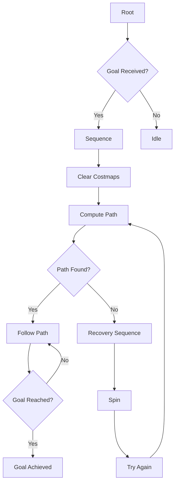

# Lab 3: NVIDIA Isaac Decision Making and Control Systems

In this lab, you'll implement decision-making and control systems for humanoid robots using NVIDIA Isaac's AI capabilities. You'll develop behavior trees for high-level decision making, implement motion control algorithms, and create a complete autonomous navigation system that integrates perception, planning, and control.

## Learning Objectives

By the end of this lab, you will be able to:
- Design and implement behavior trees for robotic decision making
- Create motion control algorithms for humanoid robots
- Integrate perception, planning, and control systems
- Implement path planning and navigation using Nav2
- Develop reactive and deliberative control architectures
- Evaluate the performance of autonomous behaviors

## Prerequisites

Before starting this lab, ensure you have:
- Completed Lab 1: Setting Up Isaac Sim for Humanoid Robot Simulation
- Completed Lab 2: NVIDIA Isaac Perception Pipeline and VSLAM Implementation
- NVIDIA Isaac Sim properly installed and configured
- Isaac ROS packages installed and accessible
- Nav2 (Navigation Stack 2) installed and configured
- Basic understanding of ROS 2 concepts and action interfaces
- Experience with Python programming for robotics
- A humanoid robot model with sensors configured in Isaac Sim

## Step 1: Setting Up the Behavior Tree Framework

First, let's establish the foundation for our decision-making system using behavior trees:

1. Install the necessary behavior tree packages:
   ```bash
   sudo apt-get install ros-humble-behaviortree-cpp-v3
   sudo apt-get install ros-humble-nav2-behavior-tree
   ```

2. Create a basic behavior tree structure for our humanoid robot:

### Behavior Tree Architecture:


### Basic Behavior Tree Implementation:
```python
import rclpy
from rclpy.node import Node
from bt_library import Blackboard
from geometry_msgs.msg import PoseStamped
from nav2_msgs.action import NavigateToPose
from rclpy.action import ActionClient
from std_msgs.msg import String
import time

class BehaviorTreeManager(Node):
    def __init__(self):
        super().__init__('behavior_tree_manager')
        
        # Initialize blackboard for shared data
        self.blackboard = Blackboard()
        
        # Set up navigation action client
        self.nav_client = ActionClient(self, NavigateToPose, 'navigate_to_pose')
        
        # Publisher for robot status
        self.status_pub = self.create_publisher(String, '/robot_status', 10)
        
        # Timer to run behavior tree ticks
        self.bt_timer = self.create_timer(0.1, self.tick_behavior_tree)
        
        # Initialize robot state
        self.robot_state = 'idle'
        self.goal_queue = []
        
        self.get_logger().info('Behavior tree manager initialized')

    def tick_behavior_tree(self):
        """Execute one tick of the behavior tree"""
        # Update blackboard with current sensor data
        self.update_blackboard()
        
        # Execute the behavior tree based on current state
        if self.robot_state == 'idle':
            self.handle_idle_state()
        elif self.robot_state == 'navigating':
            self.handle_navigation_state()
        elif self.robot_state == 'executing_task':
            self.handle_task_execution_state()
        elif self.robot_state == 'recovery':
            self.handle_recovery_state()
        
        # Publish current status
        status_msg = String()
        status_msg.data = f"State: {self.robot_state}"
        self.status_pub.publish(status_msg)

    def update_blackboard(self):
        """Update blackboard with current sensor data"""
        # In a real implementation, this would update with:
        # - Current pose from localization
        # - Sensor data from perception system
        # - Battery level
        # - Task queue
        # - Obstacle information
        pass

    def handle_idle_state(self):
        """Handle idle state - waiting for goals"""
        # Check if there are goals in the queue
        if self.goal_queue:
            goal = self.goal_queue.pop(0)
            self.start_navigation(goal)
        else:
            # Stay in idle state
            pass

    def handle_navigation_state(self):
        """Handle navigation state"""
        # Check if navigation is still active
        if not self.nav_client.server_is_ready():
            # Server not ready, go to recovery
            self.robot_state = 'recovery'
            return
            
        # In a real implementation, we would check the navigation status
        # and transition to other states as needed
        pass

    def handle_task_execution_state(self):
        """Handle task execution state"""
        # Handle specific tasks like manipulation, inspection, etc.
        # This would involve calling specific action servers
        pass

    def handle_recovery_state(self):
        """Handle recovery state"""
        # Attempt recovery behaviors
        # After recovery, return to appropriate state
        time.sleep(2.0)  # Recovery delay
        self.robot_state = 'idle'

    def start_navigation(self, goal_pose):
        """Start navigation to a goal pose"""
        # Wait for action server
        if not self.nav_client.wait_for_server(timeout_sec=5.0):
            self.get_logger().error('Navigation action server not available')
            return False
            
        # Send goal
        goal_msg = NavigateToPose.Goal()
        goal_msg.pose = goal_pose
        
        self.nav_future = self.nav_client.send_goal_async(goal_msg)
        self.nav_future.add_done_callback(self.navigation_goal_response_callback)
        
        self.robot_state = 'navigating'
        return True

    def navigation_goal_response_callback(self, future):
        """Handle navigation goal response"""
        goal_handle = future.result()
        if not goal_handle.accepted:
            self.get_logger().info('Navigation goal rejected')
            self.robot_state = 'idle'
            return
            
        self.get_logger().info('Navigation goal accepted')
        # Wait for result
        self.nav_result_future = goal_handle.get_result_async()
        self.nav_result_future.add_done_callback(self.navigation_result_callback)

    def navigation_result_callback(self, future):
        """Handle navigation result"""
        result = future.result().result
        self.get_logger().info(f'Navigation result: {result}')
        
        # Transition back to idle
        self.robot_state = 'idle'

def main(args=None):
    rclpy.init(args=args)
    
    bt_manager = BehaviorTreeManager()
    
    try:
        rclpy.spin(bt_manager)
    except KeyboardInterrupt:
        pass
    finally:
        bt_manager.destroy_node()
        rclpy.shutdown()

if __name__ == '__main__':
    main()
```

## Step 2: Implementing Motion Control Algorithms

Now let's implement motion control algorithms for the humanoid robot:

### Motion Control Node:
```python
import rclpy
from rclpy.node import Node
from sensor_msgs.msg import JointState
from geometry_msgs.msg import Twist, PoseStamped
from trajectory_msgs.msg import JointTrajectory, JointTrajectoryPoint
from builtin_interfaces.msg import Duration
from std_msgs.msg import Float64MultiArray
import numpy as np
import math
from scipy.interpolate import interp1d

class MotionControlNode(Node):
    def __init__(self):
        super().__init__('motion_control_node')
        
        # Publishers for different control interfaces
        self.joint_trajectory_pub = self.create_publisher(
            JointTrajectory, 
            '/joint_trajectory_controller/joint_trajectory', 
            10
        )
        
        self.cmd_vel_pub = self.create_publisher(Twist, '/cmd_vel', 10)
        
        # Subscribers
        self.joint_state_sub = self.create_subscription(
            JointState,
            '/joint_states',
            self.joint_state_callback,
            10
        )
        
        self.desired_pose_sub = self.create_subscription(
            PoseStamped,
            '/desired_pose',
            self.desired_pose_callback,
            10
        )
        
        # Timer for control loop
        self.control_timer = self.create_timer(0.05, self.control_loop)
        
        # Initialize joint states
        self.current_joint_positions = {}
        self.current_joint_velocities = {}
        self.current_joint_efforts = {}
        
        # Desired pose
        self.desired_pose = None
        
        # PID controllers for joints
        self.pid_controllers = {}
        
        self.get_logger().info('Motion control node initialized')

    def joint_state_callback(self, msg):
        """Update current joint states"""
        for i, name in enumerate(msg.name):
            if i < len(msg.position):
                self.current_joint_positions[name] = msg.position[i]
            if i < len(msg.velocity):
                self.current_joint_velocities[name] = msg.velocity[i]
            if i < len(msg.effort):
                self.current_joint_efforts[name] = msg.effort[i]

    def desired_pose_callback(self, msg):
        """Update desired pose"""
        self.desired_pose = msg.pose

    def control_loop(self):
        """Main control loop"""
        if self.desired_pose is not None:
            # Calculate joint trajectories to reach desired pose
            joint_trajectory = self.calculate_joint_trajectory()
            
            # Publish the trajectory
            self.joint_trajectory_pub.publish(joint_trajectory)

    def calculate_joint_trajectory(self):
        """Calculate joint trajectory to reach desired pose"""
        # This is a simplified implementation
        # In practice, you would use inverse kinematics
        
        # Create joint trajectory message
        trajectory = JointTrajectory()
        trajectory.joint_names = list(self.current_joint_positions.keys())
        
        # Create trajectory point
        point = JointTrajectoryPoint()
        
        # Calculate desired joint positions (simplified)
        for joint_name in trajectory.joint_names:
            current_pos = self.current_joint_positions.get(joint_name, 0.0)
            
            # For this example, we'll just move to a predefined position
            # In practice, this would come from inverse kinematics
            desired_pos = self.calculate_desired_joint_position(joint_name)
            
            # Add PID control
            control_output = self.apply_pid_control(
                joint_name, 
                current_pos, 
                desired_pos
            )
            
            point.positions.append(control_output)
            point.velocities.append(0.0)  # Simplified
            point.accelerations.append(0.0)  # Simplified
        
        # Set time from start (0.5 seconds for this movement)
        point.time_from_start = Duration(sec=0, nanosec=500000000)
        
        trajectory.points.append(point)
        
        return trajectory

    def calculate_desired_joint_position(self, joint_name):
        """Calculate desired joint position based on desired pose"""
        # This is a placeholder - in practice, you would use inverse kinematics
        # to calculate joint angles needed to achieve the desired end-effector pose
        
        # For demonstration, return a fixed position for each joint
        if 'hip' in joint_name:
            return 0.1  # Hip joint position
        elif 'knee' in joint_name:
            return 0.2  # Knee joint position
        elif 'ankle' in joint_name:
            return 0.05  # Ankle joint position
        elif 'shoulder' in joint_name:
            return 0.3  # Shoulder joint position
        elif 'elbow' in joint_name:
            return 0.4  # Elbow joint position
        else:
            return 0.0  # Default position

    def apply_pid_control(self, joint_name, current_pos, desired_pos):
        """Apply PID control to a joint"""
        # Initialize PID controller if not exists
        if joint_name not in self.pid_controllers:
            self.pid_controllers[joint_name] = {
                'kp': 10.0,  # Proportional gain
                'ki': 0.1,   # Integral gain
                'kd': 0.5,   # Derivative gain
                'prev_error': 0.0,
                'integral': 0.0
            }
        
        pid = self.pid_controllers[joint_name]
        
        # Calculate error
        error = desired_pos - current_pos
        
        # Update integral
        pid['integral'] += error * 0.05  # dt = 0.05s from timer
        
        # Calculate derivative
        derivative = (error - pid['prev_error']) / 0.05
        
        # Calculate control output
        output = (
            pid['kp'] * error +
            pid['ki'] * pid['integral'] +
            pid['kd'] * derivative
        )
        
        # Update previous error
        pid['prev_error'] = error
        
        # Apply limits to prevent excessive movement
        output = max(min(output, 1.0), -1.0)
        
        # Calculate new position
        new_pos = current_pos + output * 0.05  # Scale by time step
        
        return new_pos

    def move_to_pose(self, target_pose):
        """Move robot to a specific pose"""
        self.desired_pose = target_pose
        self.get_logger().info(f'Moving to pose: {target_pose}')

def main(args=None):
    rclpy.init(args=args)
    
    motion_control = MotionControlNode()
    
    try:
        rclpy.spin(motion_control)
    except KeyboardInterrupt:
        pass
    finally:
        motion_control.destroy_node()
        rclpy.shutdown()

if __name__ == '__main__':
    main()
```

## Step 3: Integrating with Nav2 for Navigation

Let's create a node that integrates our perception system with Nav2 for autonomous navigation:

### Navigation Integration Node:
```python
import rclpy
from rclpy.node import Node
from nav2_msgs.action import NavigateToPose, NavigateThroughPoses
from rclpy.action import ActionClient
from geometry_msgs.msg import PoseStamped
from sensor_msgs.msg import LaserScan, PointCloud2
from nav_msgs.msg import OccupancyGrid
from std_msgs.msg import String
from tf2_ros import TransformListener, Buffer
import numpy as np
import math

class NavigationIntegrationNode(Node):
    def __init__(self):
        super().__init__('navigation_integration_node')
        
        # Initialize action clients for Nav2
        self.nav_to_pose_client = ActionClient(self, NavigateToPose, 'navigate_to_pose')
        self.nav_through_poses_client = ActionClient(self, NavigateThroughPoses, 'navigate_through_poses')
        
        # Subscribers for sensor data
        self.map_sub = self.create_subscription(
            OccupancyGrid,
            '/map',
            self.map_callback,
            10
        )
        
        self.scan_sub = self.create_subscription(
            LaserScan,
            '/scan',
            self.scan_callback,
            10
        )
        
        # Publisher for navigation status
        self.nav_status_pub = self.create_publisher(String, '/navigation_status', 10)
        
        # TF buffer and listener
        self.tf_buffer = Buffer()
        self.tf_listener = TransformListener(self.tf_buffer, self)
        
        # Initialize variables
        self.current_map = None
        self.current_scan = None
        self.robot_pose = None
        
        # Navigation state
        self.navigation_active = False
        self.navigation_goal_handle = None
        
        self.get_logger().info('Navigation integration node initialized')

    def map_callback(self, msg):
        """Handle map updates"""
        self.current_map = msg
        self.get_logger().info('Received map update')

    def scan_callback(self, msg):
        """Handle laser scan updates"""
        self.current_scan = msg
        
        # Check for obstacles near the robot
        if self.navigation_active:
            self.check_for_obstacles(msg)

    def check_for_obstacles(self, scan_msg):
        """Check for obstacles that might require replanning"""
        # Check the front sector for obstacles
        front_sector_start = len(scan_msg.ranges) // 2 - 10
        front_sector_end = len(scan_msg.ranges) // 2 + 10
        
        if front_sector_start < 0:
            front_sector_start = 0
        if front_sector_end >= len(scan_msg.ranges):
            front_sector_end = len(scan_msg.ranges) - 1
            
        front_distances = scan_msg.ranges[front_sector_start:front_sector_end]
        
        # Filter out invalid readings
        valid_distances = [d for d in front_distances if not (math.isnan(d) or math.isinf(d))]
        
        if valid_distances:
            min_distance = min(valid_distances)
            
            # If obstacle is too close, consider stopping or replanning
            if min_distance < 0.5:  # 0.5 meters threshold
                self.get_logger().warn(f'Obstacle detected at {min_distance:.2f}m, considering replanning')
                # In a real implementation, you might cancel the current goal and replan

    def send_navigation_goal(self, goal_pose):
        """Send a navigation goal to Nav2"""
        if not self.nav_to_pose_client.wait_for_server(timeout_sec=5.0):
            self.get_logger().error('Navigation action server not available')
            return False
            
        goal_msg = NavigateToPose.Goal()
        goal_msg.pose = goal_pose
        
        self.nav_future = self.nav_to_pose_client.send_goal_async(goal_msg)
        self.nav_future.add_done_callback(self.navigation_goal_response_callback)
        
        self.navigation_active = True
        self.get_logger().info(f'Sent navigation goal to ({goal_pose.pose.position.x:.2f}, {goal_pose.pose.position.y:.2f})')
        
        return True

    def navigation_goal_response_callback(self, future):
        """Handle navigation goal response"""
        goal_handle = future.result()
        if not goal_handle.accepted:
            self.get_logger().info('Navigation goal rejected')
            self.navigation_active = False
            return
            
        self.get_logger().info('Navigation goal accepted')
        self.navigation_goal_handle = goal_handle
        
        # Wait for result
        self.nav_result_future = goal_handle.get_result_async()
        self.nav_result_future.add_done_callback(self.navigation_result_callback)

    def navigation_result_callback(self, future):
        """Handle navigation result"""
        result = future.result().result
        status = future.result().status
        
        # Log result
        if status == 4:  # GOAL_STATE_SUCCEEDED
            self.get_logger().info('Navigation succeeded')
        else:
            self.get_logger().info(f'Navigation failed with status: {status}')
        
        # Update navigation state
        self.navigation_active = False
        self.navigation_goal_handle = None
        
        # Publish status
        status_msg = String()
        status_msg.data = f"Navigation {'succeeded' if status == 4 else 'failed'}"
        self.nav_status_pub.publish(status_msg)

    def get_robot_pose(self):
        """Get current robot pose from TF"""
        try:
            transform = self.tf_buffer.lookup_transform(
                'map',
                'base_link',
                rclpy.time.Time()
            )
            
            pose = PoseStamped()
            pose.header.frame_id = 'map'
            pose.pose.position.x = transform.transform.translation.x
            pose.pose.position.y = transform.transform.translation.y
            pose.pose.position.z = transform.transform.translation.z
            pose.pose.orientation = transform.transform.rotation
            
            return pose.pose
        except Exception as e:
            self.get_logger().error(f'Failed to get robot pose: {str(e)}')
            return None

    def plan_path(self, start_pose, goal_pose):
        """Plan a path from start to goal"""
        # In a real implementation, you would use Nav2's path planning capabilities
        # or call the compute_path_to_pose service
        
        # For this example, we'll just return a simple path
        path = [start_pose, goal_pose]
        return path

def main(args=None):
    rclpy.init(args=args)
    
    nav_integration = NavigationIntegrationNode()
    
    # Example: Send a navigation goal after initialization
    # In practice, this would be triggered by higher-level logic
    
    # Create a sample goal pose
    sample_goal = PoseStamped()
    sample_goal.header.frame_id = 'map'
    sample_goal.pose.position.x = 2.0
    sample_goal.pose.position.y = 2.0
    sample_goal.pose.position.z = 0.0
    sample_goal.pose.orientation.w = 1.0  # No rotation
    
    # Wait a bit for everything to initialize, then send goal
    def send_sample_goal():
        nav_integration.send_navigation_goal(sample_goal)
    
    # Schedule sending the goal after 5 seconds
    timer = nav_integration.create_timer(5.0, send_sample_goal)
    
    try:
        rclpy.spin(nav_integration)
    except KeyboardInterrupt:
        pass
    finally:
        nav_integration.destroy_node()
        rclpy.shutdown()

if __name__ == '__main__':
    main()
```

## Step 4: Implementing Reactive Behaviors

Let's create a reactive behavior system that responds to sensor inputs:

### Reactive Behavior Node:
```python
import rclpy
from rclpy.node import Node
from sensor_msgs.msg import LaserScan, Image
from geometry_msgs.msg import Twist, PoseStamped
from std_msgs.msg import String, Bool
from cv_bridge import CvBridge
import numpy as np
import cv2
import math

class ReactiveBehaviorNode(Node):
    def __init__(self):
        super().__init__('reactive_behavior_node')
        
        # Initialize CV bridge
        self.cv_bridge = CvBridge()
        
        # Publishers
        self.cmd_vel_pub = self.create_publisher(Twist, '/cmd_vel', 10)
        self.behavior_status_pub = self.create_publisher(String, '/behavior_status', 10)
        
        # Subscribers
        self.scan_sub = self.create_subscription(
            LaserScan,
            '/scan',
            self.scan_callback,
            10
        )
        
        self.camera_sub = self.create_subscription(
            Image,
            '/camera/rgb/image_raw',
            self.camera_callback,
            10
        )
        
        # Timer for behavior execution
        self.behavior_timer = self.create_timer(0.1, self.execute_reactive_behaviors)
        
        # Initialize variables
        self.current_scan = None
        self.current_image = None
        self.robot_behavior = 'explore'  # explore, avoid_obstacles, follow_object, etc.
        
        # Robot state
        self.linear_velocity = 0.0
        self.angular_velocity = 0.0
        
        self.get_logger().info('Reactive behavior node initialized')

    def scan_callback(self, msg):
        """Handle laser scan data"""
        self.current_scan = msg

    def camera_callback(self, msg):
        """Handle camera image data"""
        try:
            self.current_image = self.cv_bridge.imgmsg_to_cv2(msg, "bgr8")
        except Exception as e:
            self.get_logger().error(f'Error converting image: {str(e)}')

    def execute_reactive_behaviors(self):
        """Execute reactive behaviors based on sensor input"""
        if self.current_scan is None:
            return
            
        # Determine current behavior based on sensor data
        self.select_behavior()
        
        # Execute the selected behavior
        if self.robot_behavior == 'explore':
            self.explore_behavior()
        elif self.robot_behavior == 'avoid_obstacles':
            self.avoid_obstacles_behavior()
        elif self.robot_behavior == 'follow_object':
            self.follow_object_behavior()
        elif self.robot_behavior == 'stop':
            self.stop_behavior()
        
        # Publish velocities
        cmd_vel = Twist()
        cmd_vel.linear.x = self.linear_velocity
        cmd_vel.angular.z = self.angular_velocity
        self.cmd_vel_pub.publish(cmd_vel)
        
        # Publish behavior status
        status_msg = String()
        status_msg.data = f"Behavior: {self.robot_behavior}, Linear: {self.linear_velocity:.2f}, Angular: {self.angular_velocity:.2f}"
        self.behavior_status_pub.publish(status_msg)

    def select_behavior(self):
        """Select behavior based on sensor data"""
        # Check for obstacles in front
        front_distances = self.get_front_distances()
        
        if front_distances:
            min_front_dist = min(front_distances)
            
            # If obstacle is very close, switch to obstacle avoidance
            if min_front_dist < 0.5:
                self.robot_behavior = 'avoid_obstacles'
                return
        
        # Check for objects in camera image
        if self.current_image is not None:
            object_detected = self.detect_object_of_interest(self.current_image)
            
            if object_detected:
                self.robot_behavior = 'follow_object'
                return
        
        # Default to exploration
        self.robot_behavior = 'explore'

    def get_front_distances(self):
        """Get distances in the front sector of the laser scan"""
        if self.current_scan is None:
            return []
            
        # Define front sector (±30 degrees from center)
        total_angles = len(self.current_scan.ranges)
        center_idx = total_angles // 2
        sector_width = int(30 * (total_angles / (2 * math.pi)))  # Convert 30 degrees to indices
        
        start_idx = max(center_idx - sector_width, 0)
        end_idx = min(center_idx + sector_width, total_angles - 1)
        
        front_distances = [
            d for d in self.current_scan.ranges[start_idx:end_idx]
            if not (math.isnan(d) or math.isinf(d))
        ]
        
        return front_distances

    def explore_behavior(self):
        """Simple exploration behavior - move forward with occasional turns"""
        self.linear_velocity = 0.3  # Move forward at 0.3 m/s
        self.angular_velocity = 0.0  # No turning
        
        # Occasionally turn to explore more area
        if np.random.random() < 0.02:  # 2% chance per cycle
            self.angular_velocity = np.random.choice([-0.5, 0.5])  # Random turn

    def avoid_obstacles_behavior(self):
        """Obstacle avoidance behavior using potential fields concept"""
        if self.current_scan is None:
            return
            
        # Get distances in different sectors
        front_distances = self.get_front_distances()
        left_distances = self.get_left_distances()
        right_distances = self.get_right_distances()
        
        if not front_distances:
            return
            
        min_front = min(front_distances) if front_distances else float('inf')
        min_left = min(left_distances) if left_distances else float('inf')
        min_right = min(right_distances) if right_distances else float('inf')
        
        # Adjust velocities based on obstacle distances
        if min_front < 0.5:
            # Obstacle very close - stop and turn
            self.linear_velocity = 0.0
            if min_left > min_right:
                self.angular_velocity = 0.8  # Turn left
            else:
                self.angular_velocity = -0.8  # Turn right
        elif min_front < 1.0:
            # Obstacle nearby - slow down and prepare to turn
            self.linear_velocity = 0.1
            if min_left > min_right:
                self.angular_velocity = 0.3
            else:
                self.angular_velocity = -0.3
        else:
            # No obstacles nearby - continue exploring
            self.linear_velocity = 0.3
            self.angular_velocity = 0.0

    def get_left_distances(self):
        """Get distances in the left sector of the laser scan"""
        if self.current_scan is None:
            return []
            
        total_angles = len(self.current_scan.ranges)
        center_idx = total_angles // 2
        sector_width = int(60 * (total_angles / (2 * math.pi)))
        
        start_idx = max(center_idx - sector_width - 10, 0)
        end_idx = max(center_idx - 10, 0)
        
        left_distances = [
            d for d in self.current_scan.ranges[start_idx:end_idx]
            if not (math.isnan(d) or math.isinf(d))
        ]
        
        return left_distances

    def get_right_distances(self):
        """Get distances in the right sector of the laser scan"""
        if self.current_scan is None:
            return []
            
        total_angles = len(self.current_scan.ranges)
        center_idx = total_angles // 2
        sector_width = int(60 * (total_angles / (2 * math.pi)))
        
        start_idx = min(center_idx + 10, total_angles - 1)
        end_idx = min(center_idx + sector_width + 10, total_angles - 1)
        
        right_distances = [
            d for d in self.current_scan.ranges[start_idx:end_idx]
            if not (math.isnan(d) or math.isinf(d))
        ]
        
        return right_distances

    def follow_object_behavior(self):
        """Object following behavior"""
        if self.current_image is None:
            return
            
        # Find the object in the image
        object_center_x = self.find_object_center(self.current_image)
        
        if object_center_x is not None:
            # Calculate how far the object is from the center of the image
            img_center = self.current_image.shape[1] / 2
            offset = object_center_x - img_center
            
            # Set velocities based on offset
            self.linear_velocity = 0.2  # Move forward slowly
            self.angular_velocity = -offset * 0.005  # Turn toward object (negative for correct direction)
        else:
            # Object lost - search for it
            self.linear_velocity = 0.0
            self.angular_velocity = 0.5  # Turn in place to search

    def detect_object_of_interest(self, image):
        """Detect if an object of interest is in the image"""
        # For this example, we'll detect red objects
        # In practice, you might use more sophisticated object detection
        
        # Convert to HSV for easier color detection
        hsv = cv2.cvtColor(image, cv2.COLOR_BGR2HSV)
        
        # Define range for red color
        lower_red = np.array([0, 50, 50])
        upper_red = np.array([10, 255, 255])
        mask1 = cv2.inRange(hsv, lower_red, upper_red)
        
        # Red can also be in the 170-180 range due to circular nature of hue
        lower_red2 = np.array([170, 50, 50])
        upper_red2 = np.array([180, 255, 255])
        mask2 = cv2.inRange(hsv, lower_red2, upper_red2)
        
        # Combine masks
        mask = mask1 + mask2
        
        # Count non-zero pixels (pixels that match the color)
        object_pixels = cv2.countNonZero(mask)
        
        # If enough pixels match, consider it an object of interest
        return object_pixels > 1000  # Threshold for detection

    def find_object_center(self, image):
        """Find the center of the detected object in the image"""
        # Convert to HSV for easier color detection
        hsv = cv2.cvtColor(image, cv2.COLOR_BGR2HSV)
        
        # Define range for red color
        lower_red = np.array([0, 50, 50])
        upper_red = np.array([10, 255, 255])
        mask1 = cv2.inRange(hsv, lower_red, upper_red)
        
        # Red can also be in the 170-180 range
        lower_red2 = np.array([170, 50, 50])
        upper_red2 = np.array([180, 255, 255])
        mask2 = cv2.inRange(hsv, lower_red2, upper_red2)
        
        # Combine masks
        mask = mask1 + mask2
        
        # Find contours
        contours, _ = cv2.findContours(mask, cv2.RETR_EXTERNAL, cv2.CHAIN_APPROX_SIMPLE)
        
        if contours:
            # Find the largest contour
            largest_contour = max(contours, key=cv2.contourArea)
            
            # Calculate the center of the contour
            moment = cv2.moments(largest_contour)
            if moment["m00"] != 0:
                cx = int(moment["m10"] / moment["m00"])
                return cx
        
        return None

    def stop_behavior(self):
        """Stop the robot"""
        self.linear_velocity = 0.0
        self.angular_velocity = 0.0

def main(args=None):
    rclpy.init(args=args)
    
    reactive_behavior = ReactiveBehaviorNode()
    
    try:
        rclpy.spin(reactive_behavior)
    except KeyboardInterrupt:
        pass
    finally:
        reactive_behavior.destroy_node()
        rclpy.shutdown()

if __name__ == '__main__':
    main()
```

## Step 5: Creating a Complete Autonomous System

Now let's create a master node that orchestrates all the components:

### Master Control Node:
```python
import rclpy
from rclpy.node import Node
from geometry_msgs.msg import PoseStamped, Twist
from std_msgs.msg import String
from sensor_msgs.msg import LaserScan, Image
from nav2_msgs.action import NavigateToPose
from rclpy.action import ActionClient
from tf2_ros import TransformListener, Buffer
import numpy as np
import math
import time
from enum import Enum

class RobotState(Enum):
    IDLE = 1
    NAVIGATING = 2
    REACTIVE_BEHAVIOR = 3
    EXECUTING_TASK = 4
    EMERGENCY_STOP = 5

class MasterControlNode(Node):
    def __init__(self):
        super().__init__('master_control_node')
        
        # Initialize state
        self.state = RobotState.IDLE
        self.previous_state = None
        
        # Initialize action client for navigation
        self.nav_client = ActionClient(self, NavigateToPose, 'navigate_to_pose')
        
        # Publishers
        self.cmd_vel_pub = self.create_publisher(Twist, '/cmd_vel', 10)
        self.status_pub = self.create_publisher(String, '/master_status', 10)
        
        # Subscribers
        self.scan_sub = self.create_subscription(
            LaserScan,
            '/scan',
            self.scan_callback,
            10
        )
        
        self.fused_pose_sub = self.create_subscription(
            PoseStamped,
            '/fused_pose',
            self.pose_callback,
            10
        )
        
        # TF buffer and listener
        self.tf_buffer = Buffer()
        self.tf_listener = TransformListener(self.tf_buffer, self)
        
        # Timer for main control loop
        self.control_timer = self.create_timer(0.1, self.main_control_loop)
        
        # Initialize variables
        self.current_scan = None
        self.current_pose = None
        self.navigation_goal = None
        self.emergency_stop_triggered = False
        
        # Mission parameters
        self.waypoints = [
            (2.0, 2.0),
            (4.0, 1.0),
            (-1.0, 3.0),
            (0.0, 0.0)  # Return to start
        ]
        self.current_waypoint_idx = 0
        self.waypoint_reached_threshold = 0.5  # meters
        
        self.get_logger().info('Master control node initialized')

    def scan_callback(self, msg):
        """Handle laser scan data"""
        self.current_scan = msg
        
        # Check for emergency stop conditions
        if self.is_emergency_stop_needed():
            self.emergency_stop_triggered = True
            self.state = RobotState.EMERGENCY_STOP

    def pose_callback(self, msg):
        """Handle pose updates"""
        self.current_pose = msg.pose

    def is_emergency_stop_needed(self):
        """Check if emergency stop conditions are met"""
        if self.current_scan is None:
            return False
            
        # Check for very close obstacles in front
        front_distances = self.get_front_distances()
        if front_distances:
            min_front_dist = min(front_distances)
            if min_front_dist < 0.3:  # Emergency threshold
                return True
                
        return False

    def get_front_distances(self):
        """Get distances in the front sector of the laser scan"""
        if self.current_scan is None:
            return []
            
        # Define front sector (±30 degrees from center)
        total_angles = len(self.current_scan.ranges)
        center_idx = total_angles // 2
        sector_width = int(30 * (total_angles / (2 * math.pi)))
        
        start_idx = max(center_idx - sector_width, 0)
        end_idx = min(center_idx + sector_width, total_angles - 1)
        
        front_distances = [
            d for d in self.current_scan.ranges[start_idx:end_idx]
            if not (math.isnan(d) or math.isinf(d))
        ]
        
        return front_distances

    def main_control_loop(self):
        """Main control loop that manages robot states"""
        # Update state if needed
        self.update_state()
        
        # Execute behavior based on current state
        if self.state == RobotState.IDLE:
            self.execute_idle_behavior()
        elif self.state == RobotState.NAVIGATING:
            self.execute_navigation_behavior()
        elif self.state == RobotState.REACTIVE_BEHAVIOR:
            self.execute_reactive_behavior()
        elif self.state == RobotState.EXECUTING_TASK:
            self.execute_task_behavior()
        elif self.state == RobotState.EMERGENCY_STOP:
            self.execute_emergency_stop()
        
        # Publish status
        status_msg = String()
        status_msg.data = f"State: {self.state.name}, Waypoint: {self.current_waypoint_idx}/{len(self.waypoints)}"
        self.status_pub.publish(status_msg)

    def update_state(self):
        """Update robot state based on conditions"""
        # Handle emergency stop
        if self.emergency_stop_triggered and self.state != RobotState.EMERGENCY_STOP:
            self.previous_state = self.state
            self.state = RobotState.EMERGENCY_STOP
            return
            
        # Resume from emergency stop if conditions are safe
        if self.state == RobotState.EMERGENCY_STOP and not self.emergency_stop_triggered:
            if self.previous_state:
                self.state = self.previous_state
            else:
                self.state = RobotState.IDLE
            return
        
        # Handle navigation completion
        if self.state == RobotState.NAVIGATING and self.is_waypoint_reached():
            self.state = RobotState.IDLE
            self.current_waypoint_idx = (self.current_waypoint_idx + 1) % len(self.waypoints)
            return
        
        # Default state transitions
        if self.state == RobotState.IDLE:
            # Check if we have a mission to execute
            if self.current_waypoint_idx < len(self.waypoints):
                self.state = RobotState.NAVIGATING
                self.navigate_to_current_waypoint()

    def execute_idle_behavior(self):
        """Execute idle behavior"""
        # Stop the robot
        cmd_vel = Twist()
        cmd_vel.linear.x = 0.0
        cmd_vel.angular.z = 0.0
        self.cmd_vel_pub.publish(cmd_vel)

    def execute_navigation_behavior(self):
        """Execute navigation behavior"""
        # Navigation is handled by Nav2, but we monitor progress
        # and can intervene if needed
        pass

    def execute_reactive_behavior(self):
        """Execute reactive behavior"""
        # This could be obstacle avoidance or other reactive behaviors
        if self.current_scan:
            # Implement reactive behavior based on scan data
            front_distances = self.get_front_distances()
            if front_distances and min(front_distances) < 0.8:
                # Implement避障 behavior
                cmd_vel = Twist()
                cmd_vel.linear.x = 0.0
                cmd_vel.angular.z = 0.5  # Turn away from obstacle
                self.cmd_vel_pub.publish(cmd_vel)

    def execute_task_behavior(self):
        """Execute specific task behavior"""
        # Placeholder for task-specific behaviors
        pass

    def execute_emergency_stop(self):
        """Execute emergency stop"""
        cmd_vel = Twist()
        cmd_vel.linear.x = 0.0
        cmd_vel.angular.z = 0.0
        self.cmd_vel_pub.publish(cmd_vel)
        self.get_logger().warn('EMERGENCY STOP ACTIVATED')

    def navigate_to_current_waypoint(self):
        """Navigate to the current waypoint"""
        if self.current_waypoint_idx >= len(self.waypoints):
            self.get_logger().info('All waypoints completed')
            return
            
        x, y = self.waypoints[self.current_waypoint_idx]
        
        # Create navigation goal
        goal_pose = PoseStamped()
        goal_pose.header.frame_id = 'map'
        goal_pose.pose.position.x = float(x)
        goal_pose.pose.position.y = float(y)
        goal_pose.pose.position.z = 0.0
        goal_pose.pose.orientation.w = 1.0  # No rotation
        
        # Send navigation goal
        self.send_navigation_goal(goal_pose)

    def send_navigation_goal(self, goal_pose):
        """Send navigation goal to Nav2"""
        if not self.nav_client.wait_for_server(timeout_sec=5.0):
            self.get_logger().error('Navigation action server not available')
            return False
            
        goal_msg = NavigateToPose.Goal()
        goal_msg.pose = goal_pose
        
        self.nav_future = self.nav_client.send_goal_async(goal_msg)
        self.nav_future.add_done_callback(self.navigation_goal_response_callback)
        
        self.get_logger().info(f'Sent navigation goal to ({goal_pose.pose.position.x:.2f}, {goal_pose.pose.position.y:.2f})')
        
        return True

    def navigation_goal_response_callback(self, future):
        """Handle navigation goal response"""
        goal_handle = future.result()
        if not goal_handle.accepted:
            self.get_logger().info('Navigation goal rejected')
            self.state = RobotState.IDLE
            return
            
        self.get_logger().info('Navigation goal accepted')
        # In a real implementation, we would track the goal execution

    def is_waypoint_reached(self):
        """Check if current waypoint is reached"""
        if self.current_pose is None or self.current_waypoint_idx >= len(self.waypoints):
            return False
            
        target_x, target_y = self.waypoints[self.current_waypoint_idx]
        
        dist_to_target = math.sqrt(
            (self.current_pose.position.x - target_x)**2 + 
            (self.current_pose.position.y - target_y)**2
        )
        
        return dist_to_target <= self.waypoint_reached_threshold

def main(args=None):
    rclpy.init(args=args)
    
    master_control = MasterControlNode()
    
    try:
        rclpy.spin(master_control)
    except KeyboardInterrupt:
        pass
    finally:
        master_control.destroy_node()
        rclpy.shutdown()

if __name__ == '__main__':
    main()
```

## Step 6: Launching the Complete System

Create a launch file to bring up the entire autonomous system:

### Complete System Launch File:
```xml
<!-- launch/complete_autonomous_system.launch.py -->
from launch import LaunchDescription
from launch_ros.actions import Node
from ament_index_python.packages import get_package_share_directory
import os

def generate_launch_description():
    # Get config directory
    config_dir = os.path.join(get_package_share_directory('your_robot_control'), 'config')
    
    return LaunchDescription([
        # Behavior tree manager
        Node(
            package='your_robot_control',
            executable='behavior_tree_manager',
            name='behavior_tree_manager',
            output='screen',
        ),
        
        # Motion control node
        Node(
            package='your_robot_control',
            executable='motion_control_node',
            name='motion_control_node',
            output='screen',
        ),
        
        # Navigation integration node
        Node(
            package='your_robot_control',
            executable='navigation_integration_node',
            name='navigation_integration_node',
            output='screen',
        ),
        
        # Reactive behavior node
        Node(
            package='your_robot_control',
            executable='reactive_behavior_node',
            name='reactive_behavior_node',
            output='screen',
        ),
        
        # Master control node
        Node(
            package='your_robot_control',
            executable='master_control_node',
            name='master_control_node',
            output='screen',
        ),
    ])
```

## Step 7: Testing and Evaluation

1. Launch Isaac Sim with your humanoid robot:
   ```bash
   # Launch Isaac Sim with your robot configuration
   ./isaac-sim --exec "omni.isaac.examples.robots.my_humanoid_robot"
   ```

2. Launch the navigation stack:
   ```bash
   ros2 launch nav2_bringup tb3_simulation_launch.py
   ```

3. Launch your complete autonomous system:
   ```bash
   ros2 launch your_robot_control complete_autonomous_system.launch.py
   ```

4. Monitor the system in RViz and check the published topics:
   ```bash
   # Monitor robot status
   ros2 topic echo /master_status
   
   # Monitor navigation status
   ros2 topic echo /navigation_status
   
   # Monitor behavior status
   ros2 topic echo /behavior_status
   ```

## Step 8: Performance Evaluation

Evaluate the performance of your autonomous system:

1. Measure navigation accuracy:
   ```bash
   # Compare planned vs executed path
   ros2 run plotjuggler plotjuggler
   ```

2. Monitor computational performance:
   ```bash
   # Monitor CPU usage
   htop
   
   # Monitor GPU usage (if using Isaac ROS acceleration)
   nvidia-smi
   ```

3. Evaluate behavior effectiveness:
   - Track how often emergency stops are triggered
   - Measure time to complete missions
   - Assess obstacle avoidance effectiveness

## Lab Summary

In this lab, you:
- Designed and implemented behavior trees for robotic decision making
- Created motion control algorithms for humanoid robots
- Integrated perception, planning, and control systems
- Implemented path planning and navigation using Nav2
- Developed reactive and deliberative control architectures
- Evaluated the performance of autonomous behaviors

## Troubleshooting Tips

1. If navigation is not working, verify that Nav2 is properly configured and launched
2. If behavior trees are not executing, check that the BT library is properly installed
3. If control is unstable, tune the PID parameters in the motion control node
4. If emergency stops are triggered too frequently, adjust the safety thresholds

## Next Steps

Congratulations! You've completed all three labs for Module 3: The AI-Robot Brain (NVIDIA Isaac™). You now have a comprehensive understanding of:
- Setting up Isaac Sim for humanoid robot simulation
- Implementing perception pipelines with VSLAM
- Developing decision-making and control systems

In the next module, you'll explore Vision-Language-Action (VLA) models and how they integrate with robotic systems.