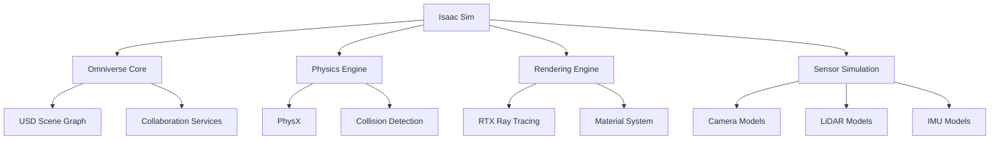

# NVIDIA Isaac™ Tools and Technologies

This section provides an in-depth exploration of the NVIDIA Isaac™ tools and technologies that form the foundation of AI-powered robotics. We'll examine each component in detail, including Isaac Sim, Isaac ROS, Isaac Lab, and related tools.

## Isaac Sim: High-Fidelity Simulation

Isaac Sim is NVIDIA's high-fidelity simulation environment built on the Omniverse platform. It provides photorealistic rendering, accurate physics simulation, and comprehensive sensor modeling for robotics development.

### Core Architecture

#### Omniverse Foundation
- **USD (Universal Scene Description)**: Scalable scene representation format
- **Microservices**: Distributed architecture for scalability
- **Real-time collaboration**: Multi-user editing capabilities
- **Extensibility**: Python and C++ extension APIs

#### Physics Engine Integration
- **PhysX**: NVIDIA's physics simulation engine
- **Rigid body dynamics**: Accurate collision and contact simulation
- **Soft body simulation**: Deformable object modeling
- **Fluid simulation**: Liquid and gas behavior modeling

### Key Features

#### Photorealistic Rendering
- **RTX ray tracing**: Realistic lighting and reflections
- **Material authoring**: Physically-based material definitions
- **Lighting systems**: Advanced illumination models
- **Environmental effects**: Weather, fog, and atmospheric simulation

#### Sensor Simulation
- **Camera simulation**: RGB, depth, stereo, and fisheye cameras
- **LiDAR simulation**: 2D and 3D LiDAR with configurable parameters
- **IMU simulation**: Accelerometer and gyroscope modeling
- **GPS simulation**: Global positioning with noise modeling

### Synthetic Data Generation

#### Domain Randomization
- **Appearance variation**: Randomizing textures, colors, and lighting
- **Geometric variation**: Modifying object shapes and sizes
- **Physical properties**: Varying friction, mass, and other parameters
- **Environmental conditions**: Changing backgrounds and contexts

#### Annotation Pipeline
- **Semantic segmentation**: Pixel-level object labeling
- **Instance segmentation**: Individual object identification
- **Bounding boxes**: Object localization
- **Keypoint detection**: Landmark identification

### Isaac Sim Extensions

#### Robotics Extensions
- **URDF import**: Direct import of ROS robot models
- **ROS bridge**: Real-time communication with ROS/ROS2
- **Robot simulation**: Accurate kinematic and dynamic modeling
- **Control interfaces**: Integration with robot controllers

#### AI Training Extensions
- **Reinforcement learning**: Integration with RL frameworks
- **Data collection**: Automated dataset generation
- **Environment randomization**: Domain randomization tools
- **Performance analytics**: Training progress monitoring

## Isaac ROS: Hardware-Accelerated Packages

Isaac ROS provides a collection of hardware-accelerated packages for robotics perception and navigation, optimized for NVIDIA platforms.

### Core Packages

#### Isaac ROS Image Pipeline
- **Image Proc**: GPU-accelerated image processing
- **Stereo Image Proc**: Hardware-accelerated stereo processing
- **Image Transport**: Optimized image data transport
- **Camera Info Manager**: Camera calibration management

#### Isaac ROS Perception

##### Isaac ROS AprilGrid
- **AprilTag detection**: GPU-accelerated fiducial marker detection
- **Pose estimation**: Accurate 6DOF pose computation
- **Calibration**: Camera and multi-camera calibration
- **Multi-target tracking**: Simultaneous tracking of multiple markers

##### Isaac ROS DNN Inference
- **TensorRT integration**: Optimized neural network inference
- **INT8 calibration**: Quantization for edge deployment
- **Multi-model support**: Running multiple networks simultaneously
- **Pipeline optimization**: Stream processing for real-time inference

##### Isaac ROS Stereo DNN
- **Stereo processing**: GPU-accelerated stereo vision
- **Deep learning fusion**: Combining stereo and neural networks
- **Real-time performance**: Optimized for robotics applications
- **Memory efficiency**: Minimized memory transfers

#### Isaac ROS Navigation

##### Isaac ROS Visual Slam
- **Feature detection**: GPU-accelerated keypoint extraction
- **Tracking**: Real-time feature tracking across frames
- **Pose estimation**: Camera motion computation
- **Map building**: Environmental representation construction

##### Isaac ROS Occupancy Grids
- **Grid mapping**: 2D occupancy grid construction
- **Sensor fusion**: Combining multiple sensor inputs
- **Dynamic updates**: Real-time map updates
- **Memory management**: Efficient grid storage and access

### Hardware Acceleration

#### CUDA Optimization
- **Kernel optimization**: Custom CUDA kernels for robotics algorithms
- **Memory management**: Efficient GPU memory allocation
- **Stream processing**: Concurrent kernel execution
- **Cooperative kernels**: Multi-block synchronization

#### TensorRT Integration
- **Model optimization**: Network pruning and quantization
- **INT8 calibration**: Quantization-aware training support
- **Dynamic batching**: Variable batch size optimization
- **Multi-GPU scaling**: Distributed inference across multiple GPUs

### Jetson Platform Support

#### JetPack Integration
- **CUDA runtime**: GPU computing platform
- **TensorRT**: Deep learning inference optimizer
- **VisionWorks**: Computer vision libraries
- **DeepStream**: Video analytics SDK

#### Power Management
- **Thermal optimization**: Efficient thermal management
- **Power profiling**: Power consumption monitoring
- **Frequency scaling**: Dynamic frequency adjustment
- **Compute modes**: Performance vs. power trade-offs

## Isaac Lab: Reinforcement Learning Framework

Isaac Lab is NVIDIA's reinforcement learning framework specifically designed for robotics applications.

### Environment Design

#### Task Specification
- **Observation spaces**: Defining sensor inputs and state representations
- **Action spaces**: Specifying control outputs and command structures
- **Reward functions**: Quantifying task success and behavior quality
- **Termination conditions**: Defining episode end criteria

#### Robot Integration
- **URDF support**: Direct import of robot models
- **Control interfaces**: Integration with robot controllers
- **Sensor simulation**: Accurate sensor modeling
- **Physics parameters**: Tuning for realistic behavior

### Training Infrastructure

#### Parallel Simulation
- **Vectorized environments**: Training multiple agents simultaneously
- **GPU acceleration**: Leveraging hardware for faster training
- **Memory efficiency**: Optimized memory usage for large batches
- **Scalability**: Distributed training across multiple GPUs

#### Policy Optimization
- **PPO implementation**: Proximal Policy Optimization algorithm
- **SAC support**: Soft Actor-Critic algorithm
- **Curriculum learning**: Progressive task difficulty
- **Transfer learning**: Adapting pre-trained policies

### Isaac Lab Components

#### RSL (Robotics Symbolic Language)
- **Mathematical operations**: Optimized for robotics calculations
- **Batch processing**: Vectorized operations for simulation
- **GPU acceleration**: CUDA-optimized computations
- **JAX integration**: Functional programming paradigm

#### Asset Management
- **Robot models**: Standard robot configurations
- **Environment assets**: Pre-built simulation environments
- **Sensor configurations**: Standard sensor setups
- **Task definitions**: Pre-defined training tasks

## Isaac Apps: Reference Applications

Isaac Apps provides reference implementations for common robotics tasks, demonstrating best practices for Isaac™ platform usage.

### Navigation Applications

#### Isaac Apps Navigation
- **SLAM implementation**: Complete SLAM pipeline
- **Path planning**: Global and local planning integration
- **Controller integration**: Trajectory following and control
- **Visualization**: Real-time mapping and navigation display

#### Isaac Apps Manipulation
- **Grasping pipeline**: Object detection and grasp planning
- **Motion planning**: Collision-free trajectory generation
- **Force control**: Impedance and admittance control
- **Learning integration**: RL-enhanced manipulation

### Perception Applications

#### Isaac Apps Perception
- **Object detection**: Real-time object recognition
- **Semantic segmentation**: Scene understanding
- **3D reconstruction**: Environment modeling
- **Sensor fusion**: Multi-sensor data integration

## Isaac Examples: Code Samples

Isaac Examples provides code samples demonstrating Isaac™ platform capabilities.

### Sample Applications
- **Basic navigation**: Simple navigation implementation
- **SLAM demonstration**: Visual SLAM example
- **Manipulation tasks**: Grasping and manipulation examples
- **Perception pipelines**: Sensor processing examples

### Integration Examples
- **ROS 2 integration**: ROS 2 node implementation
- **Custom extensions**: Creating Isaac Sim extensions
- **Hardware interfaces**: Connecting to real hardware
- **AI model integration**: Deploying trained models

## Development Tools

### Isaac Sim Tools
- **Create**: Visual scene authoring tool
- **Code**: Integrated development environment
- **View**: Scene visualization and inspection
- **Capture**: Recording and playback tools

### Isaac ROS Tools
- **ROS 2 bridge**: Real-time ROS 2 communication
- **Performance analyzer**: Profiling and optimization tools
- **Debugging tools**: Visualization and diagnostic utilities
- **Calibration tools**: Sensor and system calibration

## Deployment Considerations

### Edge Deployment
- **Jetson platforms**: Optimized for NVIDIA edge devices
- **Resource constraints**: Managing compute and memory limitations
- **Power efficiency**: Optimizing for battery-powered robots
- **Real-time requirements**: Meeting strict timing constraints

### Cloud Integration
- **Remote training**: Leveraging cloud resources for training
- **Simulation scaling**: Distributed simulation environments
- **Data management**: Handling large datasets
- **Model deployment**: Deploying models to edge devices

The NVIDIA Isaac™ ecosystem provides a comprehensive set of tools for developing AI-powered robotic systems, from simulation and training to deployment and operation. Understanding these tools enables effective implementation of intelligent robotic systems.