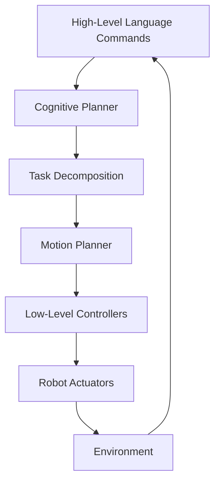
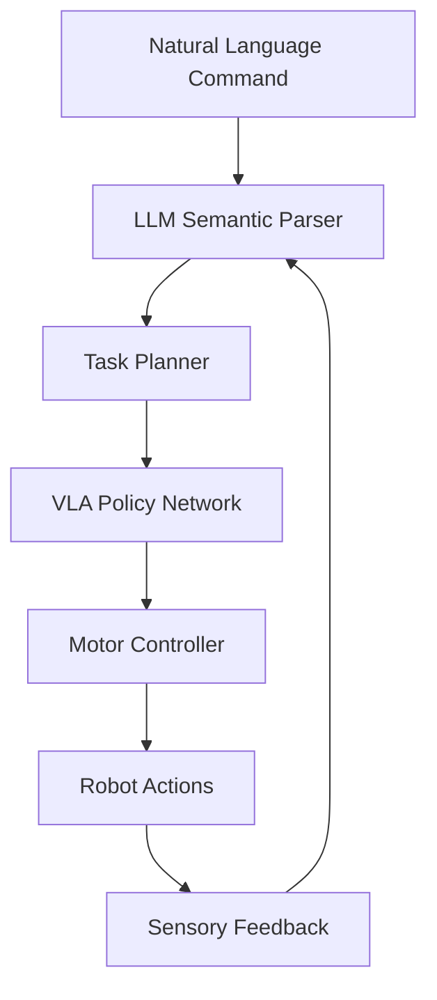

# VLA Theory and Architecture

Vision-Language-Action (VLA) models represent a significant advancement in embodied artificial intelligence, combining computer vision, natural language processing, and robotic action planning into unified neural architectures. This section explores the theoretical foundations and architectural principles underlying these systems.

## Theoretical Foundations

### Multimodal Representation Learning

VLA models are grounded in the principle of multimodal representation learning, where visual, linguistic, and action modalities are mapped to a shared latent space. This enables the model to understand relationships between what is seen, what is said, and what should be done.

The core mathematical formulation involves learning a joint embedding function:

```
f: (V, L, A) → Z
```

Where:
- V represents visual observations
- L represents linguistic instructions
- A represents action sequences
- Z is the shared latent representation space

### Embodied Cognition Principles

VLA models embody principles from embodied cognition, which suggests that cognitive processes are deeply rooted in the body's interactions with the environment. This means that understanding language and planning actions are fundamentally connected to perceptual experiences.

### Hierarchical Control Architecture

Modern VLA systems typically employ hierarchical control structures:



## Architectural Components

### Vision Encoder

The vision encoder processes raw sensory input (images, point clouds, etc.) into meaningful visual representations. Common approaches include:

- Convolutional Neural Networks (CNNs) for image processing
- Vision Transformers (ViTs) for attention-based visual understanding
- 3D CNNs or PointNet variants for depth and spatial understanding

### Language Encoder

The language encoder converts natural language instructions into semantic representations. This typically involves:

- Pre-trained language models (BERT, RoBERTa, GPT variants)
- Tokenization and embedding of linguistic input
- Contextual understanding of commands

### Action Decoder

The action decoder generates executable robot commands from the combined vision-language representation. This may involve:

- Discrete action spaces (e.g., navigation directions, grasp commands)
- Continuous control signals (e.g., joint angles, end-effector poses)
- Temporal action sequences for complex tasks

### Fusion Mechanisms

Critical to VLA models is the fusion of visual and linguistic information. Common approaches include:

1. **Early Fusion**: Combining raw modalities before processing
2. **Late Fusion**: Processing modalities separately then combining late in the network
3. **Cross-Attention**: Using attention mechanisms to allow modalities to influence each other
4. **Conditional Embedding**: Using one modality to condition the processing of another

## Training Paradigms

### Imitation Learning

Many VLA models are trained using imitation learning, where the robot learns to mimic expert demonstrations. This involves:

- Collecting human demonstrations of tasks
- Recording visual, linguistic, and action data
- Training the model to predict actions from visual and linguistic inputs

### Reinforcement Learning

Reinforcement learning approaches train VLA models through trial and error:

- Defining reward functions for successful task completion
- Exploring action spaces guided by language instructions
- Learning policies that maximize cumulative rewards

### Self-Supervised Learning

Self-supervised approaches leverage large-scale unlabeled data:

- Contrastive learning to align visual and linguistic representations
- Masked modeling to learn bidirectional mappings
- Temporal coherence learning from video data

## The Convergence of LLMs and Robotics

### Large Language Model Integration

Recent advances integrate large language models (LLMs) with robotic systems:

- **Task Planning**: LLMs decompose high-level commands into sequences of subtasks
- **Semantic Understanding**: LLMs provide world knowledge and commonsense reasoning
- **Natural Interaction**: LLMs enable conversational interfaces with robots

### Cognitive Architecture

The integration creates a cognitive architecture with multiple levels:



### Reasoning and Planning

LLMs contribute high-level reasoning capabilities:

- **Decomposition**: Breaking complex tasks into manageable subtasks
- **Abstraction**: Managing multiple levels of behavioral abstraction
- **Contextual Reasoning**: Applying world knowledge to specific situations
- **Failure Recovery**: Adapting plans when initial attempts fail

## Challenges and Limitations

### Grounding Problem

One of the central challenges in VLA models is the grounding problem: connecting abstract linguistic concepts to concrete perceptual and motor experiences. This requires:

- Establishing correspondences between words and visual concepts
- Learning mappings between language descriptions and physical actions
- Maintaining consistency across different contexts and environments

### Scalability Issues

Current VLA models face scalability challenges:

- Computational requirements for real-time operation
- Need for extensive training data across diverse scenarios
- Transfer learning difficulties between different robots and environments

### Safety and Reliability

Ensuring safe operation remains critical:

- Preventing execution of dangerous or inappropriate actions
- Handling ambiguous or contradictory instructions
- Maintaining human oversight and control

## Future Directions

### Foundation Models

The trend toward foundation models in robotics suggests future VLA systems will:

- Leverage pre-trained models across multiple domains
- Enable few-shot learning for new tasks
- Support transfer learning between different robotic platforms

### Closed-Loop Learning

Future systems will increasingly incorporate closed-loop learning:

- Online adaptation based on task performance
- Active learning to acquire new skills
- Human-in-the-loop refinement of behaviors

### Multi-Agent Coordination

Advanced VLA systems will support multi-agent scenarios:

- Coordinated action among multiple robots
- Shared understanding of language instructions
- Distributed task execution and monitoring