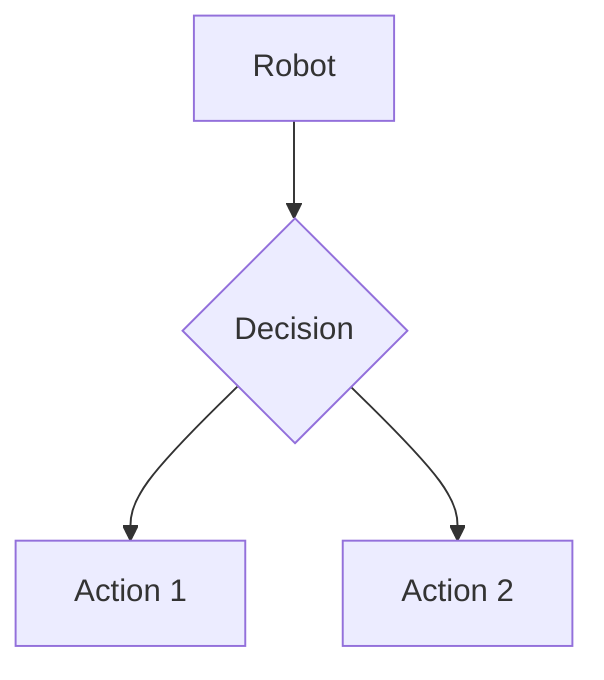

# Quickstart Guide: Physical AI & Humanoid Robotics Documentation

## Overview
This guide will help you quickly set up and start working with the Physical AI & Humanoid Robotics educational content site. The site is built using Docusaurus and contains comprehensive educational materials covering robotics, AI, and embodied intelligence.

## Prerequisites
- Node.js v18+ installed
- npm or yarn package manager
- Git for version control (optional but recommended)

## Setup Instructions

### 1. Clone the Repository
```bash
git clone <repository-url>
cd <repository-name>
```

### 2. Install Dependencies
```bash
npm install
# or
yarn install
```

### 3. Start the Development Server
```bash
npm run start
# or
yarn start
```

This will start the development server at `http://localhost:3000` with hot reloading enabled.

### 4. Build for Production
```bash
npm run build
# or
yarn build
```

This will generate a static site in the `build/` directory that can be deployed to any web server.

## Project Structure
```
docs/
├── intro.mdx                 # Introduction to Physical AI & Humanoid Robotics
├── module1-ros2/             # Module 1: The Robotic Nervous System (ROS 2)
│   ├── index.mdx
│   ├── intro.mdx
│   ├── theory.mdx
│   ├── key-concepts.mdx
│   ├── tools.mdx
│   ├── challenges.mdx
│   ├── safety.mdx
│   ├── quiz.mdx
│   └── labs/
│       ├── lab1.mdx
│       ├── lab2.mdx
│       └── lab3.mdx
├── module2-digital-twin/     # Module 2: The Digital Twin (Gazebo & Unity)
├── module3-ai-brain/         # Module 3: The AI-Robot Brain (NVIDIA Isaac™)
├── module4-vla/              # Module 4: Vision-Language-Action (VLA)
├── capstone/                 # Capstone Project: The Autonomous Humanoid
├── glossary.mdx
├── references.mdx
└── resources.mdx
docusaurus.config.js          # Docusaurus configuration
sidebar.js                    # Sidebar navigation configuration
package.json                  # Project dependencies and scripts
```

## Content Creation Guidelines

### Creating New Pages
1. Create a new `.mdx` file in the appropriate module directory
2. Use frontmatter to specify metadata:
```md
---
title: Page Title
description: Brief description of the page content
sidebar_position: 2
---

# Page Title

Content goes here...
```

### Adding Code Examples
Use standard Markdown code blocks with appropriate language specification:
```python
# Python code example
def example_function():
    print("Hello, Robotics!")
```

### Adding Diagrams
Use Mermaid syntax for diagrams:


### Adding Interactive Elements
Docusaurus supports JSX components within MDX files:
```jsx
import CodeBlock from '@theme/CodeBlock';

<CodeBlock language="python">
{`# Python code example
def example_function():
    print("Hello, Robotics!")`}
</CodeBlock>
```

## Key Features

### MDX Support
- Rich content with React components
- Interactive code examples
- Embedded diagrams and videos

### Navigation
- Automatic sidebar generation
- Breadcrumb navigation
- Previous/next page navigation

### Search
- Full-text search across all content
- Search results highlighting

### Accessibility
- Keyboard navigation
- Screen reader support
- Proper heading hierarchy

## Common Tasks

### Adding a New Module
1. Create a new directory in `docs/` with the module name
2. Add an `index.mdx` file as the module overview
3. Update `sidebar.js` to include the new module in the navigation

### Adding a New Lab
1. Create a new `.mdx` file in the appropriate module's `labs/` directory
2. Follow the lab template structure with objectives, steps, and code examples
3. Link to the lab from the module's main page

### Updating Code Examples
1. Ensure all Python examples are tested and runnable
2. Include clear explanations of what the code does
3. Provide setup instructions where necessary

## Troubleshooting

### Development Server Issues
- If the development server doesn't start, try clearing the cache:
```bash
npm run clear
# or
yarn clear
```

### Build Issues
- If the build fails, check for syntax errors in MDX files
- Ensure all referenced images and assets exist
- Verify all internal links are valid

### Content Issues
- If content doesn't appear as expected, check the frontmatter configuration
- Verify the file is in the correct directory for proper navigation